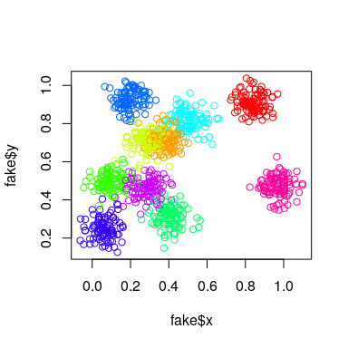
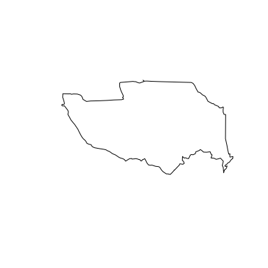
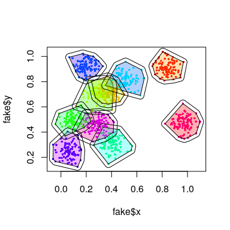

<!-- README.md is generated from README.Rmd. Please edit that file -->
bohemia: The R package of the Bohemia project
=============================================

This package contains utilities used by the Bohemia research team. It is publicly available for the purposes of reproducibility and transparency.

Installation
------------

To install this package, run the below from within the R console.

``` r
if(!require(devtools)) install.packages("devtools")
install_github('databrew/bohemia')
```

Building the package
--------------------

Having done the above, run `Rscript build_package.R` from within the main directory to compile the package.

Package utilities
-----------------

This package contains several noteworthy tools.

### Generating fake data

Some methods and analysis require "dummy" data in order to be tested. Functions which generate dummy data begin with the prefix `generate_fake`. For example, `generate_fake_locations` creates a dataframe of `n` locations, grouped into `n_clusters` clusters, which is useful for testing algorithms related to clustering, buferring, etc.

Here is a working example:

``` r
library(tidyverse)
#> ── Attaching packages ────────────────────────────────── tidyverse 1.2.1 ──
#> ✔ tibble  2.1.3     ✔ purrr   0.3.2
#> ✔ readr   1.3.1     ✔ stringr 1.4.0
#> ✔ tibble  2.1.3     ✔ forcats 0.4.0
#> ── Conflicts ───────────────────────────────────── tidyverse_conflicts() ──
#> ✖ dplyr::filter()  masks stats::filter()
#> ✖ purrr::is_null() masks testthat::is_null()
#> ✖ dplyr::lag()     masks stats::lag()
#> ✖ dplyr::matches() masks testthat::matches()
library(sp)
library(bohemia)
# Generate some fake data
fake <- generate_fake_locations(n = 1000,
                                n_clusters = 10,
                                sd = 0.05)
# Plot the fake data
plot(fake$x, fake$y, col = rainbow(10)[fake$cluster])
```



``` r
# Generate boundaries from the point locations
boundaries <- bohemia::create_borders(df = fake)
# Plot the boundaries
cols <- rainbow(10)[fake$cluster]
plot(fake$x, fake$y, col = cols, pch = 16, cex = 0.5)
plot(boundaries, add = T, col = adjustcolor(cols, alpha.f = 0.3))
```



``` r
# Generate buffers from boundaries
buffers <- bohemia::create_buffers(shp = boundaries,
                                   meters = 5000)
plot(fake$x, fake$y, col = cols, pch = 16, cex = 0.5)
plot(boundaries, add = T, col = adjustcolor(cols, alpha.f = 0.3))
plot(buffers, add = T)
```


