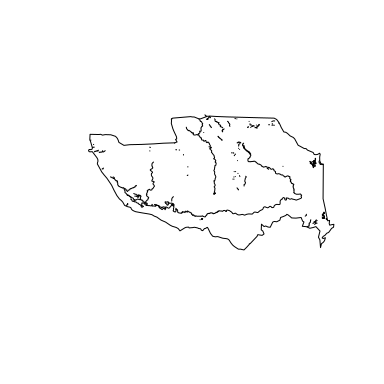
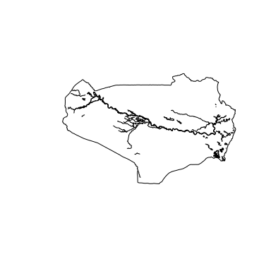
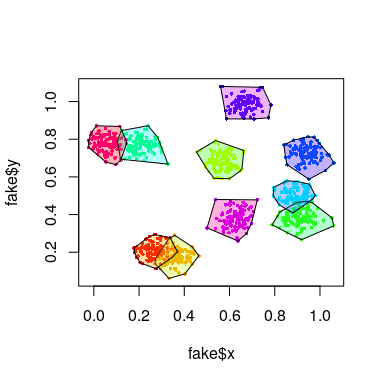
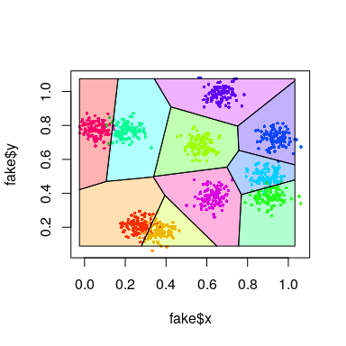
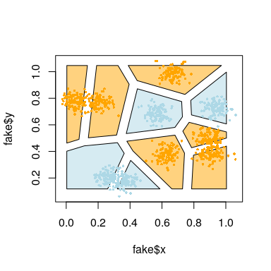

-   [bohemia: The R package of the Bohemia project](#bohemia-the-r-package-of-the-bohemia-project)
    -   [Installation](#installation)
    -   [Setting up data](#setting-up-data)
    -   [Building the package](#building-the-package)
    -   [Package utilities](#package-utilities)

<!-- README.md is generated from README.Rmd. Please edit that file -->
bohemia: The R package of the Bohemia project
=============================================

This package contains utilities used by the Bohemia research team. It is publicly available for the purposes of reproducibility and transparency.

Installation
------------

To install this package, run the below from within the R console.

``` r
if(!require(devtools)) install.packages("devtools")
install_github('databrew/bohemia')
```

Setting up data
---------------

The package includes both tools (functions) as well as data. In order to set up the package's datasets, the following steps should be taken:

#### Download OSM data

1.  Download Mozambique data from <https://download.geofabrik.de/africa/mozambique-latest-free.shp.zip> into `data-raw/geofabrik` and extract

2.  Download Tanzania data from <https://download.geofabrik.de/africa/tanzania-latest-free.shp.zip> into `data-raw/geofabrik` and extract

#### Run the data compilation script

1.  From the command line, run `cd data-raw; Rscript DATASET.R; cd..`

Building the package
--------------------

Having done the above, run `Rscript build_package.R` from within the main directory to compile the package.

Package utilities
-----------------

This package contains several noteworthy tools. What follows is a walk-through of some of them.

### Data

#### Country-level polygonal data

``` r
library(sp)
library(bohemia)

# Create a map of Mozambique at the second administrative level (district)
plot(bohemia::mozambique2)
```


``` r

# Create a map of Mozambique at the tertiary administrative level (posto administrativo)
plot(bohemia::mozambique3, lwd = 0.2)
```


``` r

# Create a map of Tanzania at the second administrative level (district)
plot(bohemia::tanzania2)
```


``` r

# Create a map of Tanzania at the tertiary administrative level (posto administrativo)
plot(bohemia::tanzania3, lwd = 0.2)
```


#### Study area polygonal data

``` r
plot(bohemia::mopeia2)
```


``` r
plot(bohemia::mopeia3)
```


``` r

plot(bohemia::rufiji2)
```


``` r
plot(bohemia::rufiji3)
```


#### Study area road data

``` r
plot(bohemia::mopeia2)
plot(bohemia::mopeia_roads, add = TRUE)
```


``` r

plot(bohemia::rufiji2)
plot(bohemia::rufiji_roads, add = TRUE)
```


#### Study area road data

``` r
plot(bohemia::mopeia2)
plot(bohemia::mopeia_roads, add = TRUE)
```


``` r

plot(bohemia::rufiji2)
plot(bohemia::rufiji_roads, add = TRUE)
```


#### Study area water data

``` r
plot(bohemia::mopeia2)
plot(bohemia::mopeia_water, add = TRUE)
plot(bohemia::mopeia_waterways, add = TRUE)
```



``` r

plot(bohemia::rufiji2)
plot(bohemia::rufiji_water, add = TRUE)
plot(bohemia::rufiji_waterways, add = TRUE)
```



### Functions

### Generating fake data

Some methods and analysis require "dummy" data in order to be tested. Functions which generate dummy data begin with the prefix `generate_fake`. For example, `generate_fake_locations` creates a dataframe of `n` locations, grouped into `n_clusters` clusters, which is useful for testing algorithms related to clustering, buferring, etc.

Here is a working example:

``` r
set.seed(1)
library(tidyverse)
#> ── Attaching packages ────────────────────────────────── tidyverse 1.2.1 ──
#> ✔ tibble  2.1.3     ✔ purrr   0.3.2
#> ✔ readr   1.3.1     ✔ stringr 1.4.0
#> ✔ tibble  2.1.3     ✔ forcats 0.4.0
#> ── Conflicts ───────────────────────────────────── tidyverse_conflicts() ──
#> ✖ dplyr::filter()  masks stats::filter()
#> ✖ purrr::is_null() masks testthat::is_null()
#> ✖ dplyr::lag()     masks stats::lag()
#> ✖ dplyr::matches() masks testthat::matches()
library(sp)
library(bohemia)
# Generate some fake data
fake <- generate_fake_locations(n = 1000,
                                n_clusters = 10,
                                sd = 0.04)
# Plot the fake data
plot(fake$x, fake$y, col = rainbow(10)[fake$cluster])
```


``` r
# Generate boundaries from the point locations
boundaries <- bohemia::create_borders(df = fake)
# Plot the boundaries
cols <- rainbow(10)[fake$cluster]
plot(fake$x, fake$y, col = cols, pch = 16, cex = 0.5)
plot(boundaries, add = T, col = adjustcolor(cols, alpha.f = 0.3))
```



``` r
# Generate buffers from boundaries
buffers <- bohemia::create_buffers(shp = boundaries,
                                   meters = 5000)
plot(fake$x, fake$y, col = cols, pch = 16, cex = 0.5)
plot(boundaries, add = T, col = adjustcolor(cols, alpha.f = 0.3))
plot(buffers, add = T)
```


As an alternative to the above approach, and so as to generate generealizable boundaries with no "holes", we can use voronoi tesselation as opposed to convex hulling.

``` r
boundaries <- create_borders(df = fake, voronoi = TRUE)
#> Loading required namespace: deldir
# Plot the boundaries
plot(fake$x, fake$y, col = cols, pch = 16, cex = 0.5)
plot(boundaries, add = T, col = adjustcolor(cols, alpha.f = 0.3))
```



Just like with convex hull generated borders, we can add buffers to delauney triangles.

``` r
# Generate buffers from boundaries
buffers <- bohemia::create_buffers(shp = boundaries,
                                   meters = 5000)
plot(fake$x, fake$y, col = cols, pch = 16, cex = 0.5)
plot(boundaries, add = T, col = adjustcolor(cols, alpha.f = 0.3))
plot(buffers, add = T, col = adjustcolor(cols, alpha.f = 0.3))
```


In the above, we use *external* boundaries, which results in one areas borders bleeding into the core of another area. As an alternative to this, we can use *internal* boundaries.

``` r
# Generate buffers from boundaries
buffers <- bohemia::create_buffers(shp = boundaries,
                                   meters = -5000)
plot(fake$x, fake$y, col = 'white', pch = 16, cex = 0.5)
plot(boundaries, add = T, col = adjustcolor(cols, alpha.f = 0.3))
plot(buffers, add = T, col = adjustcolor(cols, alpha.f = 0.5))
points(fake$x, fake$y, col = cols, pch = 16, cex = 0.5)
```


For the purposes of an intervention in which each area is assigned status A or B (ie, intervention or control), the need for buffers between areas of identical intervention status is redundant (and can unecessarily eliminate potential study participants).

``` r
# Define some ids 
ids <- sample(1:2, nrow(boundaries), replace = TRUE)
cols2 <- c('lightblue', 'orange')
cols <- cols2[ids]

# Generate buffers from boundaries
buffers <- create_buffers(shp = boundaries,
                                   meters = -5000,
                                   ids = ids)
plot(fake$x, fake$y, col = 'white', pch = 16, cex = 0.5)
# plot(boundaries, add = T, col = adjustcolor(cols, alpha.f = 0.8))
plot(buffers, add = T, col = adjustcolor(cols2, alpha.f = 0.5))
points(fake$x, fake$y, col = cols, pch = 16, cex = 0.5)
```


