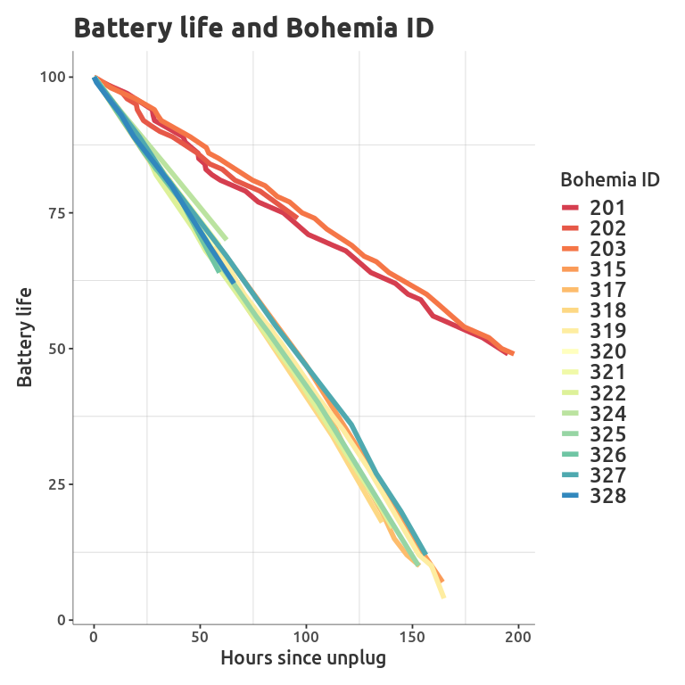

Battery test
================

``` r
# Libraries
library(databrew)
library(ggplot2)
library(tidyr)
library(tidyverse)
library(bohemia)
library(gsheet)
```

``` r
# Read in credentials
creds <- yaml::yaml.load_file('../../credentials/credentials.yaml')

# Sync traccar data
sync_workers_traccar(credentials = creds)

# Read in google data bout which tablets we're experimenting on
experiment <- gsheet2tbl('https://docs.google.com/spreadsheets/d/1P305C84d0SUe7qVeAfzMVCUgiy1ImXhdjfAWNaTywu4/edit?ts=5eea0d49#gid=0')
```

``` r
# Get tablet data
df <- bohemia::get_traccar_data(url = creds$traccar_server,
                                user = creds$traccar_user,
                                pass = creds$traccar_pass)
# Keep only those in the experiment
keep <- df %>%
  mutate(bohemia_id = as.numeric(uniqueId)) %>%
  filter(bohemia_id %in% experiment$bohemia_id) %>%
  left_join(experiment %>% dplyr::select(bohemia_id, interval)) %>%
  dplyr::select(bohemia_id, name, interval, status, id)

# Get battery life
out_list <- list()
for(i in 1:nrow(keep)){
  this_id <- keep$id[i]
  out <- get_positions_from_device_id(
                                url = creds$traccar_server,
                                user = creds$traccar_user,
                                pass = creds$traccar_pass,
                                device_id = this_id)

  out_list[[i]] <- out
}
out <- bind_rows(out_list)
```

``` r
# Analyze
# Extract battery life
extract_battery <- function(x){
  a <- strsplit(x, ' ')
  a <- lapply(a, function(x){x[1]})
  a <- unlist(a)
  b <- strsplit(a, ':', fixed = T)
  b <- lapply(b, function(x){x[2]})
  b <- unlist(b)
  as.numeric(b)
}
out$battery <- extract_battery(out$valid)

# Join the interval setting
out <- out %>%
  left_join(keep %>% dplyr::rename(deviceId = id))

# Get last time at which battery was at 100
out <- out %>%
  arrange(fixTime) %>%
  group_by(interval) %>%
  # calculate the first moment at which there is a decrease
  mutate(power = battery - dplyr::lag(battery, 1)) %>%
  filter(power <0 ) %>%
  ungroup %>%
  group_by(interval) %>%
  mutate(relative_time = deviceTime - min(deviceTime)) %>%
  mutate(start_point = max(battery)) %>%
  ungroup %>%
  mutate(adjustor = 100 - start_point) %>%
  mutate(battery = battery + adjustor)
out <- out %>%
  group_by(interval) %>%
  mutate(obs = n()) %>%
  ungroup %>% filter(obs > 2)

# Plot
library(RColorBrewer)
ggplot(data = out,
       aes(x = relative_time / 60 / 60,
           y = battery,
           color = factor(interval))) +
  geom_line(size = 2) +
  scale_color_manual(name = 'interval',
                     values = colorRampPalette(brewer.pal(n = 9, 'Spectral'))(length(unique(out$interval)))) +
  labs(x = 'Hours since unplug',
       y = 'Battery life',
       title = 'Battery life and ping interval') +
  theme_simple()
```

<!-- -->

``` r
ggplot(data = out,
       aes(x = relative_time / 60 / 60,
           y = battery,
           color = factor(bohemia_id))) +
  geom_line(size = 2) +
  scale_color_manual(name = 'Bohemia ID',
                     values = colorRampPalette(brewer.pal(n = 9, 'Spectral'))(length(unique(out$interval)))) +
  labs(x = 'Hours since unplug',
       y = 'Battery life',
       title = 'Battery life and Bohemia ID') +
  theme_simple()
```

<!-- -->

# Technical details

This document was produced on 2020-06-24 on a Linux machine (release
5.3.0-59-generic. To reproduce, one should take the following steps:

  - Clone the repository at <https://github.com/databrew/bohemia>

  - “Render” (using `rmarkdown`) the code in
    `analysis/clustering/README.Rmd`

Any questions or problems should be addressed to <joe@databrew.cc>
