```{r setup, include=FALSE, echo = FALSE}
# Basic knitr options
library(knitr)
opts_chunk$set(comment = NA, 
               echo = FALSE, 
               warning = FALSE, 
               message = FALSE, 
               error = TRUE, 
               cache = FALSE,
               fig.width = 8,
               fig.height = 8,
               fig.path = 'figures/')
```


```{r}
# Libraries
library(databrew)
library(ggplot2)
library(tidyr)
library(tidyverse)
library(bohemia)
```


```{r}
set.seed(1)
library(tidyverse)
library(sp)
library(bohemia)
# Generate some fake data
fake <- generate_fake_locations(n = 1000,
                                n_clusters = 10,
                                sd = 0.04)
# Plot the fake data
plot(fake$x, fake$y)

plot(fake$x, fake$y, col = rainbow(10)[fake$cluster])
```

### Generating village boundaries

```{r}
# Generate boundaries from the point locations
boundaries <- bohemia::create_borders(df = fake)
# Plot the boundaries
cols10 <- rainbow(10)
cols <- cols10[fake$cluster]
plot(fake$x, fake$y, col = cols, pch = 16, cex = 0.5)
plot(boundaries, add = T, col = adjustcolor(cols10, alpha.f = 0.3),
     border = NA)
```

### Generating buffers based on tesselation


```{r}
boundaries <- create_borders(df = fake, voronoi = TRUE)
# Plot the boundaries
plot(fake$x, fake$y, col = cols, pch = 16, cex = 0.5)
plot(boundaries, add = T, col = adjustcolor(cols, alpha.f = 0.3))
```

### Generating tesselated internal buffers

In the above, we use _external_ boundaries, which results in one areas borders bleeding into the core of another area. As an alternative to this, we can use _internal_ boundaries.

```{r}
# Generate buffers from boundaries
buffers <- bohemia::create_buffers(shp = boundaries,
                                   meters = -5000)
plot(fake$x, fake$y, col = 'white', pch = 16, cex = 0.5)
# plot(boundaries, add = T, col = adjustcolor(cols, alpha.f = 0.3))
plot(buffers, add = T, col = adjustcolor(cols10, alpha.f = 0.4))
points(fake$x, fake$y, col = cols, pch = 16, cex = 0.5)
```

### Generating "collapsed" tesselated internal buffers

For the purposes of an intervention in which each area is assigned status A or B (ie, intervention or control), the need for buffers between areas of identical intervention status is redundant (and can unecessarily eliminate potential study participants).


```{r}
# Define some ids 
ids <- sample(1:2, nrow(boundaries), replace = TRUE)
cols2 <- c('lightblue', 'orange')
cols <- cols2[ids]

# Create a dataframe for joining clusters to ids
merger <- data.frame(cluster = boundaries@data$cluster,
                     id = ids)
# Bring the ids into the point data
fake <- left_join(fake, merger, by = 'cluster')

# Generate buffers from boundaries
buffers <- create_buffers(shp = boundaries,
                                   meters = -5000,
                                   ids = ids)
plot(fake$x, fake$y, col = 'white', pch = 16, cex = 0.5)
# plot(boundaries, add = T, col = adjustcolor(cols, alpha.f = 0.8))
plot(buffers, add = T, col = adjustcolor(cols2[buffers@data$id], alpha.f = 0.5))
points(fake$x, fake$y, col = cols2[fake$id], pch = 16, cex = 0.5)
```

### Generating village-agnostic clusters

```{r}
fake <- generate_fake_locations(n = 1000,
                                n_clusters = 10,
                                sd = 0.1) %>% dplyr::select(-cluster)
plot(fake$x, fake$y, pch = 16)
cs <- create_clusters(cluster_size = 100,
                      locations = fake)

rcols <- length(unique(cs$cluster))
plot(cs$x, cs$y, col = rainbow(rcols)[cs$cluster])
```


What follows below is a visualization of how the `create_buffers` algorithm works.

```{r, eval = FALSE}
fake <- generate_fake_locations(n = 1000,
                              n_clusters = 5,
                              sd = 0.1) %>% dplyr::select(-cluster)
for(l in letters){
  set.seed(which(letters == l))
  message(l)
  cs <- create_clusters(cluster_size = 100,
                      locations = fake,
                      start = 'random',
                      rest = 'random',
                      plot_map = TRUE,
                      save = paste0('animation_', l))
  setwd(paste0('animation_', l))
  system('convert -delay 100 -loop 0 *.png result.gif')
  setwd('..')
}

```


<table style="width:100%">
  <tr>
    <td>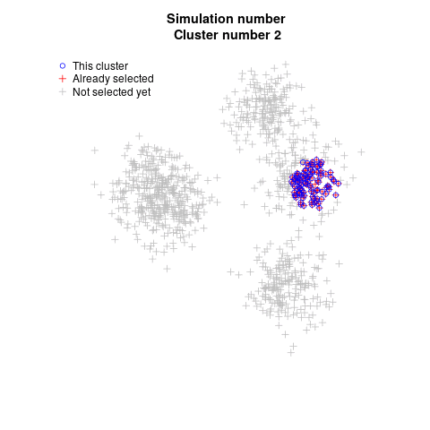</td>
    <td>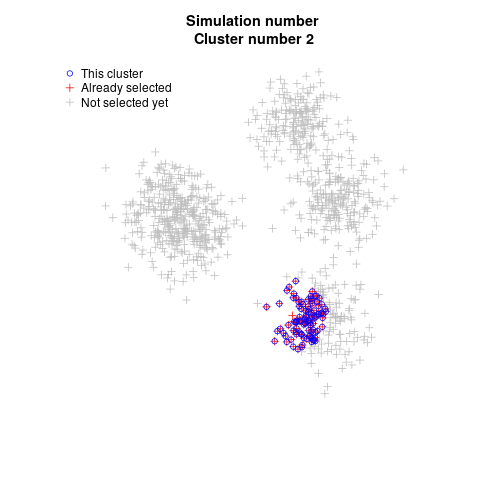</td>
    <td></td>
  </tr>
  <tr>
    <td>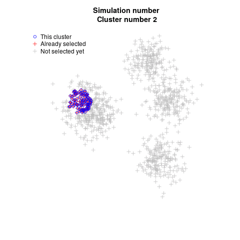</td>
    <td>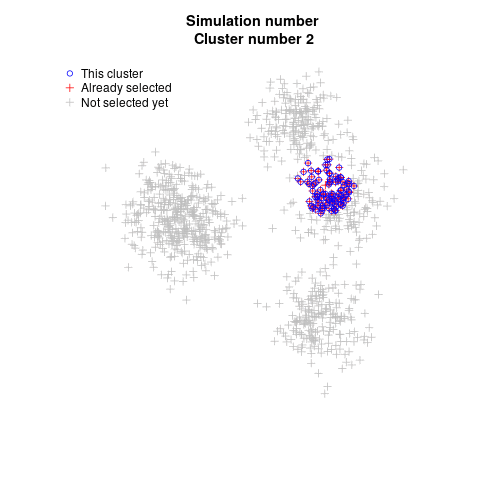</td>
    <td>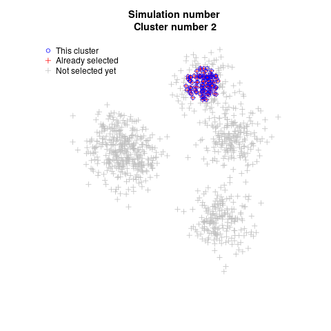</td>
  </tr>
  <tr>
    <td>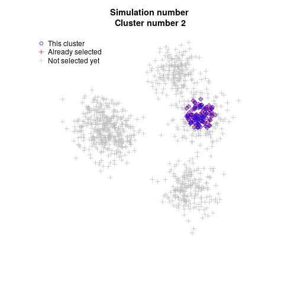</td>
    <td>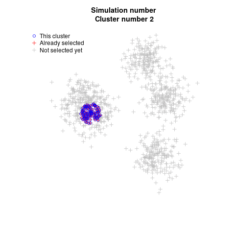</td>
    <td>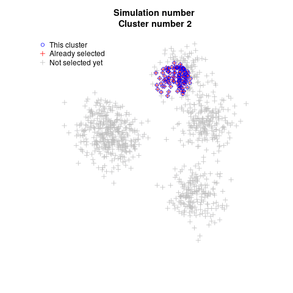</td>
  </tr>
    <tr>
    <td>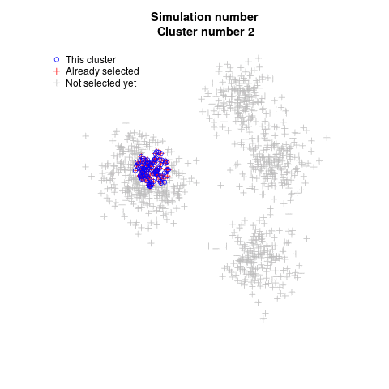</td>
    <td>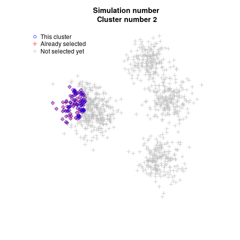</td>
    <td>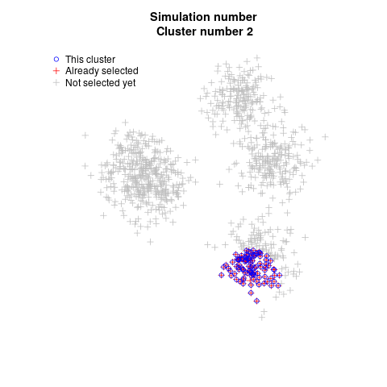</td>
  </tr>
</table>


# Technical details

This document was produced on `r Sys.Date()` on a `r Sys.info()['sysname']` machine (release `r Sys.info()['release']`. To reproduce, one should take the following steps:

- Clone the repository at https://github.com/databrew/bohemia

- "Render" (using `rmarkdown`) the code in `analysis/clustering/README.Rmd`

Any questions or problems should be addressed to joe@databrew.cc