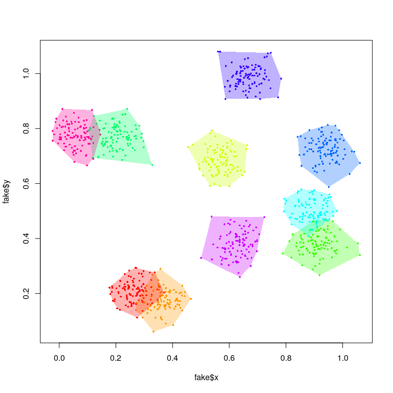
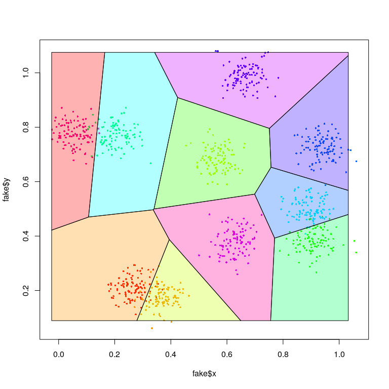
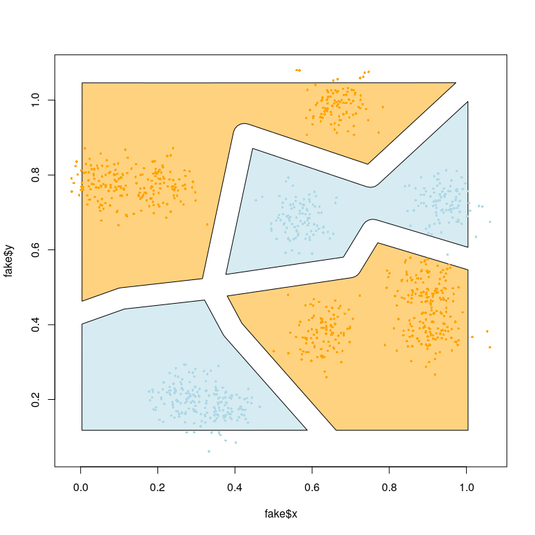
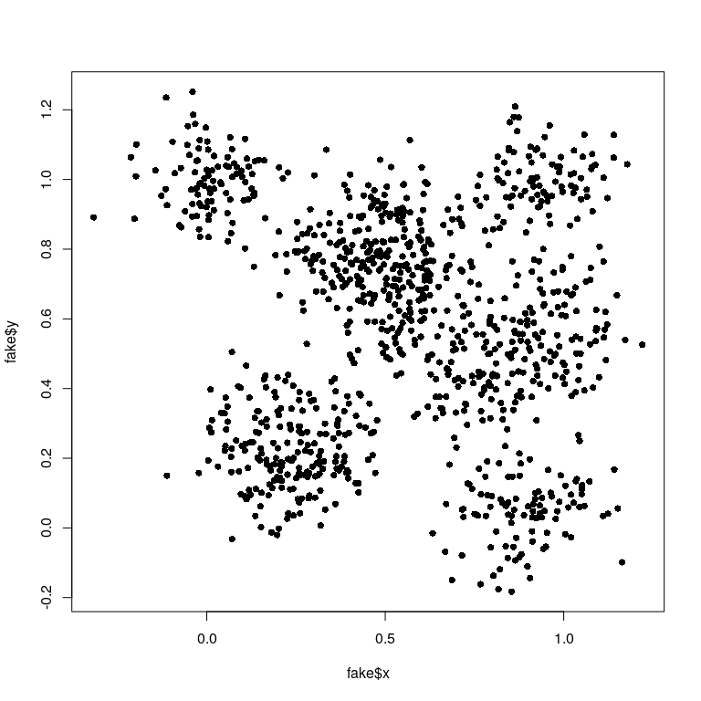

Bohemia clustering
================

<!-- --><!-- -->

### Generating village boundaries

<!-- -->

### Generating buffers based on tesselation

<!-- -->

### Generating tesselated internal buffers

In the above, we use *external* boundaries, which results in one areas
borders bleeding into the core of another area. As an alternative to
this, we can use *internal* boundaries.

<!-- -->

### Generating “collapsed” tesselated internal buffers

For the purposes of an intervention in which each area is assigned
status A or B (ie, intervention or control), the need for buffers
between areas of identical intervention status is redundant (and can
unecessarily eliminate potential study
participants).

<!-- -->

### Generating village-agnostic clusters

<!-- --><!-- -->

What follows below is a visualization of how the `create_buffers`
algorithm works.

<table style="width:100%">

<tr>

<td>

</td>

<td>

</td>

<td>

</td>

</tr>

<tr>

<td>

</td>

<td>

</td>

<td>

</td>

</tr>

<tr>

<td>

</td>

<td>

</td>

<td>

</td>

</tr>

<tr>

<td>

</td>

<td>

</td>

<td>

</td>

</tr>

</table>

# Technical details

This document was produced on 2020-10-27 on a Linux machine (release
5.4.0-52-generic. To reproduce, one should take the following steps:

  - Clone the repository at <https://github.com/databrew/bohemia>

  - “Render” (using `rmarkdown`) the code in
    `analysis/clustering/README.Rmd`

Any questions or problems should be addressed to <joe@databrew.cc>
