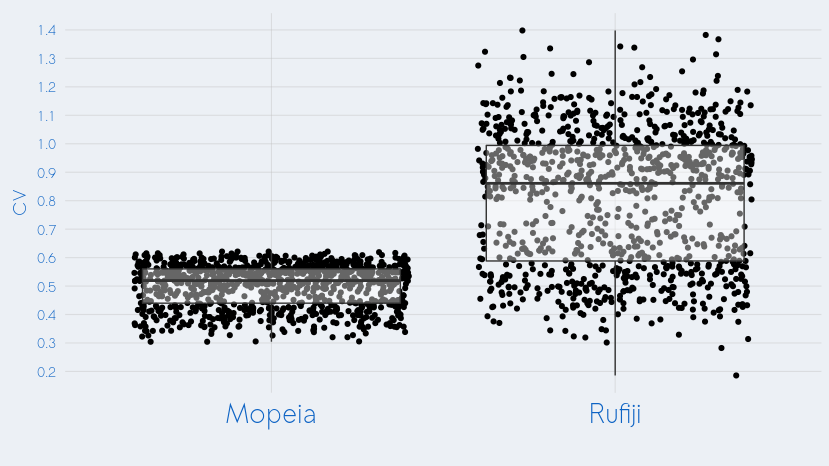
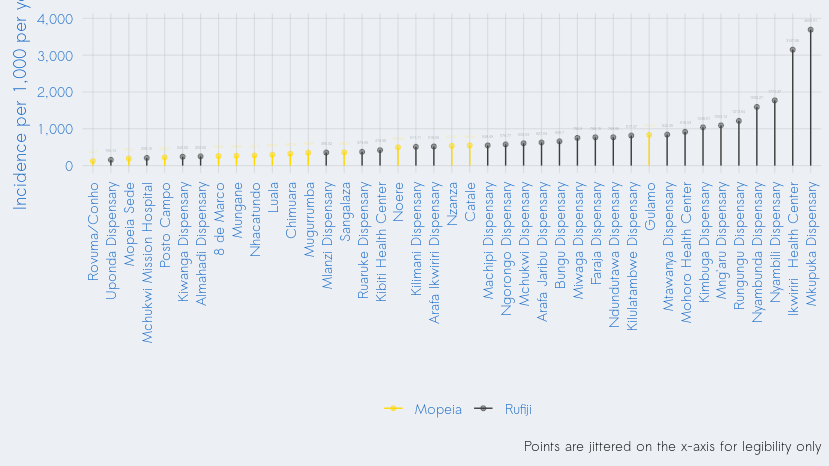

Coefficient of variation
================

The objective
-------------

We want a general notion of the the coefficient of variation (CV) in the incidence of malaria in the districts of Rufiji (Tanzania) and Mopeia (Mozambique). Are they similar? Must we use as high a CV for our power estimates in Rufiji as the one we used in Mopeia, or do we have evidence that suggets we could get by with a smaller CV (which would be operationally easier)? Let's dig in.

The challenges
--------------

### Description of the challenges

Estimating this with the currently available data is not straightforward. In addition to the obvious shortcomings in using data from several years ago (things may have changed since then), there is a larger limitation: the data we have from Mopeia is at the person-level, whereas the Rufiji data is aggregated at the level of the ward (the Tanzanian equivalent of the posto administrativo).

### Our previous (problematic) approaches

We could simply take the CV in the Mopeia clusters and compare it with the CV in the Rufiji wards, but this comparison would be inappropriate since the sizes of these areas are so radically different. Whereas Mopeia clusters are made up of several hundred people, Rufiji wards include thousand (and in some cases, tens of thousands).

We want to use similar methods on our two datasets, but their format (person-level vs. ward-level) is too dissimilar. Since we can't transform ward-level data into person-level data, we previously tried to do the opposite: transorm our person-level data (from Mopeia) to pseudo-ward-level data (ie, much larger numbers than clusters), using resampling.

Resampling, however, was unreliable and problematic (given the relatively small dataset for Mopeia). The number of observations in the Mopeia ACD dataset (approximately 1500) was far too small to be compared with the level of aggregation in the Rufiji incidence dataset (many thousand per ward). In order to "upscale" the Mopeia dataset, we (inevitably) had to resample from the small (1500) ACD numbers multiple times. Resampling from the same set many times artificially deflates variation, hence the radically different CV estimates between the two datasets. Apples-to-oranges.

### Our current approach

Now we will try to get an apples-to-apples comparison by comparing health facility data from both Mopeia (generated by Aina) and Rufiji (generated by Issa). Once the data are properly and consistently formatted, the calculation is straightforward

``` r
cv_rufiji <- sd(ruf$incidence) / mean(ruf$incidence)
cv_mopeia <- sd(mop$incidence) / mean(mop$incidence)
```

Results
-------

The health-facility-level coefficient of variation of the incidence of Malaria in Rufiji is: 0.91.

The health-facility-level coefficient of variation in the incidence of Malaria in Mopeia is: 0.51.


Interpretation
--------------

### General interpretation

Geographical variance in the incidence of malaria appears *higher* in Rufiji than Mopeia, suggesting that - even if operationally more difficult - we should use a CV for our Rufiji sample size calculations which is (at least) as high as the one we observed in Mopeia.

### Caveats

Can these two values really be compared? Maybe. There are several (3) factors which suggest not:

*1. Differences in catchment area size*

There are differences in the (supposed) catchment areas of the two sites. In Mopeia, the catchment areas range from very small (1338) to very large (3.251310^{4}). In Rufiji, the variance is less.

The below shows the distribution of CVs of 10 (random) health facilities.


Larger catchment areas (Mopeia) should be associated with less variance (ie, the lower CV in Mopeia should not be surprising).

*2. Differences in number of health facilities*

In Mopeia, we have data for 14 health facilities. In Rufiji, we have data for nearly double (27).

*3. Differences in data collection*

Data in Rufiji were collected via standard surveillance; data in Mopeia were collected during a study. It would not be surprising if part of the (greater) variance in incidence in Rufiji could be attributed to the inconsistencies of standard passive data collection (relative to the hypothetical improvement in data collection which generally accompanies a study), as opposed to variance actually that high.

Another approach?
-----------------

Without person-level data, we can't create uniform catchment area sizes (issue number 1). Nor can we "adjust" in any way for differences in data collection (issue number 3). However, we *can* use resampling to at least standardize the differences in the number of health facilities (issue number 2). That's what follows - 1,000 resamples of 10 health facilities and their corresponding CV.

``` r
# Sample 10 sites from each district to get a more comparable cv
sampler <- tibble(iteration = 1:1000) %>%
  mutate(mopeia = NA, rufiji = NA)
set.seed(12)
for(i in 1:nrow(sampler)){
  indices_mopeia <- sample(1:nrow(mop), 10)
  indices_rufiji <- sample(1:nrow(ruf), 10)
  vals_mopeia <- mop$incidence[indices_mopeia]
  vals_rufiji <- ruf$incidence[indices_rufiji]
  sampler$mopeia[i] <- sd(vals_mopeia) / mean(vals_mopeia)
  sampler$rufiji[i] <- sd(vals_rufiji) / mean(vals_rufiji)
}
sampler <- tidyr::gather(sampler, key, value, mopeia:rufiji) %>%
  mutate(key = Hmisc::capitalize(key))

ggplot(data = sampler,
       aes(x = key,
           y = value)) +
  geom_jitter() +
  geom_boxplot(alpha = 0.4) +
  theme_databrew() +
  theme(axis.text.x = element_text(size = 20)) +
  scale_y_continuous(name = 'CV', breaks = seq(0, 2, by = 0.1)) +
  labs(x = '')
```



In the above chart, it is clear that CV is generally higher in Rufiji. Recall that aforementioned issues 1 and 3 still apply.

One more visualization
----------------------

In case this helps in thinking about this...



Four more miscellaneous comments
--------------------------------

1.  IMPORTANT: The incidence in Rufiji, per health facility data, is 906.26. This seems extremely high (my previous understanding was that Rufiji had a lower incidence than Mopeia!).

2.  I included data from Kibiti (which I understand to be part of the Rufiji site area).

3.  Approximately half of the health facilities for the Kibiti/Rufiji area had *no* population or incidence data. These were excluded.

4.  These CVs were calculated at the level of the health facility, and NOT at the level of the cluster. They are useful for comparing between the two locations, but the actual point values are NOT comparable to the CVs we are estimating for power purposes at the cluster level.

Conclusion
----------

Two take-away points:

1.  Data aren't really comparable, so we should interpret with caution and use supplementary sources of knowledge to augment our undertanding.

2.  All of the data we've examined so far suggests that geographical variation in the incidence of malaria is actually *lower* in Mopeia than in Rufiji.

Technical details
-----------------

This document was produced on 2019-07-03 on a Linux machine (release 4.15.0-54-generic. To reproduce, one should take the following steps:

-   Clone the repository at <https://github.com/databrew/bohemia>

-   Populate the `analyses/cv/data` directory with the following files:

<!-- -->

    └── Estimate of incidence for Rufiji-HF malaria cases.xlsx # sent by Issa on July 2 2019
    └── 20190628_pcd_hf_incidence.xlsx # sent by Aina on June 30 2019

-   "Render" (using `rmarkdown`) the code in `analysis/cv/README.Rmd`

Any questions or problems should be addressed to <joe@databrew.cc>
