Livestock ownership and malaria risk in Mopeia
================

Major caveat
============

Livestock data is only available at the aggregated "localidade" level. The methods used in the production of "heat maps" in this report may be affected by the (false) concentration of livestock at a point location (the localidade) rather than their true (dispersed) locations. In other words, interpretation of heat maps should be carried out with caution as there may exist visual artefacts from the (false) concentration of livestock at the localidade centroids.

Analysis of aggregate data
==========================

Overlap of livestock ownership
------------------------------

### Total livestock ownership (all localidades)

### Total livestock ownership (by "Posto Administrativo")

### Total livestock ownership (by "Localidade")

### Correlation between ownership of one animal and another

On May 27 2019, Cassidy Rist asked the following (via email):

    I wonder what the overlap is among livestock ownership. 
    For example, do most people own pigs and goats, or is it 
    more likely that one or the other species is owned?

As of now, we only have aggregate-level data (most granular: localidade). Without individual-level data, the above can be addressed. Until then. we can examine the correlation at the localidade level (below), but in doing so we're committing the ecological fallacy.

The below aims to address the above question, using aggregated data ("localidade"-level).

#### Cattle and Goats

#### Cattle and Sheep

#### Cattle and Swine

#### Goats and Sheep

#### Goats and Swine

#### Sheep and Swine

Analysis of person-level data
=============================

Overall distribution of humans (point map)
------------------------------------------

(The below uses census data)

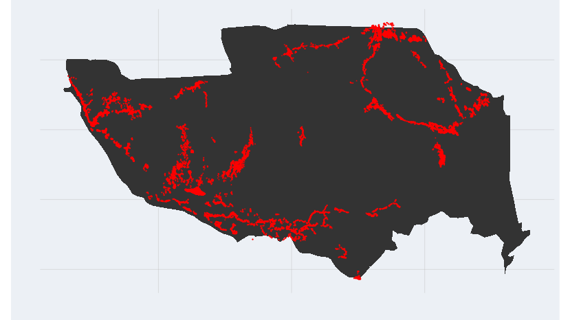

Overall distribution of humans ("heat map")
-------------------------------------------

(The below uses census data)

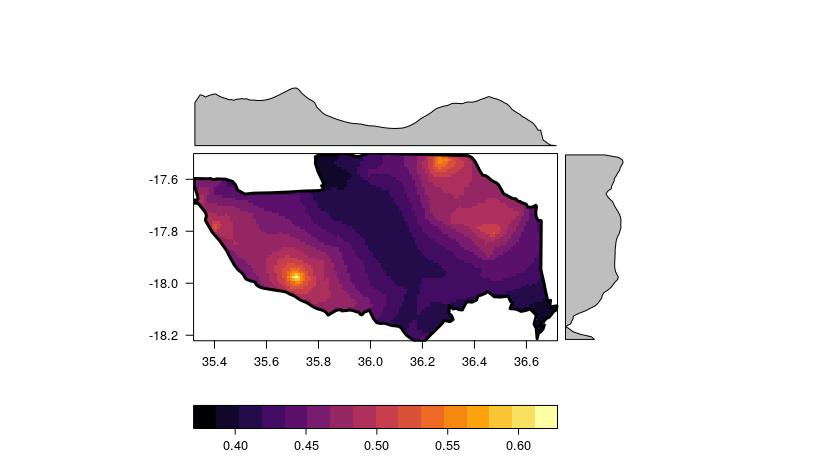

Overall distribution of livestock (point map)
---------------------------------------------

The below uses municipality data. This means that it is aggregated at the localidade-level. We also have person-level livestock data, but only in the ACD records (which are not comprehensive of all people).

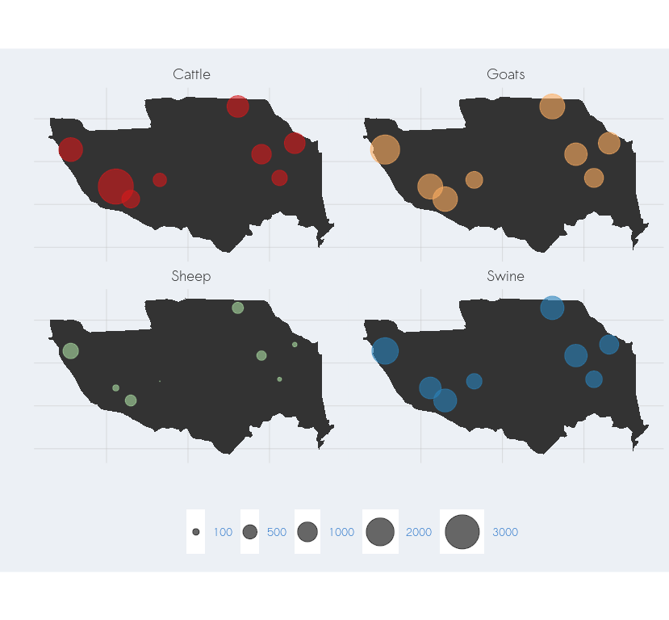

Overall distribution of livestock ("heat map")
----------------------------------------------

The below uses municipality data. This means that it is aggregated at the localidade-level. The person-level livestock data (only in the ACD records) are not comprehensive of all people.

There are two kinds of maps for each animal: (1) a straightforward heat map (showing the distribution of animals) and (2) a human population-adjusted heatmap (showing where the animal in question is more or less prevalent, relative to the distribution of the human population). In the latter map, if livestock distribution reflected perfectly human distribution, there would be no variation in color throughout the map.

### Cattle

#### Distribution of cattle

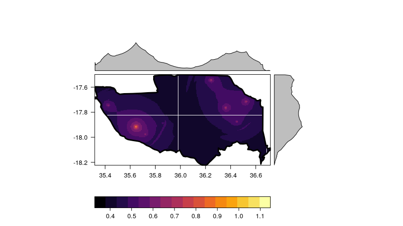

#### Distribution of cattle adjusted by human population

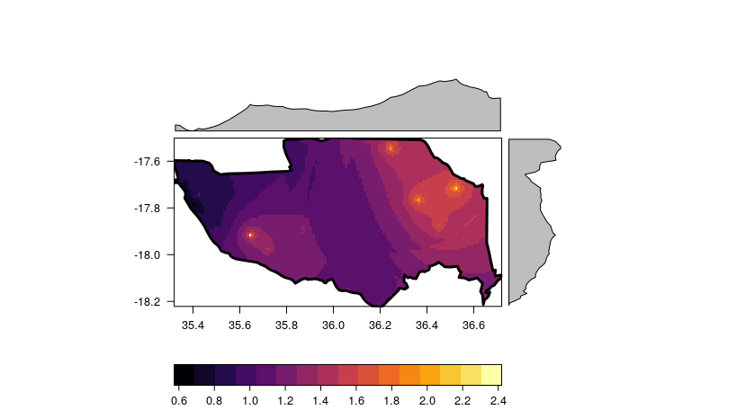

### Goats

#### Distribution of goats

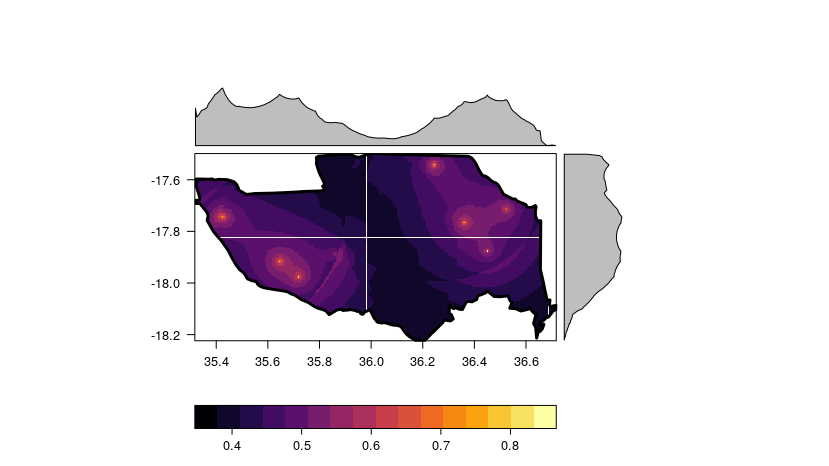

#### Distribution of cattle adjusted by human population

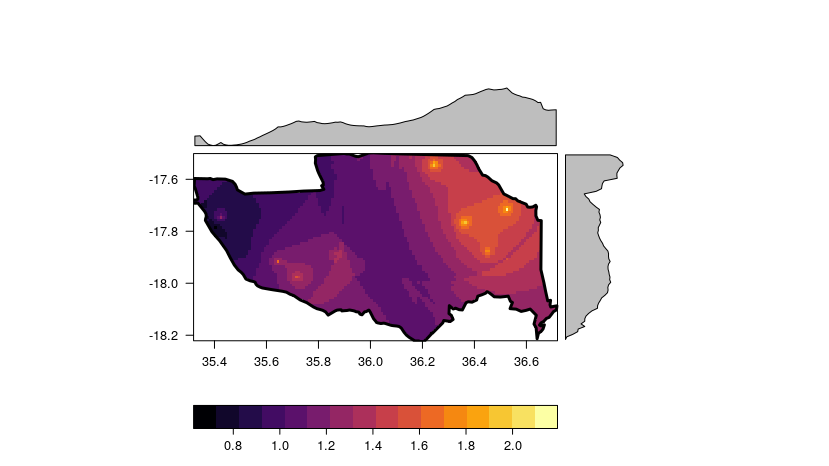

### Sheep

#### Distribution of sheep

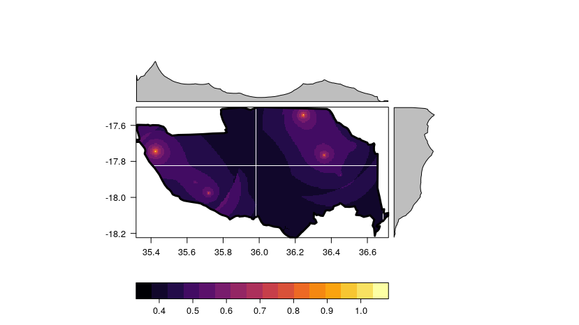

#### Distribution of sheep adjusted by human population

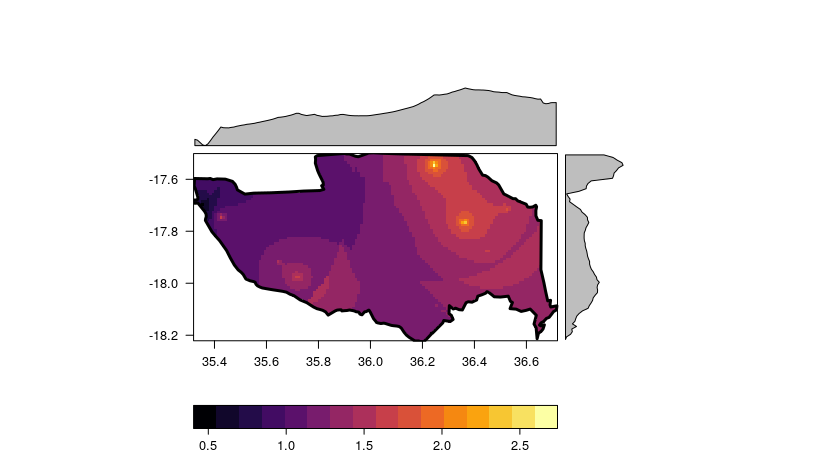

### Swine

#### Distribution of swine

#### Distribution of swine adjusted by human population

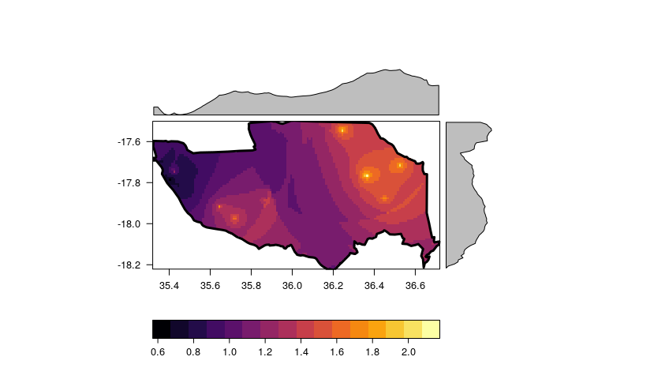

### All livestock

#### Distribution of all livestock

#### Distribution of all livestock adjusted by human population

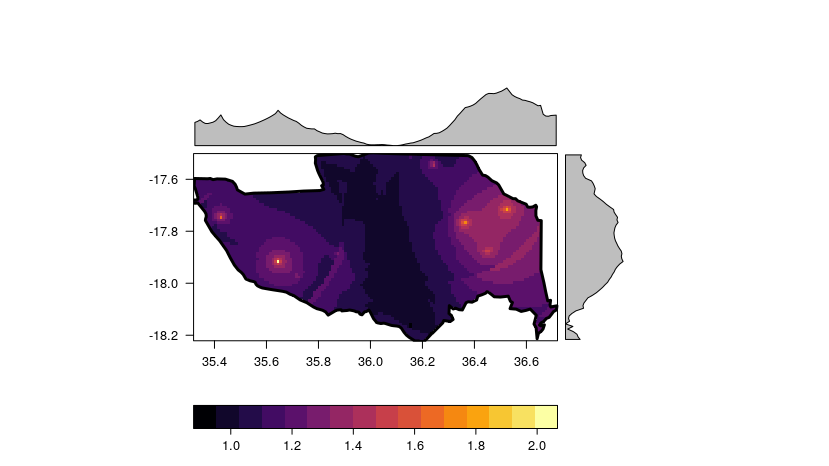

#### Distribution of all livestock except cattle

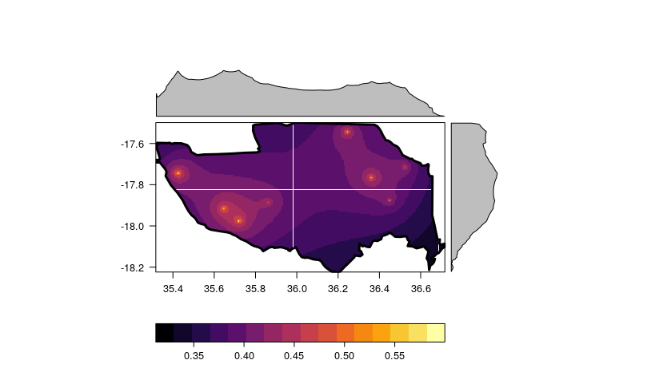

#### Distribution of all livestock adjusted by human population

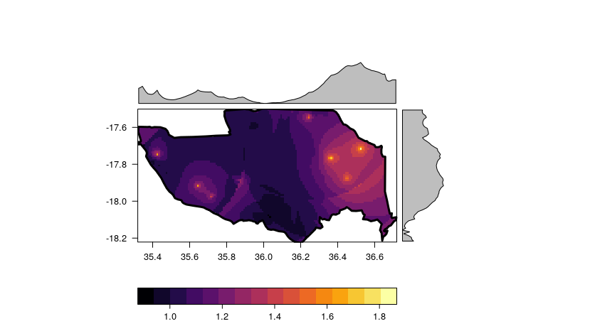

Malaria maps
------------

### Overall distribution of malaria (all ACD cases) (point map)

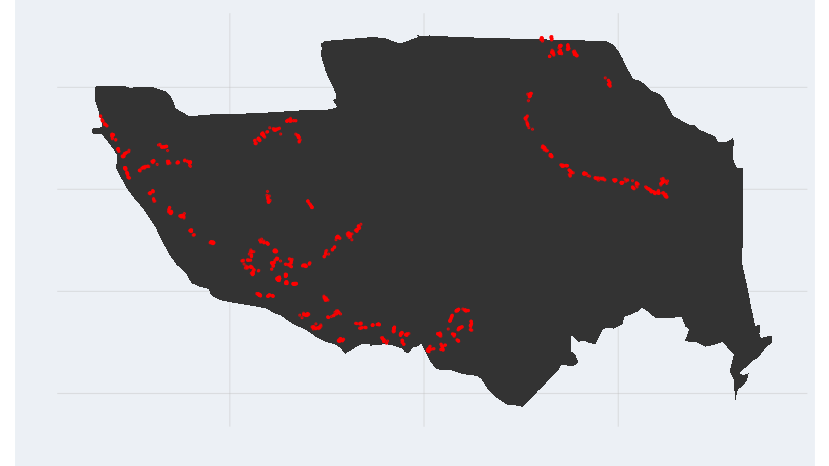

### Overall distribution of malaria (all ACD cases) with population (point map, jittered)

(Grey: house) (Red: malaria case)

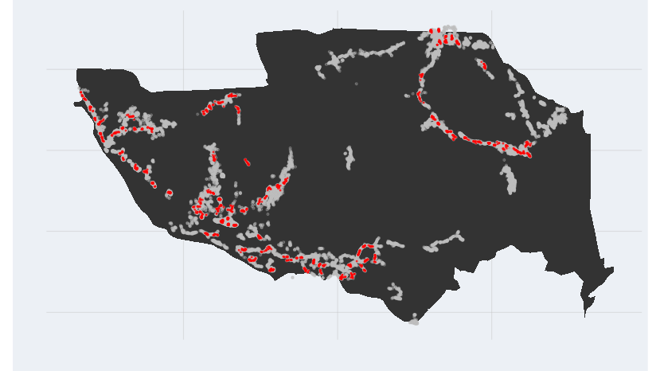

### Overall distribution of malaria (all ACD cases) ("heat map")

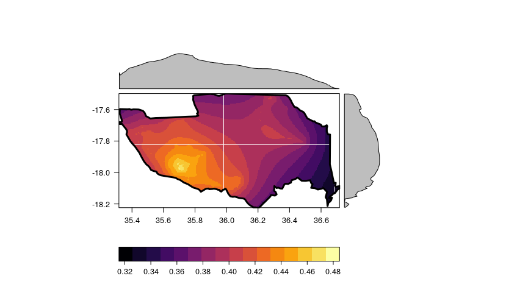

### Overall distribution of malaria, adjusted by human population (incidence heat map)

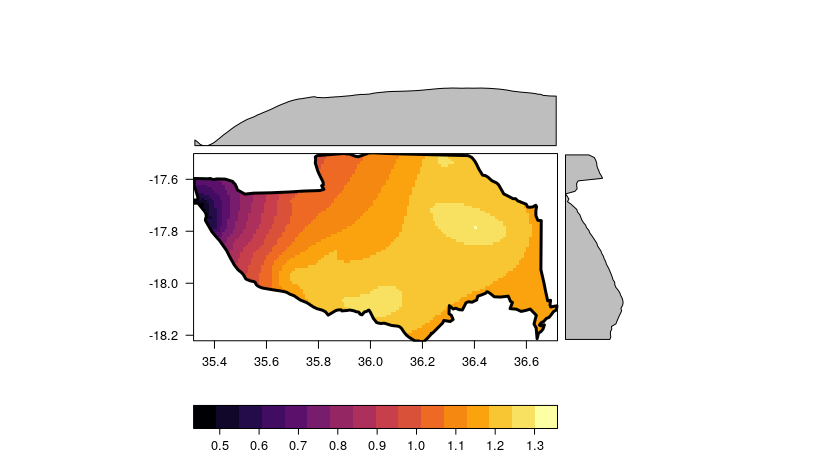

Map of livestock and malaria incidence combined into single index
=================================================================

(Excludes cattle)

The below shows the product of two values:

1.  The (percentilized) malaria distribution and

2.  The (percentilized) distribution of livestock

The lighter areas show areas with the highest (percentilized) values of both. In other words, light yellow means there is a lot of malaria and livestock, whereas dark purple means the opposite.

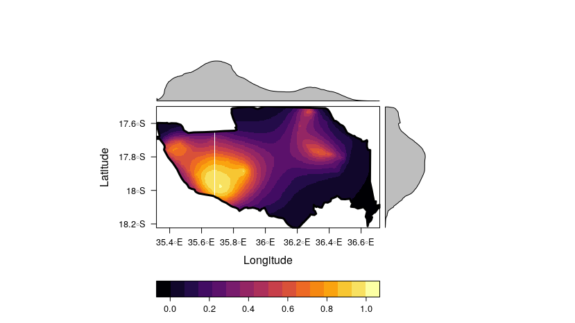

One problem with the above map is that it too closely tracks population density. There is, as would be expected, more malaria where there are more people. Accordingly, we can also examine our human population-adjusted malaria distribution and combine it (again using percentilized product aggregation) with the distribution of livestock. See below.

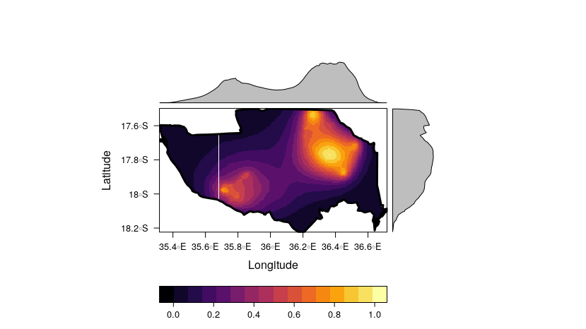

Pending: Map of mosquito densities
==================================

Technical details
=================

This document was produced on 2019-06-18 on a Linux machine (release 4.15.0-51-generic. To reproduce, one should take the following steps:

-   Clone the repository at <https://github.com/databrew/bohemia>

-   Populate the `analyses/livestock_distribution/data` directory with the following files: `Distribuicao de gado em Mopeia (1).xlsx` (emailed to team members from Charfudin Sacoor on May 27 2019);

-   Populate the `analyses/livestock_distribution/data/from_eldo` directory with the following files (emailed from Eldo to team on June 10 2019):

<!-- -->

    ├── Census_2016.csv
    ├── COST_ACD_Core_13-05-2019.csv
    ├── COST_ACD_Follow_Up_Core_13-05-2019.csv
    ├── COST_ACD_Follow_Up_V062017_Core_10-05-2019.csv
    ├── COST_Censo2017_Core.1.4.2019.csv
    ├── COST_CROSS_2017_Core_Final_11.04.2019.csv
    ├── COST_CROSS_2018_Core_Final_11.10.2018.csv
    ├── COST_Cross_2019_Core_10-06-2019.csv
    ├── COST_PCD_2019_Core_15-04-2019.csv
    ├── COST_PCD_V062017_Core_17-01-2019.csv
    ├── COST_SprayStatus_by_Village_Id_11.04.2019.EE.csv
    ├── Livestock_Mopeia.csv
    └── Pcd1_core.csv

-   Download the `COST_Permids.New&Old_EE.csv` file, sent by Eldo to team on June 11 2019, into `data/from_eldo`.

-   "Render" (using `rmarkdown`) the code in `analysis/livestock_distribution/README.Rmd`

Any questions or problems should be addressed to <joe@databrew.cc>
