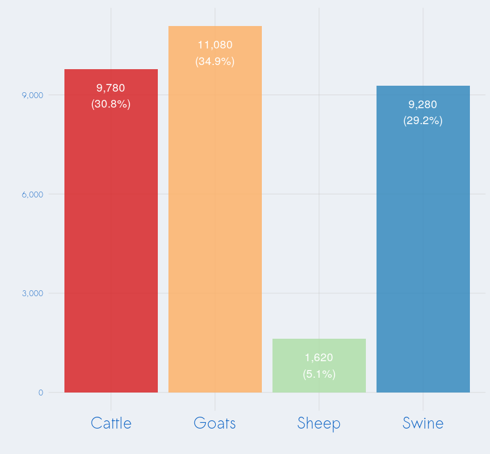
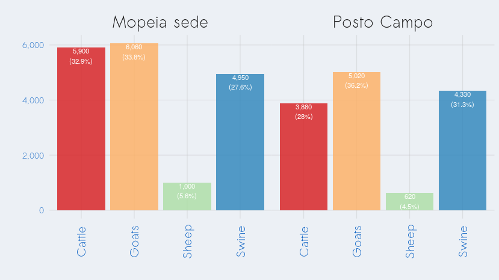
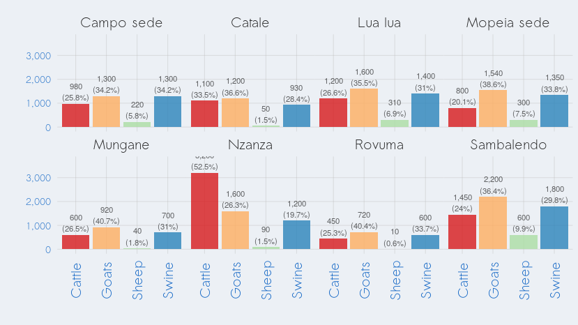
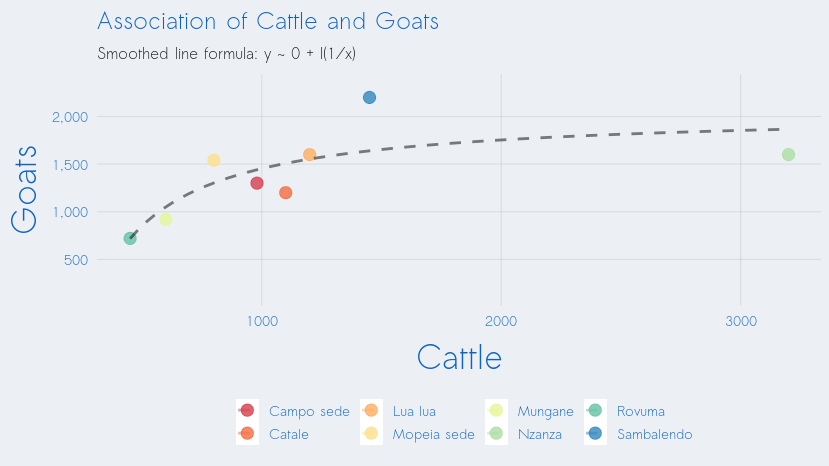
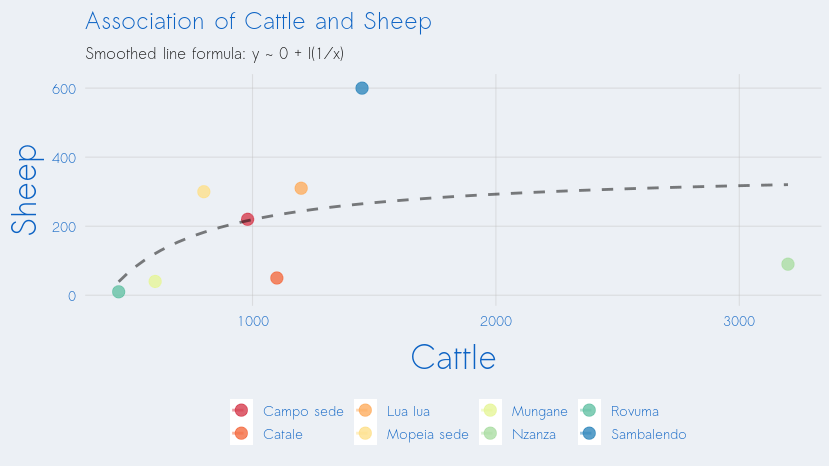
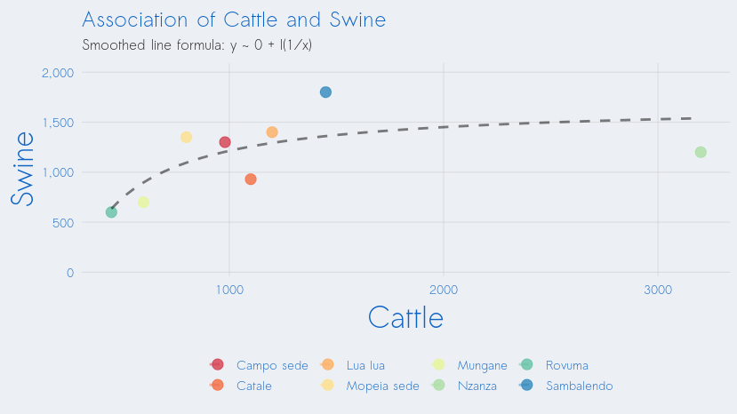
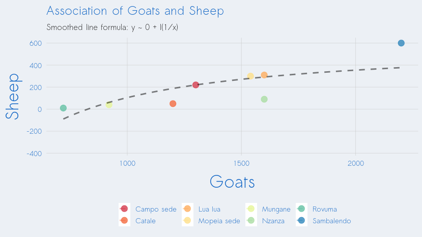
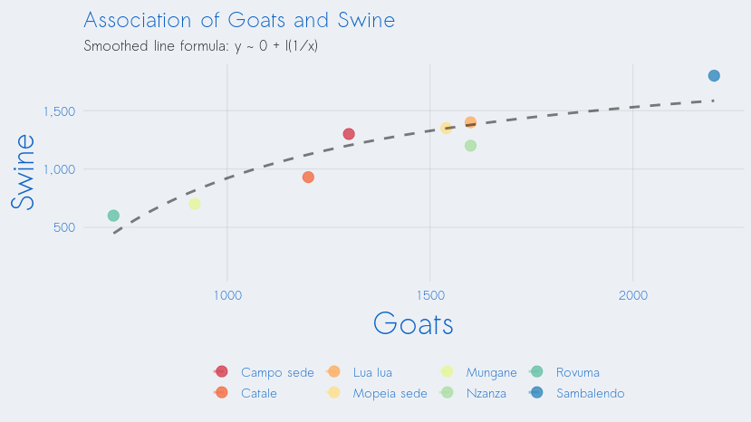
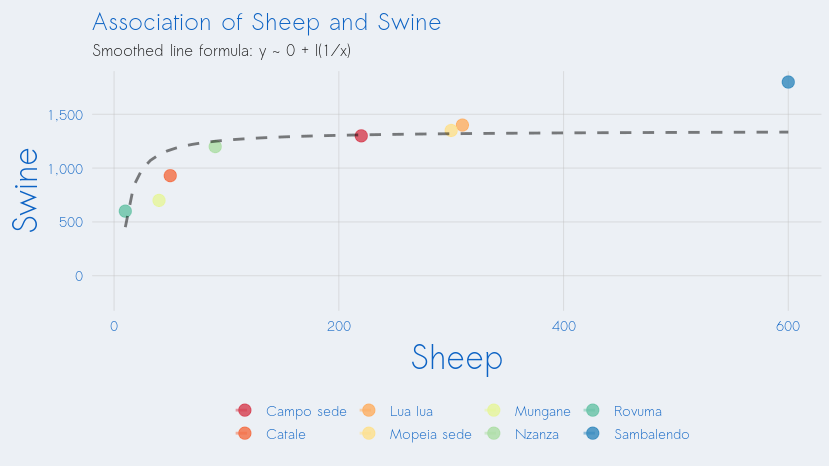

Livestock ownership and malaria risk in Mopeia
================

Overlap of livestock ownership
==============================

### Total livestock ownership (all localidades)

### Total livestock ownership (by "Posto Administrativo")

### Total livestock ownership (by "Localidade")

### Correlation between ownership of one animal and another

On May 27 2019, Cassidy Rist asked the following (via email):

    I wonder what the overlap is among livestock ownership. 
    For example, do most people own pigs and goats, or is it 
    more likely that one or the other species is owned?

As of now, we only have aggregate-level data (most granular: localidade). Without individual-level data, the above can be addressed. Until then. we can examine the correlation at the localidade level (below), but in doing so we're committing the ecological fallacy.

The below aims to address the above question, using aggregated data ("localidade"-level).

#### Cattle and Goats

#### Cattle and Sheep

#### Cattle and Swine

#### Goats and Sheep

#### Goats and Swine

#### Sheep and Swine

Map of livestock
================

Map of malaria incidence in cohort children
===========================================

Map of livestock and malaria incidence combined into single index
=================================================================

Pending: Map of mosquito densities
==================================

Technical details
=================

This document was produced on 2019-06-10 on a Linux machine (release 4.15.0-46-generic. To reproduce, one should take the following steps:

1.  Clone the repository at <https://github.com/databrew/bohemia>

2.  Populate the `analyses/livestock_distribution/data` directory with the following files: `Distribuicao de gado em Mopeia (1).xlsx` (emailed to team members from Charfudin Sacoor on May 27 2019);

3.  "Render" (using `rmarkdown`) the code in `analysis/livestock_distribution/README.Rmd`

Any questions or problems should be addressed to <joe@databrew.cc>
