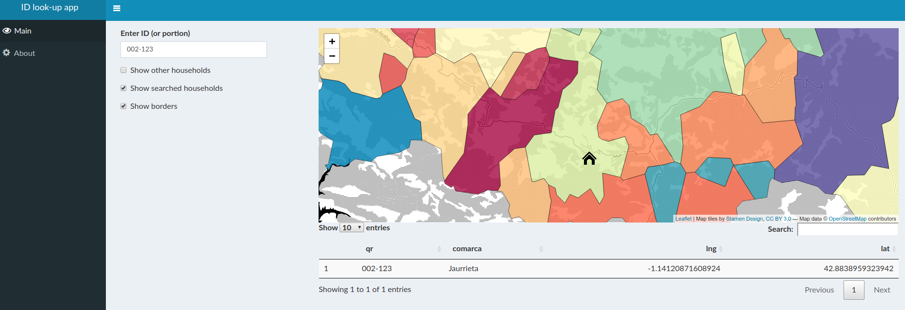

```{r setup, include=FALSE, echo = FALSE}
# Basic knitr options
library(knitr)
opts_chunk$set(comment = NA, 
               echo = FALSE, 
               warning = FALSE, 
               message = FALSE, 
               error = TRUE, 
               cache = FALSE,
               fig.width = 8,
               fig.height = 8,
               fig.path = 'figures/')
```


```{r}
# Libraries
library(tidyverse)
library(bohemia)
```

What follows is a walk-through of some of the issues and concerns that have been raised in regards to the proposed ID schema for the Bohemia project. The format is (a) header text outlining the concern and (b) regular text outlining details and (in some cases) rebuttal. The purpose of this document is not to provide definitive guidance, but rather to foster discussion.

Prior to reading this document, one should be familiar with the proposed Bohemia [location handling and ID framework](https://github.com/databrew/bohemia/blob/master/misc/location_and_ids.md).


## 1. The ID schema does not contain geographic information

This is true. The proposed ID framework for the Bohemia project is a 6 digit number (ie, `123-456`) in which no geographic data is explicitly stored. In other words, one cannot deduce the village based solely on the ID number.

This is different from many census projects, which often use a naming scheme in which certain portions of the ID number contain coded geographic information. For example, a household with ID `123-4567-890` might mean something like:

- `123`: The coded ID of the fieldworker  
- `4567`: The coded ID of the village  
- `890`: The household number, unique to that village  

The **advantage** of the traditional ID (with embedded geographic coding) is that one can quickly ascertain the village of a household based solely on its number (ie, "that household must be in Calanaga because it is numbered 4567").

However, there are several **disadvantages** to the traditional ID. These are:

* ID numbers have to be longer (more paint, more space, more time, more likelihood of error on input and transcription) 
* When errors occur (as they do inevitably), the embedded geographic info can actually cause _more_ confusion (ie, a house in village `123` might unintentionally be enumerated as `223`, which is actually the code of a different village)  
* There is an increased likelihood of duplication since there are no physical mechanisms to prevent it (this is particularly true when multiple fieldworkers enumerate the same village)  
* Using barcodes is difficult/impossible because they need to be pre-printed (as it is not known, _a priori_ how many codes should be printed for each village ID)  

The proposed 6-digit, geo-agnostic ID framework for the Bohemia project has the following advantages:

* ID numbers are short (less paint, less time, less likelihood of error)
* ID numbers do not contain geographic information embedded (but geographic information can be retrieved via a look-up app, such as http://bohemia.team:3838/ids/)
* A physical constraint (printed QR stickers) prevents duplication


## 2. The traditional ID schema allows for aggregate geographic calculations

The traditional ID schema, with its embedded geographic code, allows for straightforward aggregate geographic calculations. This is true: from ID numbers alone, one knows (a) where the house is located, (b) how many houses are enumerated in that hamlet, (c) the limitations of the hamlet, (d) the physical sequence of households, etc.

However, all of the above is also possible with the proposed geo-agnostic system. Geographic information (lat, lng, hamlet name, etc.) is collected on all households, _regardless_ of ID nomenclature. Accordingly, geographic information can be retrieved on all households, regardless of ID nomenclature. For example, in this dummy web application (http://bohemia.team:3838/ids/) one can type in the ID of any household(s) and retrieve the neighborhood, location, etc. The web application also can generate village borders (via voronoi tesselation) based solely on the point data of the households by clicking "Show borders".




## 3. The traditional ID schema is operationally useful for workers

It has been mentioned that the traditional ID schema (with embedded geographic information) is operationally useful for workers, since they can quickly ascertain which hamlet they are in based on the observed ID numbers, and can find a household quickly with the help of a hamlet chief using the (unique) sub-hamlet ID number. In this area, it is clear that the traditional schema is superior to the proposed new schema. If workers commonly are unaware of the hamlets they are in, or need to find households offline based on a sequential numbering system, then the traditional schema is advantageous for this.

## 4. Sustainability

Concerns have been raised regarding the sustainability of QR stickers. Will they hold up to 5 years of rain and sun? Are they difficult to acquire locally?

It is unknown at this point exactly how the stickers will hold up under real-world conditions. For this reason, we propose an intentionally redundant approaching using both stickers and paint. In the case of one failing, the other should remain.

It should be noted, however, that outdoor barcodes have previously been used for census operations. A national [census in South Africa](http://www.statssa.gov.za/census/census_2001/theCount/Count.pdf) used them on doors. It is common [in industry](http://www.brady.eu/en-eu/related-information/labels/tough-outdoor-labels) to use printed QR stickers for outdoor furniture, vehicles, etc. 

In regards to local acquisition / printing capabilities, we are not aware of which local options exist. 

## 5. Costs

We proposed the QR option with the assumption that the savings from reduced errors would offset the printing and materials costs. The cost per label would vary depending on whether (a) sites outsourced the printing or (b) sites chose to acquire materials and print themselves. In the latter case, we estimate:

- 600-1000 USD for the printer (such as the Zebra ZD420t or Zebra ZT220)
- 340 USD for 30,000 labels (such as Zebra 8000t CryoCool, 30x15)
- 500 USD incidentals, replacements

For a total of $2000. It is most likely cheaper to do this via a contractual printing service, but this has the disadavantage of not being to print replacements ad-hoc, etc. (see item 7).

## 6. Time

Operations are going to begin in March. It was asked whether it will be possible to have everything prepared by then. 

We cannot speak for acquisitions timing in Mozambique (don't know how long these processes take). Acquiring printing materials or printing through a third party contractor in Europe would be relatively immediate (<1 week).

## 7. Operationality

**Replacement**: A concern was raised regarding how to replace damaged codes. In the case of acquiring an in-house printer, this would be straightforward. In the case of a third-party contractor, this would depend on whether it was nearby. 

**Size**: Questions were raised regarding size. The stickers would be small: 30 x 15 mm. For a fieldworker to see the house number, the paint would still be the main visual identifier.

**Similar numbers**: A concern was raised regarding repeated house numbers. For example, if three fieldworkers worked in the same village, there might be three houses with ID numbers: `123-000`, `153-000`, `221-000` (ie, three households ending in 000). This would be possible up to a maximum of the number of fieldworkers enumerating that village. If this posed problems, the issue could be reduced / eliminated by planning the assignation of QR codes per village, and/or randomizing their assignment order (rather than sequential assignment).


## 8. Final comments

The proposed ID nomenclature was created with the aim of _simplifying_ operations and _reducing_ errors. If it achieves these goals, we should pursue it. However, if the operations experts feel that it _complicates_ their work or _increases_ errors, we still have time to revert to our discuss other options.
