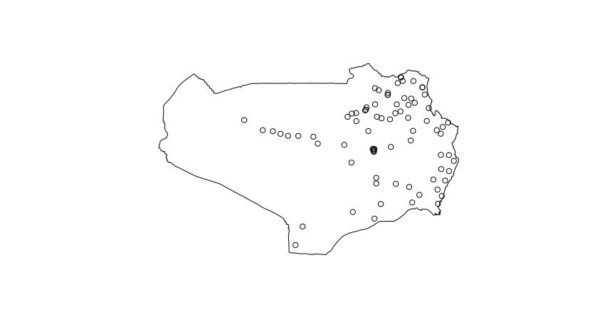
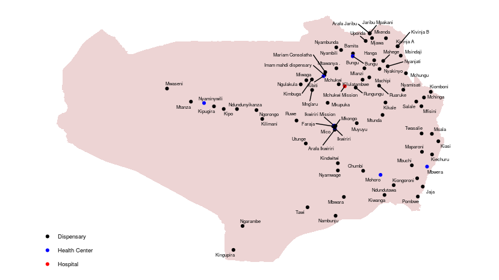
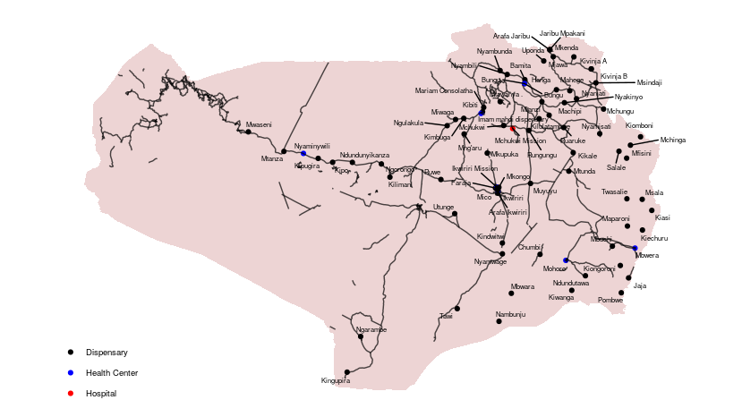
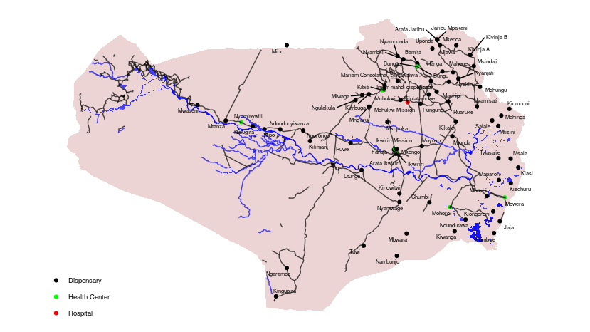

Rufiji health post locations
================

**What**: What follows are some code examples for generating maps of
Rufiji health facility locations.

**Why**: Issa requested technical assistance from Joe to generate maps
of Rufiji health posts. To the extent that both (a) the maps themselve
and (b) the code for generating the maps may be useful to others
involved in the Bohemia project, this document is being made public.

``` r
# Libraries
library(Hmisc)
library(tidyverse)
library(readxl)
library(ggplot2)
library(haven)
library(bohemia)
library(sp)
library(ggthemes)
library(ggrepel)
# Read in rufiji data
hp <- read_excel('Health facilities in Rufiji Valley.xlsx')
names(hp) <- Hmisc::capitalize(names(hp))
# Classify the types of posts
hp <- hp %>%
  dplyr::mutate(type = ifelse(grepl('Hospital', `Facility name`),
                              'Hospital',
                              ifelse(grepl('Health Center', `Facility name`),
                                     'Health Center',
                                     ifelse(grepl('Dispensary', `Facility name`),
                                            'Dispensary', 'Other'))))
```

## Simple plot

``` r
plot(bohemia::ruf2)
points(hp$Longitude, hp$Latitude)
```

<!-- -->

## Slightly more beautiful plot

``` r
rufex <- fortify(bohemia::ruf2, id = NAME_2)
ggplot() +
  geom_polygon(data = rufex,
       aes(x = long,
           y = lat,
           group = group),
       fill = 'brown',
       alpha = 0.2) +
  theme_map() +
    coord_map() +
  geom_point(data = hp,
             aes(x = Longitude,
                 y = Latitude))
```

<!-- -->

## Map with labels

``` r
# "Fortify" the map data
rufex <- fortify(bohemia::ruf2, id = NAME_2)
# Modify the point data
pd <- hp %>%
               dplyr::mutate(`Facility name` = gsub(' Hospital| Health Center| Dispensary', '', `Facility name`))
ggplot() +
  geom_polygon(data = rufex,
       aes(x = long,
           y = lat,
           group = group),
       fill = 'brown',
       alpha = 0.2) +
  theme_map() +
    coord_map() +
  geom_point(data = pd,
             aes(x = Longitude,
                 y = Latitude,
                 color = type)) +
  geom_text_repel(data = pd,
                  aes(x = Longitude,
                      y = Latitude,
                      label = `Facility name`),
                  size = 2) +
  scale_color_manual(name = '',
                     values = c('black','blue', 'red'))
```

<!-- -->

## Map with labels and roads

``` r
# "Fortify" the map data
rufex <- fortify(bohemia::ruf2, id = NAME_2)
roads <- fortify(bohemia::rufiji_roads, id = osm_id)
# Modify the point data
pd <- hp %>%
               dplyr::mutate(`Facility name` = gsub(' Hospital| Health Center| Dispensary', '', `Facility name`))
ggplot() +
  geom_polygon(data = rufex,
       aes(x = long,
           y = lat,
           group = group),
       fill = 'brown',
       alpha = 0.2) +
  theme_map() +
    coord_map() +
  geom_point(data = pd,
             aes(x = Longitude,
                 y = Latitude,
                 color = type)) +
  geom_text_repel(data = pd,
                  aes(x = Longitude,
                      y = Latitude,
                      label = `Facility name`),
                  size = 2) +
  geom_path(data = roads,
                   aes(x = long,
                       y = lat,
                       group = group),
            alpha = 0.7,
            color = 'black') +
  scale_color_manual(name = '',
                     values = c('black','blue', 'red')) 
```

<!-- -->

## Map with labels, roads, and water

``` r
# "Fortify" the map data
rufex <- fortify(bohemia::ruf2, id = NAME_2)
roads <- fortify(bohemia::rufiji_roads, id = osm_id)
water <- fortify(bohemia::rufiji_water, id = osm_id)
waterways <- fortify(bohemia::rufiji_waterways, id = osm_id)
# Modify the point data
pd <- hp %>%
               dplyr::mutate(`Facility name` = gsub(' Hospital| Health Center| Dispensary', '', `Facility name`))
ggplot() +
  geom_polygon(data = rufex,
       aes(x = long,
           y = lat,
           group = group),
       fill = 'brown',
       alpha = 0.2) +
  theme_map() +
  coord_map() +
  geom_point(data = pd,
             aes(x = Longitude,
                 y = Latitude,
                 color = type)) +
  geom_path(data = roads,
                   aes(x = long,
                       y = lat,
                       group = group),
            alpha = 0.7,
            color = 'black') +
  geom_polygon(data = water,
               aes(x = long,
                   y = lat,
                   group = group),
               fill = 'blue',
               alpha = 0.7) +
    geom_path(data = waterways,
               aes(x = long,
                   y = lat,
                   group = group),
               color = 'blue',
               alpha = 0.7) +
  geom_text_repel(data = pd,
                  aes(x = Longitude,
                      y = Latitude,
                      label = `Facility name`),
                  size = 2) +
  scale_color_manual(name = '',
                     values = c('black','green', 'red')) 
```

<!-- -->

## Interactive plot

The below generates an interactive plot. It’s available for viewing at
[databrew.cc/rufiji.html](databrew.cc/rufiji.html).

``` r
library(leaflet)
library(leaflet.extras)
library(htmlwidgets)

l <- leaflet() %>%
  addProviderTiles(provider = providers$Esri.WorldImagery) %>%
  addPolygons(data = bohemia::ruf2,
              stroke = NA,
              color = 'red') %>%
  addMarkers(data = hp, lng = ~Longitude, lat = ~Latitude,
             popup = ~`Facility name`)
# l
htmlwidgets::saveWidget(l, file = 'rufiji.html', selfcontained = TRUE)
```

## Technical details

This document was produced on 2019-07-15 on a Linux machine (release
4.18.0-25-generic. To reproduce, one should take the following steps:

  - Clone the repository at <https://github.com/databrew/bohemia>

  - “Render” (using `rmarkdown`) the code in
    `analysis/rufiji_health_posts/README.Rmd`

Any questions or problems should be addressed to <joe@databrew.cc>
