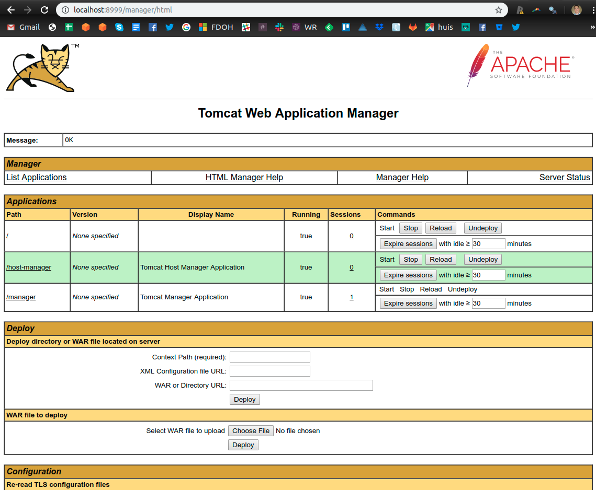
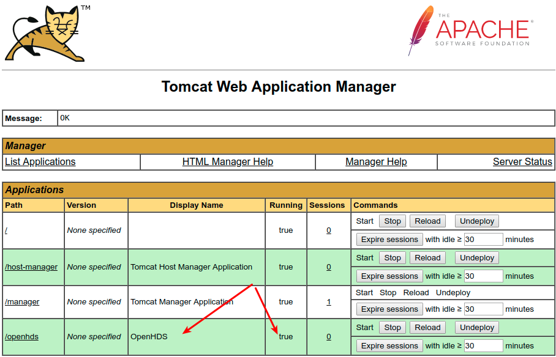
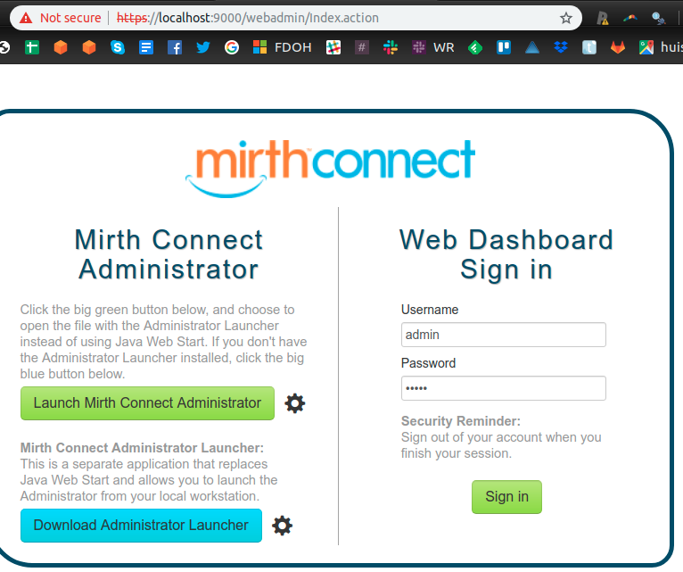
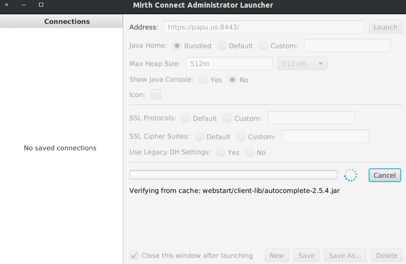
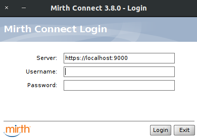
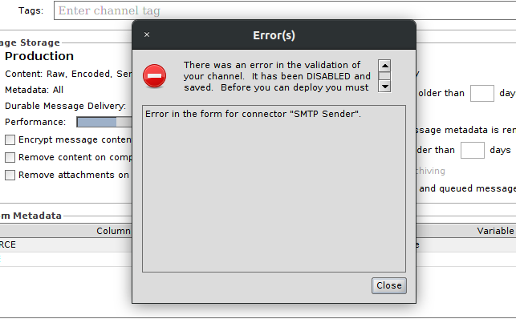
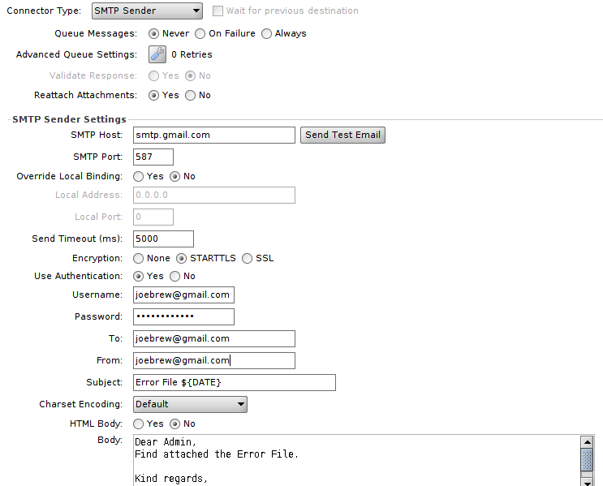

# Admin guide for setting up the Bohemia project data system (OpenHDS+)

The below guide is a walk-through of setting up the Bohemia data infrastructure. It assumes you are running a cloud server on AWS (which will not be the case for local sites). For local servers, much of the ssh, tunneling, etc. sections can simply be ignored/altered.

## Spin up an EC2 instance on AWS

_The below should only be followed for the case of a remote server on AWS. In production, sites will use local servers, physically housed at the study sites. In the latter case, skip to the [Setting up OpenHDS section](https://github.com/databrew/bohemia/blob/master/guide/guide.md#setting-up-openhds)_


- Log into the AWS console: aws.amazon.com
- In the upper right hand corner select "Sign-into Console"
- Click the “Launch a virtual machine” option under “Build a solution”
- Select "Amazon Linux 2 AMI (HVM) SSD"
-To the far right select 64-bit (x86)  
- Click “select”  
- Choose the default instance type (General purpose, t2.large, 2 vCPUs, 8 gb memory, etc.)  
- Click “Review and launch”
- Click “Edit security groups”
- Ensure that there is an SSH type rule with source set to `0.0.0.0/0` to allow any address to SSH in. Set "Source" to "Anywhere"
- Create a second rule with "Type" set to "All traffic", the "Port Range" set to 0-65535, and the "Source" set to "Anywhere"
- Create a third rule with "Type" set to "HTTP" and "Port Range" set to 80
- Create a fourth rule with "Type" set to "HTTPS", Port Range set to 443
- Create a fifth rule with Type "Custom TCP Rule", Port Range 8080, Source 0.0.0.0/0, ::/0
- Click “launch” in the bottom right
- A modal will show up saying “Select an existing key pair or create a new key pair”
- Select “Create a new key pair”
- Name it “openhdskey”
- Download the `.pem` file into your `/home/<username>/.ssh/id_rsa` directory
- If that directory does not exist, run the steps in the next section (“Setting up SSH keys”)
- Run the following to change permissions on your key: `chmod 400 ~/.ssh/openhdskey.pem`
- Click “Launch instances”
- Wait a few minutes for the system to launch (check the "launch log" if you’re impatient)
- Click on the name of the instance (once launched)
- This will bring you to the instances menu, where you can see things (in the “Description” tab below) like public IP address, etc.


### Setting up SSH keys

- If you don’t have an SSH key on your system yet, run the following:
`ssh-keygen -t rsa -b 4096 -C “youremail@host.com”`
- Select defaults (ie, press enter when it asks you the location, password, etc.)
- You will now have a file at `/home/<username>/.ssh/id_rsa`
- To verify, type: `ls ~/.ssh/id_*` (this will show your key)
- To change permissions to be slightly safer, run the following: `chmod 400 ~/.ssh/id_rsa`

### Connect to the servers

- In the “Instances” menu, click on “Connect” in the upper left
- This will give instructions for connecting via an SSH client
- It will be something very similar to the following:

```
ssh -i "/home/joebrew/.ssh/openhdskey.pem" ec2-user@ec2-18-222-111-104.us-east-2.compute.amazonaws.com
```

- Congratulations! You are now able to run linux commands on your new ubuntu server

### Managing users (ie, creating ssh keypairs for other users)

- Having ssh’ed into the server, run the following: `sudo adduser <username_of_new_user>`
- Type a password
- Press “enter” for all other options
- To create a user with no password, run the following: `sudo adduser <username_of_new_user> --disabled-password`. For example:
`sudo adduser benmbrew --disabled-password`
- Switch to that user: `sudo su -  benmbrew`
- Create a `.ssh` directory for the new user and change permissions:
`mkdir .ssh; chmod 700 .ssh`
- Create a file named “authorized_+keys” in the `.ssh` dir and change permissions: `touch .ssh/authorized_keys; chmod 600 .ssh/authorized_keys`
- Open whatever public key is going to be associated with this user (the .pub file) and paste the  content into the authorized_keys file (ie, open authorized_keys in nano first and then copy-paste from your local machine)
Grant sudo access to the new users: `sudo usermod -a -G sudo benmbrew`

## Getting the server set-up for hosting
- Run the following after ssh'ing into the server: `sudo yum update`
- Run the following after ssh'ing into the server: `sudo yum install httpd -y`
- Start the httpd service: `sudo service httpd start`
- Check the status: `sudo service httpd status`
- Ensure that httpd always runs on system reboot: `sudo chkconfig httpd on`
- Go to this directory: `cd /var/www/html`
- Get a dummy index.html to put there: `sudo wget https://raw.githubusercontent.com/databrew/bohemia/master/guide/misc/index.html .`
- Go to the EC2 instance's public domain and ensure that it's working (for example, http://ec2-18-222-111-104.us-east-2.compute.amazonaws.com/)


### Setting up Linux  

- This guide was written for, and assumes, Amazon Linux 2. Full details below:  NAME="Amazon Linux"
VERSION="2"
ID="amzn"
ID_LIKE="centos rhel fedora"
VERSION_ID="2"
PRETTY_NAME="Amazon Linux 2"
ANSI_COLOR="0;33"
CPE_NAME="cpe:2.3:o:amazon:amazon_linux:2"
HOME_URL="https://amazonlinux.com/"
Amazon Linux release 2 (Karoo)

```
NAME="Amazon Linux"
VERSION="2"
ID="amzn"
ID_LIKE="centos rhel fedora"
VERSION_ID="2"
PRETTY_NAME="Amazon Linux 2"
ANSI_COLOR="0;33"
CPE_NAME="cpe:2.3:o:amazon:amazon_linux:2"
HOME_URL="https://amazonlinux.com/"
Amazon Linux release 2 (Karoo)
```
- Update the hostname of the machine to be `data-management.local`. You can check the hostname by running `hostnamectl` and examing the `Static hostname` parameter. To update the hostname, run the following:
```
sudo hostnamectl set-hostname data-management.local
```
- Then, make the hostname change persistent across sessions by running: `sudo nano /etc/cloud/cloud.cfg`
- Add the below line to the bottom of the file:
```
preserve_hostname: true
```
- Ensure that the change worked. Run `sudo reboot`, wait a few seconds, ssh back into the instance and run `hostname`. It should show `data-management.local`

- Then, open /etc/hosts by running `sudo nano /etc/hosts` and add the following line:
```
127.0.0.1 data-management.local
```
- Then, open the /etc/cloud/cloud.cfg file by running `sudo nano /etc/cloud/cloud.cfg` and change the `preserve_hostname` parameter from `false` to `true`.

- If the file is not writable run `sudo chmod /etc/cloud/cloud.cfg`

### Installing Java 8

- Run the following to install Java 8: `sudo yum -y install java-1.8.0-openjdk java-1.8.0-openjdk-devel`
- This guide was written with the following version (produced running `java -version`):

```
openjdk version "1.8.0_201"
OpenJDK Runtime Environment (build 1.8.0_201-b09)
OpenJDK 64-Bit Server VM (build 25.201-b09, mixed mode)
```

### Installing MySQL Server

- Run the following to install MySQL Server: `sudo apt-get install mysql-server`
```
sudo yum localinstall https://dev.mysql.com/get/mysql80-community-release-el7-1.noarch.rpm
sudo yum install mysql-community-server
sudo systemctl start mysqld
```

#### Setting up MySQL Server

- Locate the temporary password for root: `sudo grep 'temporary password' /var/log/mysqld.log`
- Set a new password by running `sudo mysql_secure_installation`
  - Enter old password when prompted
  - Enter new password: `A1b4exg!adlz8`
  - Say "no" to all options except reloading the privilege tables

- Log-in: `sudo mysql -uroot -p'A1b4exg!adlz8'` (this opens the MySQL command line interface using the `root` user)
- To get a better password, we first have to lower the security level a bit. Run the following to see what can be modified:
```
SHOW VARIABLES LIKE 'validate_password%';
```
- Run:
```
SET GLOBAL validate_password.policy=LOW;
SET GLOBAL validate_password.length=0;
SET GLOBAL validate_password.mixed_case_count=0;
SET GLOBAL validate_password.number_count=0;
SET GLOBAL validate_password.special_char_count=0;
```
- Now rerun `sudo mysql_secure_installation`
- Set password to `data`
- Now log-in using the new password: `sudo mysql -uroot -pdata`

- The following should now appear (indicating that you are succesfully in the MySQL CLI): `mysql>`
- Create a user: `CREATE USER 'data'@'%' IDENTIFIED BY 'data';` (this will throw an error if run more than once)
- Create databases:
```
CREATE DATABASE IF NOT EXISTS openhds;
CREATE DATABASE IF NOT EXISTS odk_prod;
```
- Grant access privileges to user:
`GRANT ALL ON *.* TO 'data'@'%';`
`GRANT ALL PRIVILEGES ON *.*`
- Flush privileges: `flush privileges;`
- Exit MySQL cli (ctrl+d)  
- Restart MySQL-service by running: `sudo systemctl stop mysqld; sudo systemctl start mysqld`

### Installing Tomcat

- Run the following:
```
sudo groupadd tomcat
sudo useradd -M -s /bin/nologin -g tomcat -d /opt/tomcat tomcat
cd ~
wget https://archive.apache.org/dist/tomcat/tomcat-8/v8.5.9/bin/apache-tomcat-8.5.9.tar.gz
sudo mkdir /opt/tomcat
sudo tar xvf apache-tomcat-8*tar.gz -C /opt/tomcat --strip-components=1
```
- Update permissions:
```
cd /opt/tomcat
sudo chgrp -R tomcat /opt/tomcat
sudo chmod -R g+r conf
sudo chmod g+x conf
sudo chown -R tomcat webapps/ work/ temp/ logs/
```
- Set up Systemd file:
```
sudo nano /etc/systemd/system/tomcat.service
```
- Paste the below into the new file:
```
# Systemd unit file for tomcat
[Unit]
Description=Apache Tomcat Web Application Container
After=syslog.target network.target

[Service]
Type=forking

Environment=JAVA_HOME=/usr/lib/jvm/jre
Environment=CATALINA_PID=/opt/tomcat/temp/tomcat.pid
Environment=CATALINA_HOME=/opt/tomcat
Environment=CATALINA_BASE=/opt/tomcat
Environment='CATALINA_OPTS=-Xms512M -Xmx1024M -server -XX:+UseParallelGC'
Environment='JAVA_OPTS=-Djava.awt.headless=true -Djava.security.egd=file:/dev/./urandom'

ExecStart=/opt/tomcat/bin/startup.sh
ExecStop=/bin/kill -15 $MAINPID

User=tomcat
Group=tomcat
UMask=0007
RestartSec=10
Restart=always

[Install]
WantedBy=multi-user.target
```
- Reload: `sudo systemctl daemon-reload`
- Start tomcat: `sudo systemctl start tomcat`
- Check the status: `sudo systemctl status tomcat`
- Ensure that it runs on boot: `sudo systemctl enable tomcat`

- Set `JAVA_HOME` variable
  - `export JAVA_HOME=/usr/lib/jvm/java-1.8.0-openjdk-1.8.0.201.b09-0.amzn2.x86_64`
  - `sudo nano /etc/profile` and add line like `export JAVA_HOME="/usr/lib/jvm/java-1.8.0-openjdk-1.8.0.201.b09-0.amzn2.x86_64"`

- Create tomcat users: `sudo nano /opt/tomcat/conf/tomcat-users.xml`
- In the `tomcat-users` section, create a new role by adding the following lines:
```
<role rolename="manager-gui" />
<user username="data" password="data" roles="manager-gui" />
```
- Run the following to allow Tomcat to be run on different machines:
```
sudo nano /opt/tomcat/webapps/manager/META-INF/context.xml
```
- And then comment out the `<Valve>` section. In other words, that area of the file should look like this:
```
<Context antiResourceLocking="false" privileged="true" >
<!--
  <Valve className="org.apache.catalina.valves.RemoteAddrValve"
         allow="127\.\d+\.\d+\.\d+|::1|0:0:0:0:0:0:0:1" />
-->
</Context>
```
- Restart the tomcat service: `sudo systemctl restart tomcat`
- Increase memory allocation to Tomcat (not doing for now) in (`/etc/systemd/system/tomcat.service`): `CATALINA_OPTS="-Xms512M -Xmx1024M"`
- Ensure that everything is working up by going to the following address in your local web browser: http://18.223.119.121:8080/manager/ (Replace the IP address with the address of your Ec2 instance)
- You can now log-in as Username: `data` and Password: `data`. Once logged-in, the below will appear in the web browswer.



### Installing the MySQL-J Connector


- Install the mysql lib package with `sudo yum install mysql-connector-java` which will put the MySQL connector into `/usr/share/java`
- `cd` to `/opt/tomcat/lib`
- Create a symbolic link:
```
sudo ln -s ../../../usr/share/java/mysql-connector-java.jar mysql-connector-java.jar
```
- Restart the Tomcat service: `sudo systemctl restart tomcat`

### Install SSH-server

```
sudo yum install -y openssh-server
```
- Start it: `sudo service sshd start;`
- Ensure it's up and running `sudo service ssh status`
- Ensure it starts on boot: `sudo systemctl enable sshd` (not sure if this is working!)

### Getting and setting up openhds

- On your _local_ machine, run the following to download openhds-server
```
sudo apt install unzip
cd ~/Documents # change to any directory you prefer
mkdir openhds
cd openhds
wget https://github.com/SwissTPH/openhds-server/releases/download/openhds-1.6/openhds.war
```
- If you need to edit fields, do the below and then re-jar
  - Extract via: `unzip openhds.war`
  - Edit the fields in `WEB-INF/classes/database.properties` to ensure that `dbURL`, `dbUser` and `dbPass` are adequate (only if changed from this guide)
  - If desired, edit values in `WEB-INF/classes/codes.properties` (and other documents in the same directory) to change parameters.
  - Put everything back in the .war file: `rm openhds.war; jar -cvf openhds.war *`

### Deploying OpenHDS in Tomcat

- On your local machine, go to http://18.223.119.121:8080/manager/html (replace IP address if applicable)
- Scroll down to the "Select WAR file to upload" section
- Select the `openhds.war` file you downloaded a few minutes ago in the "Choose File" menu.
- Click "Deploy" button (see below image)

- Click the "start" button on the 'openhds' row of the 'Applications table'. The app is now running.
- Things should appear as below:


### Setting up OpenHDS data requirements

You now need to insert some data into the openhds-database. Take the following steps:
- On the remote server, run the following so as to get the openhds files (you previously ran this on your local machine):
```
sudo apt install unzip
cd /home/ubuntu # change to any directory you prefer
mkdir openhds
cd openhds
wget https://github.com/SwissTPH/openhds-server/releases/download/openhds-1.6/openhds.war
```
- Extract its contents: `unzip openhds.war`
- In the location where its contents have been extracted, run the code in `WEB-INF/classes/openhds-required-data.sql` by executing the following:
```
cd WEB-INF/classes
sudo mysql -udata -pdata openhds openhds-required-data.sql
```
- If you get any errors, then take the following steps:
  - On the remote server, open the mysql cli by running `sudo mysql -udata -pdata openhds`
  - On the local machine, open `WEB-INF/classes/openhds-required-data.sql`
  - Copy lines from local to remote, running 1 by 1. If errors found, debug.


### Confirm that everything is working so far

- To confirm that everything is working at this point, on your local machine, visit `localhost:8999/openhds` in the browser. A green log-in screen should appear.
- If you want, change the language
- Log in with credentials "admin" and "test"
- Click on parameters in the far left and change if required (not yet)

## Installing Mirth
- On your local machine go to https://www.nextgen.com/products-and-services/integration-engine
- Right click on the `Installer` link under "Nextgen Connect Integration Engine 3.80" and save the `.sh` file locally
- On your remote server, run the following:
```
cd /home/ubuntu
mkdir mirth
cd mirth
```
- `cd` into the local directory where you downloaded the `.sh` file.
- Now copy the downloaded `.tar.gz` file from your local to remote machine by running the following on your local machine as such (file names, paths, endpoint, etc. may vary):
```
scp -i "/home/joebrew/.ssh/openhdskey.pem" mirthconnect-3.8.0.b2464-unix.sh ec2-user@ec2-18-222-111-104.us-east-2.compute.amazonaws.com:/home/ubuntu/mirth
```
- Prior to installing the `.sh` file, you need to change some options in your java configuration:
  - Run the following: `sudo nano /etc/java-8-openjdk/accessibility.properties`
  - Comment out the line that says `assistive_technologies=org.GNOME.Accessibility.AtkWrapper`
- From the remote machine, run `chmod a+x mirthconnect-3.8.0.b2464-unix.sh`
- Run the installer: `sudo ./mirthconnect-3.8.0.b2464-unix.sh`
- You'll need to press `Enter` and `1` a few times to confirm the license agreement
- When it asks "Where should Mirth Connect be installed?", type `/usr/'local/mirthconnect'`
- When it asks "Which components should be installed?", press `Enter`
- When it asks "Create symlinks?", press `Enter` (ie, "Yes")
- When it asks "Select the folder where you would like Mirth Connect to create symlinks", type `Enter` to confirm the local `/usr/local/bin`
- When it asks which port (Web Start Port), type 8082 (since 8080 is already used by Tomcat)
- When it asks for the Administrator Port, keep as default 8443 (press `Enter`)
- For all password options, keep default (ie, press `Enter`)
- For "Application data", type: `/usr/local/mirthconnect/data` # (Comment for self"!!IMPORTANT, THIS SHOULD PERHAPS BE `apps`)
- For Logs, type: `/usr/local/mirthconnect/logs`
- Install and run

- To confirm that everything is working, serve the Mirth Connect Administrator to your local browser via an SSH tunnel:
```
ssh -i /home/joebrew/.ssh/openhdskey.pem -N -L 9000:ec2-18-222-111-104.us-east-2.compute.amazonaws.com:8443 ec2-user@ec2-18-222-111-104.us-east-2.compute.amazonaws.com -v
```

- Now open the following url in your local browser: `https://localhost:9000`
- Sign in with the credentials `admin` (username) and `admin` (password)


### Configure mirth to work with MySQL
- By default, Mirth will use a Derby database; we must change this to MySQL. Do so as follows.
- Get into mysql cli: `sudo mysql -uroot -pdata`
- Run the following:
```
CREATE DATABASE mirthdb DEFAULT CHARACTER SET utf8;
GRANT ALL ON mirthdb.* TO data@'%' IDENTIFIED BY 'data' WITH GRANT OPTION;
```
- Run `sudo nano /usr/local/mirthconnect/conf/mirth.properties`
- Replace the `database = derby` line with `database = mysql`
- Replace the `database.url` line with `database.url = jdbc:mysql://localhost:3306/mirthdb`
- Set values for `database.username` and `database.password` to `data` and `data`
- Restart the mirth service: `sudo service mcservice restart`
- You can now log into the Mirth Connect Administrator with the `admin/admin`. To do this, first make a tunnel:
```
ssh -i /home/joebrew/.ssh/openhdskey.pem -N -L 9000:ec2-18-222-111-104.us-east-2.compute.amazonaws.com:8443 ec2-user@ec2-18-222-111-104.us-east-2.compute.amazonaws.com -v
```
- Go to `https://localhost:9000` in your local browser. You may get a warning about site security (since it's not https). Affirm.
- Log in with `admin` as Username and `admin` as Password (just to ensure that it works)
- Log out
- I believe that the next step is unnecessary: Keeping here temporarily. Do not run:
    - Click "Launch Mirth Connect Administrator". This will download a `.jnlp` file to your local machine, which you can then use `icedtea-netx` to run:
    ```
    sudo apt-get intall icedtea-netx
    javaws webstart.jnlp
    ```
    (In the applet, go through and say "yes" to everything, checking "Remember this option" "For applet" for all options)

- Click "Download the Administrator Launcher" in the bottom left
- Give all the requested permissions
- A file will be downloaded to your local machine
- Make that file executable: `chmod +x mirth-administrator-launcher-1.1.0-unix.sh`
- Execute the file: `sudo ./mirth-administrator-launcher-1.1.0-unix.sh`
- Set the Address to the ssh tunnel: `https://localhost:9000`

- Click launch
- Now the Mirth Connect Administrator will launch
- Again set address to the ssh tunnel: `https://localhost:9000`

- The Mirth Connect Administrator will prompt you to register and change passwords. Keep password and user as `admin`.
- Then right click on a user in the `Users` table and create a new user named `data` with password `data`

- You now have a program on your local machine called "Mirth Connect Administrator Launcher". Search for it by clicking on the unity tab
- Remember, to run it, you'll need to have an SSH tunnel set-up

### Importing MirthConnect channels

- Download the zip file at `https://github.com/SwissTPH/Mirth-Channels/releases/download/1%2C6/Mirth-Channels.zip` to your local machine
- Unzip into the previously created `openhds` directory on your local machine
- On your local machine, open the "Mirth Connect Administrator Launcher" program
- Once Mirth Connect Administrator is up and running, click on the "Channels" menu on the left
- Right click on a row in the "Channels" table and select "Import channel"
- Import the following channels. If asked about version conversion, select "Yes". After each one click "Save Changes" on the left.
  - `Baseline.xml`
  - `Baseline Household.xml`
  - `Update Events.xml`
  - `Update Household.xml`
  - `Database Error Writer.xml`
  - `File Error CreateSend.xml`
- On the last file, you may get an error which prevents it from being enabled. Proceed - it will be disabled for the time being (! NEED TO FIX)

- When finished your "Channels" menu should look like this:

- Click on "Edit Global Scripts" under the "Channel Tasks" heading on the left
- Click "Import scripts"
- Select "Global Scripts.xml"
- Make no changes (for now)
- Click "Save scripts"
- Click "Channels" in the left menu
- Click "Edit Code Templates" under the "Channel Tasks" heading on the left
- Click "Import Libraries" and select "Code Template Library.xml"
- Click on "Alerts" in the left menu
- Click "Import Alert" under the "Alert Tasks" heading to the left
- Select "Events Connection Alert.xml"
- Double click on "Events Connection Alert"
- To the right, under the "Channels" heading, select "Baseline", "Baseline Households", "Update Events", and "Update Households"
- Click "Enable"
- Click "Save alert" to far left; ignore warning message.
- Click "Channels" to far left
- Double-click on "File Error CreateSend"
- Select the "Destinations" tab
- Fill out the menu as below

- Click "Save Changes" to the left
- Email logging still doesn't work (the "Send Test Email" function still fails. This will be fixed at a later date)

- In order for the above to work, you need to have two-factor authentication OFF for your gmail account.
- To do this:
  - Go to https://myaccount.google.com
  - In the "Security" section, select 2-Step Verification.
  - Select "Turn off"
  - Below, in the "Less secure app access", ensure that it is set to "On"

## Installing ODKAggregate

### Configuring ODK Aggregate

ODKAggregate both (a) serves as a repository for electronic forms in data collection (to be syncronized with tablets) and (b) recipient and storage for completed forms which are submitted _from_ tablets
- From the remote server, run the following to create an odk directory:
```
cd /home/ubuntu
mkdir odk
cd odk
```
- Run the following to get the latest release of ODKAggregate
```
wget https://github.com/opendatakit/aggregate/releases/download/v2.0.3/ODK-Aggregate-v2.0.3-Linux-x64.run.zip
```
- Unzip: `unzip ODK-Aggregate-v2.0.3-Linux-x64.run.zip`
- Adjust permissions: `chmod 777 ODK-Aggregate-v2.0.3-Linux-x64.run`
- Run the installer: `./ODK-Aggregate-v2.0.3-Linux-x64.run`
- You'll be prompted with lots of questions. Press 'Enter'/'y' to each until you get to the question about the parent directory for "ODK Aggregate"
- For parent directory, write `~/ODK`
- The next question is about database. Select 1 (MySQL)
- Press 'Enter' for the next few items. Confirm that you do not have an SSL certificate
- When asked about Port Configuration and internet-visible IP address, type "Y"
- Keep Connector Port as 8080
- For "Internet-visible IP address or DNS name", type: `localhost` (!!! Important, per the official OpenHDS guide, this should be  `data-management.local`, but in order to run via ssh-tunneling, we need to do with localhost)
- Skip through the Tomcat, MySQL, Apache, Java stuff (already done)
- When prompted to "stop and restart your Apache webserver", run `sudo service tomcat8 restart` in a different terminal tab (might require ssh'ing into the server again)
- For the database server settings section, type the defaults (port `3306` for the database port number and `127.0.0.1` for the server hostname)
- For database username: set to `data`
  - Same with database password
- For database name, type: `odk_prod`
- Name your instance as `odk_prod`
- For ODK Aggregate Username: `odk_prod`
- Confirm "Configure" at the end


### Installing ODK Aggregate

- There is now a folder called "ODKAggregate" in the `~/ODK` directory. Go there: ` cd ~/ODK/ODK\ Aggregate/`
- Within that folder there is a file named `create_db_and_user.sql`. Run it:
```
sudo mysql -uroot -pdata create_db_and_user.sql
```
- If any problems with the above, copy and paste the code line by line into the sql cli after running `sudo mysql -uroot -pdata`
- Now we need to run Tomcat manager. Create an SSH tunnel to port 8080 as below:
```
ssh -i /home/joebrew/.ssh/openhdskey.pem -N -L 8999:ec2-18-222-111-104.us-east-2.compute.amazonaws.com:8080 ec2-user@ec2-18-222-111-104.us-east-2.compute.amazonaws.com -v
```
- In your local browser, go to `http://localhost:8999/manager`
- Note in the "Applications" table that ODKAggregate is not yet running
- Copy the file created in configuration (`~/ODK/ODK\ Aggregate/create_db_and_user.sql`) from your remote to local machine, by running the below from the local machine
```
scp -i "/home/joebrew/.ssh/openhdskey.pem" "ec2-user@ec2-18-222-111-104.us-east-2.compute.amazonaws.com:/home/ubuntu/ODK/ODK\ Aggregate/ODKAggregate.war" .
```
- You now have a `.war` file on your local machine
- In the web browser, go to the "WAR file to deploy" section of the page, select the recently downloaded `.war` and deploy
- ODKAggregate should now show up in the "Applications" table in the Tomcat Web Application Manager
- Navigate to http://localhost:8999/ODKAggregate/ in the browser.
- You'll be reedirected to http://localhost:8999/ODKAggregate/Aggregate.html.
- Click Log-in (button in upper right)
- Click "Sign in with Aggregate password"
- Sign-in with the credentials `odk_prod` (username) and `aggregate` (password)
- Click on the "Site Admin" tab
- Change the password for `odk_prod` user to `data`

## Upload HDSS Core XLSForms

_Note, prior to deployment of Bohemia, different xmls will be created, modified, etc._

- On your local machine, clone Paulo Filimone's implementation of the OpenHDS tablet application: `git clone https://github.com/philimones-group/openhds-tablet`
- Note, within this recently cloned repository, the `xforms` directory. This includes `.xml` files which were created from the Excel-formatted `.xls` forms at https://github.com/SwissTPH/openhds-tablet/releases/download/1.5/xlsforms.zip
- In your local browser, with the tunnel running (see previous section), open `localhost:8999/ODKAggregate`.
- Click on the "Form Management" tab
- Click on "Add New Form"
- Upload the following forms, one-by-one, from your local `openhds-tablet/xforms` directory (note, this sometimes causes spontaneous errors - keep trying):
```
baseline.xml
change_hoh.xml
death_registration.xml
death_to_hoh.xml
in_migration.xml
location_registration.xml
Membership.xml
out_migration_registration.xml
pregnancy_observation.xml
pregnancy_outcome.xml
Relationship.xml
social_group_registration.xml
visit_registration.xml
```
- Following successful upload, your view should look like this:


## Create data management database/views

- On the remote server, open the mysql cli by running: `sudo mysql -uroot -pdata odk_prod`
- Copy and paste the following to run:

```
CREATE TABLE `errors` (
 `id` int(11) NOT NULL AUTO_INCREMENT,
 `CHANNEL` varchar(30) DEFAULT NULL,
 `DATA` varchar(1000) DEFAULT NULL,
 `ERROR` varchar(280) DEFAULT NULL,
 `exported` int(1) DEFAULT '0',
 `inserted_timestamp` timestamp DEFAULT CURRENT_TIMESTAMP,
 `COMMENT` varchar(500) DEFAULT NULL,
 PRIMARY KEY (`id`)
) ENGINE=InnoDB AUTO_INCREMENT=1 DEFAULT CHARSET=latin1;
#UPDATE ROUND VIEWS
create view IN_MIGRATION_VIEW as select * from IN_MIGRATION_CORE where
PROCESSED_BY_MIRTH=2;
create view LOCATION_VIEW as select * from LOCATION_REGISTRATION_CORE where
PROCESSED_BY_MIRTH=2;
create view DEATH_VIEW as select * from DEATH_REGISTRATION_CORE where
PROCESSED_BY_MIRTH=2;
create view MEMBERSHIP_VIEW as select * from MEMBERSHIP_CORE where
PROCESSED_BY_MIRTH=2;
create view OUT_MIGRATION_VIEW as select * from
OUT_MIGRATION_REGISTRATION_CORE where PROCESSED_BY_MIRTH=2;
create view PREGNANCY_OBSERVATION_VIEW as select * from
PREGNANCY_OBSERVATION_CORE where PROCESSED_BY_MIRTH=2;
create view PREGNANCY_OUTCOME_VIEW as select * from PREGNANCY_OUTCOME_CORE
where PROCESSED_BY_MIRTH=2;
create view RELATIONSHIP_VIEW as select * from RELATIONSHIP_CORE where
PROCESSED_BY_MIRTH=2;
 create view SOCIALGROUP_VIEW as select * FROM SOCIAL_GROUP_REGISTRATION_CORE
where PROCESSED_BY_MIRTH=2;
CREATE VIEW DEATHTOHOH_VIEW AS SELECT * FROM DEATH_TO_HOH_CORE
WHERE PROCESSED_BY_MIRTH =2;
# BASELINE ROUND VIEW
create view BASELINE_VIEW as select * from BASELINE_CORE where
PROCESSED_BY_MIRTH=2;
CREATE USER 'datamanager'@'%' IDENTIFIED BY 'dataODKmanager';
GRANT SELECT, UPDATE ON DEATH_VIEW TO 'datamanager'@'%';
GRANT SELECT, UPDATE ON errors TO 'datamanager'@'%';
GRANT SELECT, UPDATE ON IN_MIGRATION_VIEW TO 'datamanager'@'%';
GRANT SELECT, UPDATE ON LOCATION_VIEW TO 'datamanager'@'%';
GRANT SELECT, UPDATE ON MEMBERSHIP_VIEW TO 'datamanager'@'%';
GRANT SELECT, UPDATE ON OUT_MIGRATION_VIEW TO 'datamanager'@'%';
GRANT SELECT, UPDATE ON PREGNANCY_OBSERVATION_VIEW TO 'datamanager'@'%';
GRANT SELECT, UPDATE ON PREGNANCY_OUTCOME_VIEW TO 'datamanager'@'%';
GRANT SELECT, UPDATE ON RELATIONSHIP_VIEW TO 'datamanager'@'%';
GRANT SELECT, UPDATE ON SOCIALGROUP_VIEW TO 'datamanager'@'%';
GRANT SELECT, UPDATE ON DEATHTOHOH_VIEW TO 'datamanager'@'%';
# BASELINE ROUND PERMISSIONS
GRANT SELECT, UPDATE ON BASELINE_VIEW TO 'datamanager'@'%';
```
- The above creates a MySQL user named `datamanager` with password `dataODKmanager`.
- This user can only access the error views and error table, modify/reset erroneous data (see "Error handling" section)

## Customizing location hierarchy

(Not doing for now)

# Tablet set-up

- Fetch an android device (phone/tablet)
- On that android device, download Paulo Filimone's implementation of of the OpenHDS .apk by going to https://github.com/philimones-group/openhds-tablet/releases/download/1.6.2/openhds-tablet-1.6.2.apk
- Download ODKCollect via Google Play
- Install both OpenHDS and ODKCollect on the android device

## Set up OpenHDS Mobile

- Open OpenHDS Mobile
- Tap "Preferences" in the upper-right
- Click on the url under the heading "OpenHDS Server Location"
- Enter the URL of the OpenHDS server and confirm your input with a click on "OK"

## Set up ODKCollect

- Open ODKCollect
- Click the three dots in the upper-right hand corner
- Select "General Settings"
- Click "Server"
- Change the server URL to http://data-management.local:8080/ODKAggregate
- Set the credentials to `odk_prod` (user) and `data` (password)

## Synchronizing OpenHDS Mobile

- First, one must prepare the data on the server to be synced to the tablet:
  - Take the following steps in the web interface of the OpenHDS server:
    - Log in as admin to open OpenHDS Server
    - Click on menu item "Utility Routines" - Round codes
      - Create the round (0 = baseline, 1 = first follow-up, etc.)
    - Click on the menu item "Utility" - Tasks
      - In the field Round number, enter the number of the round just created and click on "Start Visit Task". Wait until you see that the task is ended
