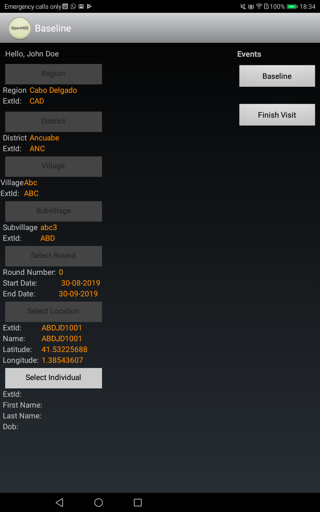

# How to set up the data collection device (tablet/phone)

Once the system has been deployed and forms have been created, data collection software needs to be installed on android devices (phone or tablet). This guide shows how.

## Software installation

- Fetch an android device (phone/tablet)
- On that android device, download Paulo Filimone's implementation of of the OpenHDS .apk by going to https://github.com/philimones-group/openhds-tablet/releases/download/1.6.2/openhds-tablet-1.6.2.apk
- Download ODKCollect via Google Play
- Install both OpenHDS and ODKCollect on the android device

### Set up OpenHDS Mobile

- Open OpenHDS Mobile
- Tap "Preferences" in the upper-right
- Click on the url under the heading "OpenHDS Server Location"
- Enter the URL of the OpenHDS server: https://datacat.cc/openhds

### Set up ODKCollect

- Open ODKCollect
- Click the three dots in the upper-right hand corner
- Select "General Settings"
- Click "Server"
- Change the server URL to https://datacat.cc/ODKAggregate
- Set the credentials to `data` (user) and `data` (password)

### Synchronizing OpenHDS Mobile

- Log into OpenHDS Mobile via the Supervisor log-in with credentials: admin/test
- Click "Sync Database", "Sync Field Workers", "Sync Extra Forms"
- In "Show Stats", everything should be green before going out to collect data (if with real data)

### Synchronizing ODKCollect

- In ODKCollect, select "Get Blank Form"
- Select all the forms we want. Click "Get Selected"

# Fieldworker guide

This next section is intended for either (a) fieldworkers' direct use or (b) for use by those who are training fieldworkers. It assumes that the data pipeline is up and running, that tablets are configured, etc. For the purposes of this example, we'll assume that the fieldworker is named "data data", with user ID `FWDD1` and password `data` (for more details on creating fieldworkers, see the [guide_local_data_manager.md](Local data manager guide)).

## Logging in

- Click on the "OpenHDS Mobile" icon in android.
- Click "Language" to the right and select whichever language you would like for the interface (English, Portuguese, Swahili, and others are available).
- In the "Field Worker Login" area, log in with the below credentials:
  - FWDD1 (username)
  - data (password)
  - Check the box for "baseline"

## Creating new location

- When you visit a new household (or cluster of households), you'll have to create a new location. Click through the location hierarchy, selecting the relevant locations (country, region, district, village, etc.). Having done this, you'll then click "Create Location" to the right.
- Keep the Location Name, Location Type as is.
- Click on the word "Geopoint"
- Click "Start GeoPoint" (Allow access to ODK collect for your device, if applicable)
- The device will now geocode the current location (might take a few seconds). Wait until the text box on the tablet includes the words "Using GPS. Accuracy is...". Then save the location by clicking "Save GeoPoint".
- Once a location has been captured, click the "save" (floppy disk) icon in the upper right. Then click the downwards-right pointing arrow, then "Go to end", and then "Save form and exit"
- Your screen should now look something like this:

-You've now registered a location! In the future, if you go through the same location hierarchy (district, ward, village, etc.), you'll have the option to choose this location, rather than geocode a new one).

## Entering data
- This section is not finished.
