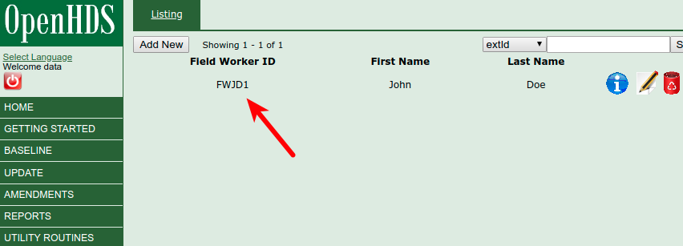

# How to set up the data collection device (tablet/phone)

Once the system has been deployed and forms have been created, data collection software needs to be installed on android devices (phone or tablet). This guide shows how.

# Setting up fieldworker credentials  

## Credentials

- You'll be provided with credentials for the central server from the DataBrew team. For the purposes of this example, we'll use the below credentials.
  - Username: data
  - Password: data

### Creating a fieldworker

- Go to https://datacat.cc/openhds and log in with the above credentials.
- Click "Utility Routines" in the left bar, followed by "Field Workers".
- Create fieldworker(s) profiles. For the purposes of this example, we'll use the following credentials:
    - First name: John
    - Last name: Doe
    - Password: data
- After creation, the role will be assigned a "Field Worker ID"

- The data manager should keep a copy of usernames and passwords, so as to provide them with the fieldworker. If a password is lost/forgotten, it is possible to reset (by requires re-syncing the tablet).

## Software installation

- Fetch an android device (phone/tablet)
- On that android device, download Paulo Filimone's implementation of of the OpenHDS .apk by going to https://github.com/philimones-group/openhds-tablet/releases/download/1.6.2/openhds-tablet-1.6.2.apk
- Download ODKCollect via Google Play
- Install both OpenHDS and ODKCollect on the android device

### Set up OpenHDS Mobile

- Open OpenHDS Mobile
- Tap "Preferences" in the upper-right
- Click on the url under the heading "OpenHDS Server Location"
- Enter the URL of the OpenHDS server: https://datacat.cc/openhds

### Set up ODKCollect

- Open ODKCollect
- Click the three dots in the upper-right hand corner
- Select "General Settings"
- Click "Server"
- Change the server URL to https://datacat.cc/ODKAggregate
- Set the credentials to `data` (user) and `data` (password)

### Synchronizing OpenHDS Mobile

- Log into OpenHDS Mobile via the Supervisor log-in with credentials: admin/test
- Click "Sync Database", "Sync Field Workers", "Sync Extra Forms"
- In "Show Stats", everything should be green before going out to collect data (if with real data)

### Synchronizing ODKCollect

- In ODKCollect, select "Get Blank Form"
- Select all the forms we want. Click "Get Selected"

# Fieldworker guide

This next section is intended for either (a) fieldworkers' direct use or (b) for use by those who are training fieldworkers. It assumes that the data pipeline is up and running, that tablets are configured, etc. For the purposes of this example, we'll assume that the fieldworker is named "data data", with user ID `FWDD1` and password `data` (for more details on creating fieldworkers, see the [guide_local_data_manager.md](Local data manager guide)).

## Logging in

- Click on the "OpenHDS Mobile" icon in android.
- Click "Language" to the right and select whichever language you would like for the interface (English, Portuguese, Swahili, and others are available).
- In the "Field Worker Login" area, log in with the below credentials:
  - FWDD1 (username)
  - data (password)
  - Check the box for "baseline"

# Collecting data

- When you first arrive at a new house, you'll need to create a new location before you can do anything else.

## Creating new location

- When you visit a new household (or cluster of households), you'll have to create a new location. Click through the location hierarchy, selecting the relevant locations (country, region, district, village, etc.). Having done this, you'll then click "Create Location" to the right.
- This will open an ODK form.
- Click on the word "Location name" to name the location. For example, "Brew househould".
- Swipe to the side until you get to the "Geopoint" page.
- Click on the word "Geopoint"
- Click "Start GeoPoint" (Allow access to ODK collect for your device, if applicable)
- The device will now geocode the current location (might take a few seconds). Wait until the text box on the tablet includes the words "Using GPS. Accuracy is...". Then save the location by clicking "Save GeoPoint".
- Once a location has been captured, click the "save" (floppy disk) icon in the upper right. Then click the downwards-right pointing arrow, then "Go to end", and then "Save form and exit"
- Your screen should now look something like this:

-You've now registered a location! In the future, if you go through the same location hierarchy (district, ward, village, etc.), you'll have the option to choose this location, rather than geocode a new one).
- Now that a location has been created, you'll not to specify an individual.

## Selecting/creating an individual

- Click "Select Individual" in the bottom left. You'll get a message saying that "No individuals found!"
- Click "Baseline" in the top right.
- Answer the questions about parents, and then an ODK form will open.
- Click on "First name" and start filling out the form from there (swipe to advance questions)
- Go through all the questions. Once at the last page (it will say "You are at the end of Baseline registration"), click "Save Form and Exit"
- You'll now automatically be brought back to OpenHDS where a window will popup saying to "create a Membership for the individual"

## Creating a family (membership)

- Membership is the concept of belong to a household
- Click "OK"
- A pop-up saying "Please search for an existing or create a new household" will come up
- Click "Create"
- You'll be brought to the "Social group registration" form in ODK
- Click on "Social Group Name" and start filling out the form
- Give the social group a name (ie, "Brew family")
- Go through the rest of the form. At the end of the form click "Save Form and Exit"
- You'll now automatically be brought back to OpenHDS where a window will popup saying "create a Membership for the HoH"

## Membership registration
- Select the household you just created by clicking on it
- You'll be brought to the "Membership registration" form in ODK
- Click on "Relationship to Group Head"
- Select "Head" (assuming you are doing head of house first)
- Select the start date of membership in that family
- Go to end of form and click "Save Form and Exit"

# Filling out the census

- There are two census forms:
  1. **"censushouse" (the household form)**: This form only needs to be filled out once for each household (and should be filled out after selecting the household head's name in OpenHDS)
  2. **"censusmember" (the member form)**: This form needs to be filled out for _everybody_ in a household, including the household head

## Household census

- In OpenHDS, click "Select Individual" in the bottom left.
- Select the Household Head's name (even if it is not with the Household Head that you are speaking)
- In the upper right of OpenHDS, click on the "Extra Forms" button
- Now click "Search" (without typing anything )
- Click on "censushouse"
- You will be brought to the ODK form. Location information is already pre-loaded, so it starts on question 4. Click on question 4.
- Go question through question, scrolling down and to the right to advance.

## Individual census

- In OpenHDS, click "Select Individual" in the bottom left.
- Select the name of the person for whom you are filling out the form (remember, even though you filled out the "Household census" for the head of household, you also have to do this form for the head of household)
- In the upper right of OpenHDS, click on the "Extra Forms" button
- Now click "Search" (without typing anything )
- Click on "censusmember"
- You will be brought to the ODK form. Location information is already pre-loaded, so it starts on question 4. Click on question 4.
- Go question through question, scrolling down and to the right to advance.

## Sending data

- Once done, open the ODK Collect app and send all finalized forms
