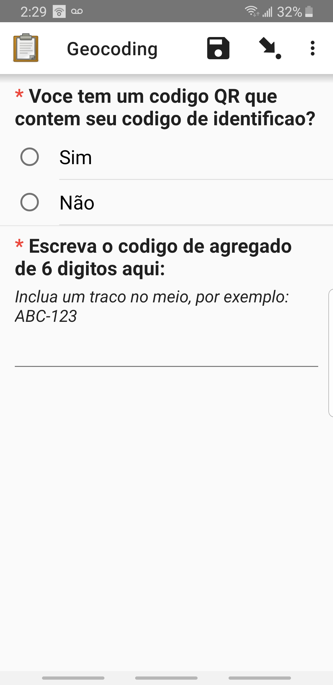
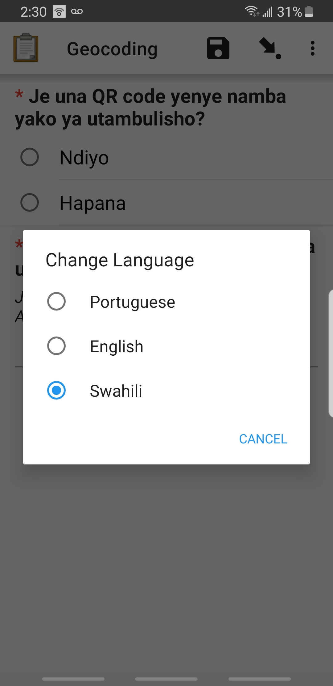

# Bohemia census: geocoding teams

## Context

- The Bohemia census includes several geocoding fields pertaining to (a) location of a household, (b) location of bodies of water, and (c) location of livestock.  
- In general, these locations will be geocoded _during_ the "interview" (ie, at the same time as the general census data collection).  
- However, there may be some cases in which pausing the interview to carry out geocoding for (c) would result in undue operational burden.  
  - Example A: A census participant has many animals who sleep and eat in multiple locations, each between 500 and 1000 meters from the house. Going to each of these locations would result in hours of walking, which would disrupt the interview.
  - Example B: A census participant has only one location in which animals are held. However, the census participant and/or his/her family only have a short window of time before one or more of them have to leave (and the time does not permit going to geocode the location of the animals)
- In the above cases, the fieldworker can choose to _not_ geocode (ie, answer all questions but skip the geocoding fields).
- In this case, as soon as the data is sent to the server, an alert will be sent to the data manager to deploy a separate geocoding team.
- When able, the geocoding team will go to the household in question and carry out data capture related exclusively to geocoding animal locations.
- What follows are instructions for carrying using the separate "geocoding" form.

## Operational flow

- Census fieldworker skips 1 or more geocoding fields during interview
- Census fieldworker submits form to server
- Server automatically identifies the skipped field(s)
- Data manager is automatically notified of the skipped field(s) and the relevant meta-information (household number and location, fieldworker in question)
- Data manager deploys a geocoding team/individual to fill out the geocoding form (below)

## Accessing the form

- Open ODK and select "Fill Blank Form"
- Select the form titled "geocoding"

## Collecting data

### The landing page

- To change the language, select the 3 dots in the upper right hand corner.

- Select the language of choice.

- If you answer "No" to the first question, you will be prompted with an additional question that reads: "Manually write your 3 digit worker ID here".
- The 6-character household ID must be of the format "ABC-123"
- The red asterisk indicates a question is manatory before moving forward.

### Geocoding

- Go to the area that should be geocoded and select the "Start GeoPoint" field.

- You may be prompted to allow ODK to access your devices GPS functionality.

### Location details (dry season)

- On this page please select all the fields that apply to this location in the dry season.
- For example, the image below indicates that this location is where Adult cattle graze, young cattle sleep, adult pigs graze, and young pigs sleep during the dry season.
 - It also indicates this is not where young cattle graze, adult pigs sleep and young pigs graze during the dry season, and that the respondent wasn't sure if Adult cattle sleep in this area during the dry season.

 

- Once you've completed this swipe to the next page.

### Location details (wet season)

- Similar to the last page, indicate which fields apply to the wet season.
- For example, the image below indicates Young cattle and young pigs sleep at this location during the wet season, but only young cattle graze there too.

- Once you've completed this swipe to the next page.

### Saving and sending the form

- Select the "Save Form and Exit" field

 

- This will bring you back to the main menu.
- Select "Send Finalized Form".
- Make sure the box to the right of the form name is "checked" and the select "Send Selected" to upload a finished form.
