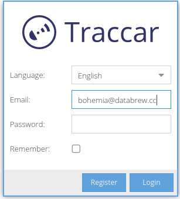

# How to explore fieldworker GPS data

## Context

- During the census phase of the Bohemia project, the location of data capture devices (tablets) will be tracked. The purpose of this tracking is to both:
  - Help with recovery in the case of device loss or theft
  - Enable, over time, the identification of travel routes through the aggregation of the GPS tracks/paths taken by each tablet, and the subsequent generation of travel route planning tools and maps
- This guide details how to explore GPS data in real-time

## Website access

- Go to https://bohemia.fun  
- Log in with the username bohemia@databrew.cc and the password sent to you via email

Unfinished...
