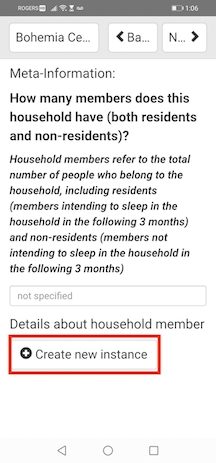
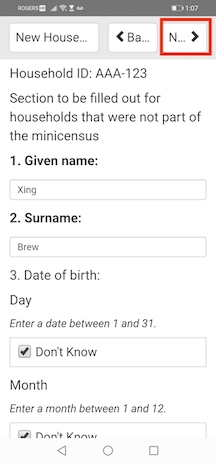
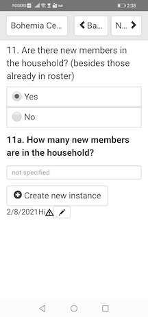
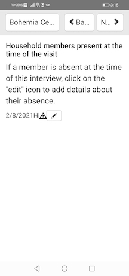
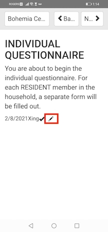
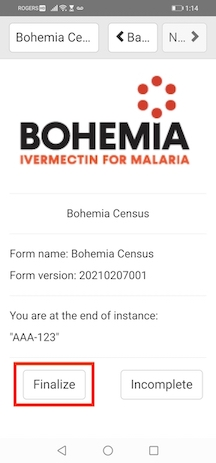

# Bohemia Census ODK-X Survey Form Navigation

## Introduction

The ODK-X census form is structured as one main census form, along with several subforms nested within the main form. You will know that you are filling out a subform because you will see the prompt “Create new instance”. Once you enter a subform, navigating out of the subform can be a little counterintuitive. This guide is meant to help you navigate the ODK-X form and subforms. 

### Creating new instance 

The first time you will encounter a subform is for the household members roster. 

In the case you are adding a new household (i.e., one not minicensed), under _Details about household member_,  click ‘Create new instance’ to enter details about each household member. 

Once you click the “Create new instance” button, you are now filling out a subform for one household member. When you are done entering details about the member, click the ‘NEXT’ button to return to the previous screen.  

You will now see the member’s name listed under the ‘Create new instance’ button with a checkmark icon, a pencil button, and an ‘X’ button next to the name. The checkmark icon indicates that you have finalized details in the subform for that member. You can edit details about the member by clicking the pencil icon. You can delete a member you have created by clicking the X icon. 

If you click ‘BACK’ instead of ‘NEXT’ in the subform while trying to return to the main census form screen, you will be taken to a ‘Contents’ page. Click ‘NEXT’ to return to the subform page and then ‘NEXT’ again to return to the main census form screen. 

### Household Members

With ODK-X, all the household member information is stored in one data table, so all the subforms regarding household members are linked together. This means that anytime there is a question about household members, you will see the roster of relevant* members listed under the ‘Create new instance’ button. 

*Some subforms are only meant to be filled out for Resident Members, so you will only see resident member names listed.

If the question asks about new members (e.g., Q11 in the household survey), click ‘Create new instance’ to add details about the new member. 

If the question asks for details about existing members (e.g., Q12 to add details about an absent member), click the pencil button next to the member’s name to add details about a particular member. 

### Deleting subform entry while within the subform

In the case you’ve accidentally clicked ‘Create new instance’ or you are filling out a subform but would like to delete it midway:
Click the menu button at the top left of the screen. A popup will appear with the options Language, Content, Ignore Changes + Exit, Save Changes + Exit, and Finalize Changes + Exit will appear in the menu. Click ‘Ignore Changes + Exit’ and then ‘Exit’ on the confirmation page. This subform entry will be deleted and you will be taken back to the main census form screen. 

Another way to return to the main census screen after completing a subform rather than clicking ‘NEXT’ is to click the top left menu button, then click the ‘Finalize Changes + Exit’ button. 

Once you have finished the household survey, you will be taken to the main page of the Individual Questionnaire, where you will see the name of all the Resident Members presented. To fill out a form for a member, click the pencil button next to his/her name. 

Once you have finished filling out a form for each resident household member, you will be taken to the screen below. Click ‘Finalize’ to finalize the survey. In order to finalize the survey, all member questionnaires must be ‘finalized’. 

