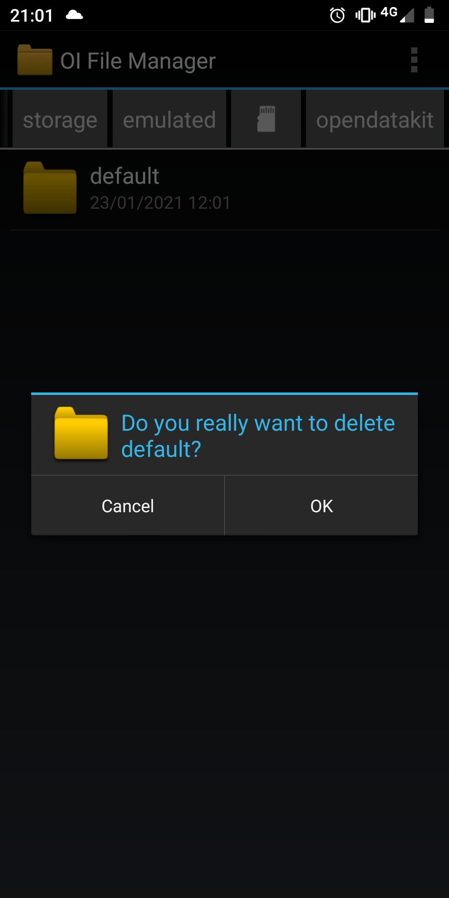

# ODK X Server Client setup

## Introduction

This guide is a description of the steps to follow when setting up an android device for the Bohemia full census. The census uses a suite of apps called "ODK-X". This documentation heavily references the [official ODK-X documentation](https://docs.odk-x.org/). A data manager should follow the below steps to set up each tablet.

## Supplementary information  

This section contains information, not instructions. Feel free to skip.

#### Overview

The ODK X suite of applications needed for the project are:

- [OI File Manager](https://github.com/openintents/filemanager/releases)
- [ODK-X Services](https://github.com/odk-x/services/releases/latest)
- [ODK-X Survey](https://github.com/odk-x/survey/releases/latest)
- [ODK-X Tables](https://github.com/odk-x/tables/releases/latest)

#### Background on how these interact:

The OI File Manager is used to help with the navigation into the `opendatakit` artifacts installed on the device. The other apps depend on it as the file manager to interface with each other.

The ODK-X Services app is the orchestrator, it is used to keep the data in the phone and the server in sync. Typically, you use this to download forms and data from the server and upload the same from the device to the server. You also have the option to `RESET SERVER` from this app. _Please beware that this is a destructive action and would delete all the data in the server thus impact all users relying on that server_

The ODK-X Survey app is the ODK Collect alternative, used for form based data collection workflows that can be seamlessly integrated with Tables to create and modify records. It is what you use to view the survey forms and record the responses.

The ODK-X Tables app offers a way to visualize, process, and modify data collected by Survey, all on the device. On this app, you review the data collected from the Survey in spreadsheet format and if applicable, html tables format, maps format and navigation (where you show a compass to guide the user to a set of location co-ordinates)

# Instructions

## Download and install apps

You'll start by downloading and installing 4 applications on the android device.

- **Install OI File Manager**: Go to https://github.com/openintents/filemanager/releases/download/2.2.2/FileManager-release-2.2.2.apk and download the [APK file](https://github.com/openintents/filemanager/releases/download/2.2.2/FileManager-release-2.2.2.apk). Since the app is not being downloaded from the Google Play App Store, your device may bring up a message to the effect of "not allowed to install unknown apps from this source". In this case, you will need to grant permission to your device to "install unknown apps" or "allow installation from source".  

- **Install ODK-X Services**: Go to https://github.com/odk-x/services/releases/tag/2.1.7 and download the [APK file](https://github.com/odk-x/services/releases/download/2.1.7/ODK-X_Services_v2.1.7.apk). Then install.

- **Install ODK-X Survey**: Go to https://github.com/odk-x/survey/releases/tag/2.1.7 and download the [APK file](https://github.com/odk-x/survey/releases/download/2.1.7/ODK-X_Survey_v2.1.7.apk). Then install.

- **Install ODK-X Tables**: Go to https://github.com/odk-x/tables/releases/tag/2.1.7 and download the [APK file](https://github.com/odk-x/tables/releases/download/2.1.7/ODK-X_Tables_v2.1.7.apk). Then install.

## Set up server connection

- Open the ODK-X Tables app.  
- Press the settings button (gear icon in upper right)  
- Select "Server Settings"  
- Slick "Server URL"  
- Set the server URL to https://databrew.app  
- Set the server sign-on credential as "Username"  
- Set the Username as "data"  
- Set the server password as "data"  
- Click the back button  
- An "Authenticate credentials" pop-up will show show up; Click "Authenticate New User".  
- Slick "Verify User Permissions"  
- You should see a "Verification successful" window. Click "OK".  
- You'll be brought back to the "General Settings" page. Click the back button until you return to the main menu.
- Click the refresh button (circular arrows in the upper right).  
- Click "Sync now"  

## Opening census form
### Using ODK-X Survey
- On the main page, you'll see a list of forms. Most of these are really sub-forms of the main form (ie, "repeats"). The form of interest / relevance is the "Bohemia Census" form.
- Click on the "Bohemia Census" form to open it  
- For a new household, click "Create new instance"
- For an existing household, find the ID number from the list and click the pencil icon next to that ID number  

### Using ODK-X Tables
- Open the app, you'll see the home page of the census.
- Click on the button for the action you want to take

## Refreshing the app with new data from server

- To push to and retrieve data from the server, you can use the refresh button as described in the `Set up server connection` above.
Alternatively, from the ODK-X Table home page, click on the `Send Data` button

- If the server has changed e.g. a new database structure has been set up, you will get the feedback as an error.

- In this instance, you should delete the folder `default` as shown in the error message

- After deleting the folder, return to the app and attempt a new sync. Follow the `Set up server connection` steps to re-authenticate to the server and retrieve new version of forms and database. 

IMPORTANT: This will lose all the data in the local app instance that was not pushed to the server prior. This is why its critical that server resets are well coordinated to prevent data loss.

### Handling Navigation from Content Pages view
When filling out a survey, there are some sections that are populated via the `Create New Instance` button. 
When such a section is entered, clicking the `Back` button will _not_ take you back to the census question you were at.
If you should realize that the section was entered in error, please click the `Next` button and that will take you to the census section.

It is counterintutive at first but the logic is, the 'new instance' is a separate form which has no history of which form initiated a call to load it. Thus, when the `Back` button is clicked in it, it defaults to the `Contents` page.