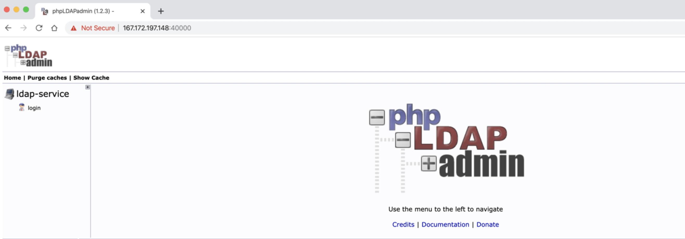

# ODK X Server Setup

## Introduction

This guide is a description of the steps to follow when setting up a server for the bohemia project to use ODK X.
It will heavily reference the [official documentation](https://docs.odk-x.org/) from ODK X and only provide the context specific to this project.

## Overview

The ODK X suite of applications needed for the project are:

- [OI File Manager](https://github.com/openintents/filemanager/releases)
- [ODK-X Services](https://github.com/odk-x/services/releases/latest)
- [ODK-X Survey](https://github.com/odk-x/survey/releases/latest)
- [ODK-X Tables](https://github.com/odk-x/tables/releases/latest)

To get a feel of how these work, install them on your android device and use the sample survey included as per instructions at https://docs.odk-x.org/basics-install/ and https://docs.odk-x.org/survey-sample-app/

### For the background on how these interact:

The OI File Manager is used to help with the navigation into the `opendatakit` artifacts installed on the device. The other apps depend on it as the file manager to interface with each other.

The ODK-X Services app is the orchestrator, it is used to keep the data in the phone and the server in sync. Typically, you use this to download forms and data from the server and upload the same from the device to the server. You also have the option to `RESET SERVER` from this app. _Please beware that this is a destructive action and would delete all the data in the server thus impact all users relying on that server_

The ODK-X Survey app is the ODK Collect alternative, used for form based data collection workflows that can be seamlessly integrated with Tables to create and modify records. It is what you use to view the survey forms and record the responses.

The ODK-X Tables app offers a way to visualize, process, and modify data collected by Survey, all on the device. On this app, you review the data collected from the Survey in spreadsheet format and if applicable, html tables format, maps format and navigation (where you show a compass to guide the user to a set of location co-ordinates)

For the bohemia project the server is deployed on AWS. The following sections are focused on setting this up.

## ODK-X Cloud Endpoints

ODK-X Cloud Endpoints are servers that communicate with the ODK-X Android applications. They implement the [ODK-X REST Protocol](https://github.com/odk-x/odk-x/wiki/ODK-2.0-Synchronization-API-(RESTful)).

To run the project, we use the [ODK-X Sync Endpoint](https://docs.odk-x.org/sync-endpoint/) set up on AWS.

### Set Up ODK-X Sync Endpoint on AWS

Official documentation reference: https://docs.odk-x.org/sync-endpoint-cloud-setup/#setting-up-an-aws-account


#### Setting up a virtual machine

1. Click on EC2 link under the COMPUTE section. Then, go ahead and launch a new instance.

2. Choose an Amazon Machine Image (AMI). Scroll through the options and select Ubuntu Server 18.04 LTS (HVM), SSD Volume Type.

3. Skip the `Choose an Instance Type` step. Instead, click on the `3: Configure Instance` tab at the top and then click on the `As File` option and then attach the `cloud_init_AWS.yml` file provided in the `misc/odkx/init_files` folder.

4. Click on the `6. Configure Security Group` tab in order to modify the firewall rules and control the traffic for the instance.
Create a new security group, name it `custom_security_group` and modify the rules to match the rules specified below, then click Review and Launch.


| Type  |   Protocol    |   Port Range  |   Source  |
| :---- | :-----------: | :-----------: | --------: |
| SSH   |   TCP |   22  |   Custom  0.0.0.0/0   |
| HTTP  |   TCP |   80  |   Custom  0.0.0.0/0, ::/0 |
| HTTPS |   TCP |   443 |   Custom  0.0.0.0/0, ::/0 |
| Custom TCP Rule   |   TCP |   40000   |   Custom  0.0.0.0/0, ::/0 |
|   |   |   |

5. Review the Instance Launch and then click Launch.

6. Create a new key pair to access the instance via SSH and make sure to download it to a secure location. Finally, click Launch Instances!


#### Configuring a key pair  

- A modal will show up saying “Select an existing key pair or create a new key pair”
- Select “Create a new key pair”
- Name it pariskey.pem
- Run the following to change permissions on your key: `chmod 400 ~/.ssh/pariskey.pem`
- Click “Launch instances”
- Wait a few minutes for the system to launch (check the "launch log" if you’re impatient)
- This will bring you to the instances menu, where you can see things (in the “Description” tab below) like public IP address, etc.

### Allocate a persistent IP

- So that your AWS instance's public IP address does not change at reboot, etc., you need to create an "Elastic IP address". To do this:
  - Go to the EC2 dashboard in aws
  - Click "Elastic IPs" under "Network & Security" in the left-most menu
  - Click "Allocate new address"
  - Select "Amazon pool"
  - Click "Allocate"
  - In the allocation menu, click "Associate address"
  - Select the instance you just created. Also select the corresponding "Private IP"
  - Click "Associate"
- Note, this guide is written with the below elastic id. You'll need to replace this with your own when necessary.

```
13.36.9.244
```

### Setting up SSH keys

- If you don’t have an SSH key on your system yet, run the following:
`ssh-keygen -t rsa -b 4096 -C “youremail@host.com”`
- Select defaults (ie, press enter when it asks you the location, password, etc.)
- You will now have a file at `/home/<username>/.ssh/id_rsa`
- To verify, type: `ls ~/.ssh/id_*` (this will show your key)
- To change permissions to be slightly safer, run the following: `chmod 400 ~/.ssh/id_rsa`

### Connect to the servers

- In the “Instances” menu, click on “Connect” in the upper right
- This will give instructions for connecting via an SSH client
- It will be something very similar to the following:

```
ssh -i "/home/joebrew/.ssh/pariskey.pem" ubuntu@ec2-13-36-9-244.eu-west-3.compute.amazonaws.com
```

- Congratulations! You are now able to run linux commands on your new ubuntu server
- If you want, create an alias such as:
```
alias odkx='ssh -i "/home/joebrew/.ssh/pariskey.pem" ubuntu@ec2-13-36-9-244.eu-west-3.compute.amazonaws.com'
```
- Add the above line to ~/.bashrc to persist
- Run `source ~/.bashrc`
- You can now ssh into the instance by simply running `odkx`

### Setting up the domain

- In domains.google.com, click on the purchased domain.
- Click on "DNS" on the left
- Go to "Custom resource records"
- You're going to create two records:
  1. Name: @; Type: A; TTL 1h; Data: 13.36.9.244
  2. Name: www; Type: CNAME; TTL: 1h; Data: ec2-18-218-151-100.us-east-2.compute.amazonaws.com.

#### Connecting to your virtual machine

1. Go back to the EC2 dashboard and click on Running instances.

2. Select the instance that you want to connect to and then click Connect.

3. SSH in (see above instructions)

4. Before running the launch scripts, check the logs to ensure that all the packages have been successfully installed, which should take about 2-3 minutes. The virtual machine may also reboot in this time.
Use the following command to get into the log directory.

    `cd /var/log`

    Now, open the log file with command:

    `tail cloud-init-output.log`

5. If you see the message `The system is finally up, after X seconds` you can proceed to the next step! Otherwise, continue to wait and check the log again.

#### Running launch scripts

1. In order to run the ODK-X launch scripts, first navigate back to the Ubuntu directory with the following command:

    `cd /home/ubuntu`

2. Run the build scripts with the command:

    `sudo ./script_to_run.sh`

The script will ask you for the server's domain and an administration email address to configure https on the server.

After gathering this data the script will begin the install and you should see a bunch of statements executing in your console. Wait approximately 5-10 minutes for the installation to complete.

3. Once all the services have been created, check if all the services are running properly with the command:

    `sudo docker stack ls`

    You should see 9 services running under the name `syncldap`.

#### Launching LDAP Admin

1. Using the IP address of the virtual machine, navigate to `https://13.36.9.244:40000/` within your browser in order to access the services screen. It will warn you about your connection not being private but should give you the option to proceed at the bottom.

2. If you see the following screen after proceeding, you are good to go!


_Hack tip: If you can't get the option to proceed on your browser when using the domain name, especially with the error `NET::ERR_CERT_AUTHORITY_INVALID` you can access the page by using its IP Address. Log in to AWS and open the url from the instance page._


### Creating Users

Official documentation reference: https://docs.odk-x.org/sync-endpoint-cloud-setup/#sync-endpoint-setup-create-user

1. Click login on the left and log in into the ldap-service using the credentials:

    - login DN: `cn=admin,dc=example,dc=org`
    - password: `admin`

2. Click the `+` sign next to `dc=example, dc=org` to expand it. Within the unfolded menu, in the `ou=people` section

3. Click on `Create a child entry`.

4. Select the `Generic: User Account` template.

5. Fill out information for the new user (data, data, uid 1000) and `create object`

6. Assign the user object to `default_prefix_synchronize_tables` group.

7. Commit (confirm) that you want to create this entry on the next screen.


#### Add User to Group

When you have created a user, you need to add the user to the respective group from the group settings.

1. Click the `+` sign next `ou=groups` to expand it.
2. Within the unfolded menu, in the `ou=default_prefix` section, click on `gidNumber=503`, which is the group ID that corresponds to `default_prefix_synchronize_tables`. Groups correspond to the access permissions available to a certain user.

3. Click on `Add new attribute` which should show a pull-down menu and then select `memberUid`.
4. Enter the `memberUid` of the user, _this is the 'username' you created_, and then update the object.

#### Creating Admin User

1. Click login on the left and log in into the ldap-service using the credentials:

    - login DN: `cn=admin,dc=example,dc=org`
    - password: `admin`

2. Click the `+` sign next to `dc=example, dc=org` to expand it. Within the unfolded menu, in the `ou=people` section

3. Click on `Create a child entry`.

4. Select the `Generic: User Account` template.

5. Fill out information for the new user and `create object`

6. Assign the user object to `default_prefix super_user_tables` group.

7. Commit (confirm) that you want to create this entry on the next screen

#### Add Admin User to Groups

When you have created an admin user, you need to add the user to the respective groups from the group settings.
The steps are the same as for the regular user, except we add this user to multiple groups.

1. Click the `+` sign next `ou=groups` to expand it.
2. Within the unfolded menu, in the `ou=default_prefix` section, click on `gidNumber=502`, which is the group ID that corresponds to `default_prefix super_user_tables`. _Groups correspond to the access permissions available to a certain user._

3. Click on `Add new attribute` which should show a pull-down menu and then select `memberUid`.
4. Enter the `memberUid` of the user, _this is the 'username' you created_, and then update the object.

Repeat the steps to add the user to the following groups
- `gidNumber=500` -- `default_prefix site_admins`
- `gidNumber=501` -- `default_prefix administer_tables`
- `gidNumber=503` -- `default_prefix synchronize_tables`
- `gidNumber=504` -- `default_prefix form_managers`

Note: The final view when the admin user logs in to the server should be similar to:


#### create admin user

click ou=people, create a child entry, just like above, but instead of data / data make it dbrew / admin (uid 1001) and make `default_prefix_super_user_tables`
- go to gidnumber=502, click add new attribute, member uid, dbrew
- do same for all numbers for dbrew

#### Web Login to the Server

1. Navigate to `https://[IP_ADDRESS]/web-ui/login` and log in as a valid user.

_Note_

_If you are unable to log in, you may need to take the docker stack down and bring it back up again. This is done with via ssh using the commands:_

`sudo bash`

`docker stack rm syncldap`

`cd sync-endpoint-default-setup`

`docker stack deploy -c docker-compose.yml -c docker-compose-https.yml syncldap`

_After creating the users required, there is no longer need access to the LDAP admin interface. Update the `custom_security_group` you created on the instance setup and delete the custom tcp entry with port 40000._

### Potential Gotchas

1. Incase you use Cloudflare as your DNS provider and have it set to sign your requests, you may encounter the too many redirects error when you try to access the web login page. Use this guide to fix that https://themebeez.com/blog/fix-err-too-many-redirects-cloudflare-loop/

2. The default set up may be rejecting the login credentials even after you restart the stack. To view the logs, ssh into the instance and run:

`docker service ls` - shows you the names of the services
`docker service logs -f <SERVICE NAME>` - shows the real time logs. For authentication, tail the web-ui service

3. To set up the EC2 instance to have a static IP, refer to the guide for the bohemia aggregrate setup

### Source Code References

- https://github.com/odk-x/sync-endpoint-default-setup

### Outstanding Tasks

- [ ] Production set up for the LDAP as advised in the [Advanced LDAP](https://github.com/odk-x/sync-endpoint-default-setup#warnings)
