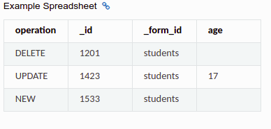
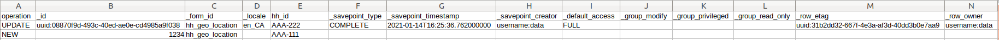
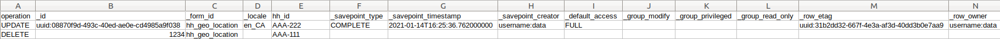
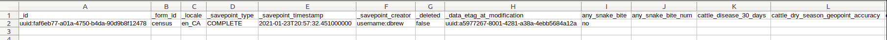
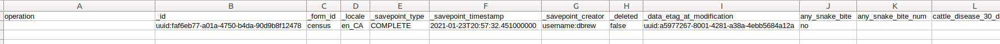
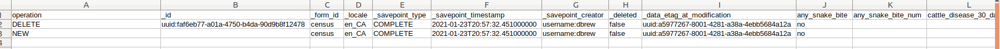

# How to set up ODK-X Suitcase

- Create a directory for placing the ODK-X Suitcase `.jar` file:

```
cd ~/Documents
mkdir suitcase
cd suitcase
```

- Download the program into the newly created directory by running the following:
```
wget https://github.com/odk-x/suitcase/releases/download/2.1.7/ODK-X_Suitcase_v2.1.7.jar
```

- Make sure the .jar file is executable
```
chmod +x ODK-X_Suitcase_v2.1.7.jar
```

## Suitcase CLI

- For a list of available options:
```
java -jar ~/Documents/suitcase/ODK-X_Suitcase_v2.1.7.jar --help
```

### download data: 

```
java -jar ODK-X_Suitcase_v2.1.7.jar -download -a -cloudEndpointUrl "https://databrew.app" -appId "default" -tableId "hh_geo_location" -username "data" -password "data" -path "Download"
```
(NOTE: specifying "Download" as the path creates a folder called "Download" in your current directory that holds the data manifest csv: ~/Documents/suitcast/Download/default/hh_geo_location/data_unformatted.csv)

### update data:

```
java -jar 'ODK-X_Suitcase_v2.1.7.jar' -cloudEndpointUrl 'https://databrew.app' -appId 'default' -dataVersion 2 -username 'data' -password 'data' -update -tableId 'hh_geo_location' -path 'hh_geo_location.csv'
```
- The above command workd for updating, deleting, or adding new data on the ODK-X Cloud Endpoint. You will need a correctly formatted csv.

``Tip: use the.csv file from `Download` as a template and simply change the name of the csv (in this case to hh_geo_location.csv), and add the "operation" column with the desired command``

- The contents of the first column ("operation") in the csv file will determe if new data should be added, or if existing data should be updated or deleted. 
- The valid values for the "operation" column are: `UPDATE`, `FORCE_UPDATE`, `NEW` and `DELETE`. 
- In the example below, all the columns besides "hh_id" are "meta-variables" and MUST be present in the csv. To change the value of an existing column, simply add the column name (in this example "hh_id") with the new value (AAA-222). 
- If you are using downloaded data as template, then all the columns are already present and you just need to change the values you want (I only included hh_id in the example pics below, but all columns could be present if you want).
    - `UPDATE` is used for updating data that already exists on the server. The update is done by matching on the `_id`column. The `_id` for an instance can be found by downloading the data using ODK-X suitcase.
    - If an update is successfully implemented, a folder will be create called "Update" in your working directory with a .txt file showing the results of the update (ex: "Thu Jan 21 14:18:43 EST 2021 row Id: uuid:08870f9d-493c-40ed-ae0e-cd4985a9f038 had outcome SUCCESS").

    - `FORCE_UPDATE` is used for updating data with a more aggressive strategy, if -UPDATE failed.
    - `NEW` is used for adding new rows (instances) to the server. We can add the entry `NEW` to our existing csv.
        - If the `_id` column is empty, a row id and row e tag will be generated automatically. 
        - If the `_id` column is filled with an existing id, the existing data on the server will be overwritten (works the same as update).
        - A new entry will only update the variables specified. If a variable is not specified or left blank, it will remain unchanged on the server.
        - if a new entry includes a variable not present on the server, then the push to the server will fail with a "BAD_COLUMN_NAME" error. 
   
    - `DELETE` is used for deleting rows (instances) from the server by matching on the `_id` column. In the image below, we delete the newly created instance. 
   

### Reset the server 

   - To completely wipe all the data from the server:
```java -jar "ODK-X_Suitcase_v2.1.7.jar" -cloudEndpointUrl "https://databrew.app" -appId "default" -dataVersion 2  -username "dbrew" -password "admin" -reset```
   - To wipe the data for one form on the server:
```java -jar "ODK-X_Suitcase_v2.1.7.jar" -cloudEndpointUrl "https://databrew.app" -appId "default" -dataVersion 2  -username "dbrew" -password "admin" -reset -tableId "hh_geo_location"```

### Add fresh forms
   - After clearing the data from the server make sure that all data is deleted on your android device by deleting the "opendatakit" folder in your "OI File Manager". If this is not deleted, the next synch will add all forms on your phone to the server. 
   - Follow this guide to add new forms: https://github.com/databrew/bohemia/blob/master/guides/guide_odkx_add_surveys.md

### Example: 

- This example will pull the census table, modify the instances, and update accordingly on the server.

1) Having installed `suitcase` in the following path: `~/Documents/suitcase/`, pull the census table with the following command into the suitcase directory:

    - ```java -jar ODK-X_Suitcase_v2.1.7.jar -download -a -cloudEndpointUrl "https://databrew.app" -appId "default" -tableId "census" -username "data" -password "data" -path "Download"```

This will download the census table manifest data to this location: ~/Documents/suitcast/Download/default/census/data_unformatted.csv)

2) In order to update the data, we mush change the name from "data_unformatted.csv" to the name of the table in question: "census.csv". 
 

3) Then open the csv file and add the "operation" column as the leading column. In this example, we will test all operations: NEW and DELETE.
 


4) In this example we copy and paste the original entry to create a fake entry. Remove the `_id` entry for the new row - they will be generated upon upload. Add `NEW` in the "operation" column next to the fake entry and `DELETE` next to the original entry. Make sure you change one of the survey fields (hh_id, snake_bite, etc) so you are able to confirm the new data on the server.
 


5) Run this command to update the server:

    - ```java -jar 'ODK-X_Suitcase_v2.1.7.jar' -cloudEndpointUrl 'https://databrew.app' -appId 'default' -dataVersion 2 -username 'data' -password 'data' -update -tableId 'census' -path 'Download/default/census/census.csv'```

6) Check the server to see if the old data was deleted and new data added. Synch with the server on your android device to as well. 

Note: `UPDATE` existing data works the same way the `NEW` command works, but you must specify the correct `_id` to update, rather than leaving it blank (as in the case with `NEW`).


