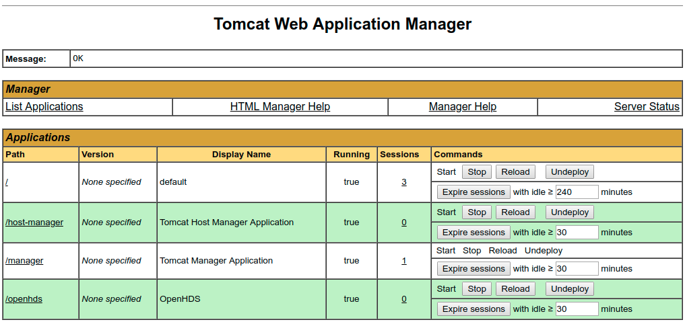
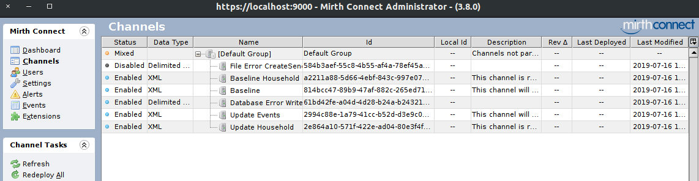
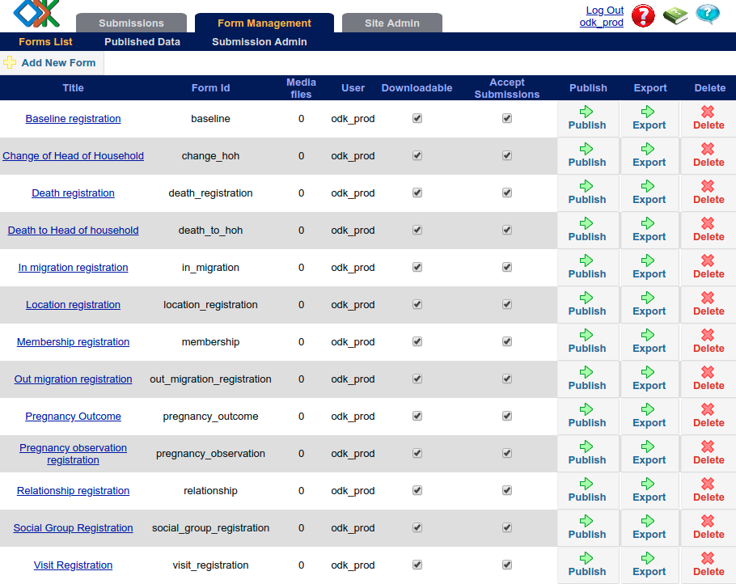

# Admin guide for setting up the Bohemia project data system (OpenHDS+)

The below guide is a walk-through of setting up the Bohemia data infrastructure. It assumes you are running a cloud server on AWS (which will not be the case for local sites). For local servers, much of the ssh, tunneling, etc. sections can simply be ignored/altered.

## Buy a domain

- Go to domains.google.com and buy a domain.
- For the purposes of this guide, the domain being used is `www.datacat.cc`

## Spin up an EC2 instance on AWS

_The below should only be followed for the case of a remote server on AWS. In production, sites will use local servers, physically housed at the study sites. In the latter case, skip to the [Setting up OpenHDS section](https://github.com/databrew/bohemia/blob/master/guide/guide.md#setting-up-openhds)_

#### Create a VPC configuration
- Log into the AWS console: aws.amazon.com
- Go to the VPC dashboard: https://console.aws.amazon.com/vpc/home#dashboard
- Click "Launch VPC Wizard"
- Follow the wizard for the VPC with a Single Public Subnet configuration.
- Enter aggregate-vpc (or your desired name) as the name and description.
- Select the VPC you previously created.
- Click on Create.
- Click on the newly created security group from the list, click on the Inbound rules tab, the Edit rules.
- Set the below rules:
  - SSH: Anywhere
  - HTTP: Anywhere
  - HTTPS: Anywhere
  - (For Mirth to work, you also need to add Anywhere access on HTTP and HTTPS for ports 8082 and 8443)
- Save rules

#### Create an IAM role
- Go to the IAM - Roles tab (https://console.aws.amazon.com/iam/home#/roles)
- Click "Create role"
- Select "AWS service" and click "EC2"
- Click "Next:Permissions"
- Search for "AmazonEC2ReadOnlyAccess" and select it
- Click "Next:Tags". Do nothing.
- Click "Next: Review"
- Enter "aggregate-role" as the name
- Click "Create role"


#### Create an EC2 machine
- Go to the EC2 dashboard (https://console.aws.amazon.com/ec2/v2/home#Home)
- Click the “Launch a virtual machine” option under “Build a solution”
- Select "Ubuntu Server 18.04 LTS (HVM), SSD Volume Type"
-To the far right select 64-bit (x86)  
- Click “select”  
- Choose the instance type: General purpose, t2.small (or larger)
- Click on Next: Configure Instance Details.
- Select the VPC you previously created in the Network dropdown ("aggregate-vpc")
- Select "Enable" in the Auto-assign Public IP dropdown.
- Select the IAM role you previously created in the IAM role dropdown.
- Toggle the Advanced Details section and copy and paste the below (based on [this](https://raw.githubusercontent.com/opendatakit/aggregate/master/cloud-config/aws/cloud-config.yml) script, but mofified for our purposes):
```
#cloud-config

packages:
  - zip
  - unzip
  - wget
  - curl
  - tomcat8
  - tomcat8-common
  - tomcat8-admin
  - tomcat8-user
  - postgresql-10
  - openjdk-8-jdk-headless
  - nginx
  - software-properties-common
  - awscli

write_files:
  - path: /root/aggregate-config.json
    content: |
      {
        "home": "/root",
        "jdbc": {
          "host": "127.0.0.1",
          "port": 5432,
          "db": "aggregate",
          "schema": "aggregate",
          "user": "aggregate",
          "password": "aggregate"
        },
        "security": {
          "hostname": "foo.bar",
          "forceHttpsLinks": true,
          "port": 80,
          "securePort": 443,
          "checkHostnames": false
        },
        "tomcat": {
          "uid": "tomcat8",
          "gid": "tomcat8",
          "webappsPath": "/var/lib/tomcat8/webapps"
        }
      }
  - path: /tmp/nginx-aggregate
    content: |
      server {
          client_max_body_size 100m;
          server_name foo.bar;

          location / {
              proxy_pass http://127.0.0.1:8080;
          }
      }
  - path: /usr/local/bin/download-aggregate-cli
    permissions: '0755'
    content: |
      #!/bin/sh
      curl -sS https://api.github.com/repos/opendatakit/aggregate-cli/releases/latest \
      | grep "aggregate-cli.zip" \
      | cut -d: -f 2,3 \
      | tr -d \" \
      | wget -O /tmp/aggregate-cli.zip -qi -

      unzip /tmp/aggregate-cli.zip -d /usr/local/bin
      chmod +x /usr/local/bin/aggregate-cli
  - path: /root/.aws/config
    permissions: '0644'
    content: |
      [default]
      region = foobar
      output = text

runcmd:
  - download-aggregate-cli

  - unattended-upgrades
  - apt-get -y autoremove

  - rm /etc/nginx/sites-enabled/default
  - mv /tmp/nginx-aggregate /etc/nginx/sites-enabled/aggregate

  - add-apt-repository -y universe
  - add-apt-repository -y ppa:certbot/certbot
  - apt-get -y update
  - apt-get -y install python-certbot-nginx
  - (crontab -l 2>/dev/null; echo "0 0 1 * * /usr/bin/certbot renew > /var/log/letsencrypt/letsencrypt.log") | crontab -

  - su postgres -c "psql -c \"CREATE ROLE aggregate WITH LOGIN PASSWORD 'aggregate'\""
  - su postgres -c "psql -c \"CREATE DATABASE aggregate WITH OWNER aggregate\""
  - su postgres -c "psql -c \"GRANT ALL PRIVILEGES ON DATABASE aggregate TO aggregate\""
  - su postgres -c "psql -c \"CREATE SCHEMA aggregate\" aggregate"
  - su postgres -c "psql -c \"ALTER SCHEMA aggregate OWNER TO aggregate\" aggregate"
  - su postgres -c "psql -c \"GRANT ALL PRIVILEGES ON SCHEMA aggregate TO aggregate\" aggregate"

  - sed -i -e 's/foobar/'"$(curl -s http://169.254.169.254/latest/meta-data/placement/availability-zone/ | sed 's/.$//')"'/' /root/.aws/config
  - aws ec2 describe-tags | grep "aggregate.hostname" | grep "$(curl -s http://169.254.169.254/latest/meta-data/instance-id)" | awk -F' ' '{print $5}' > /tmp/domain-name
  - sed -i -e 's/foo\.bar/'"$(cat /tmp/domain-name)"'/' /root/aggregate-config.json
  - sed -i -e 's/foo\.bar/'"$(cat /tmp/domain-name)"'/' /etc/nginx/sites-enabled/aggregate

  - aggregate-cli -i -y -c /root/aggregate-config.json

  - service nginx restart
```
- Click on Next: Add Storage and edit the storage settings. Set to a minimum of 30gb.
- Click on Next: Add Tags.
- Add `aggregate.hostname` key with the domain name as the value (e.g., `datacat.cc`). Important. You need to have purchased the hostname prior to doing this (ie, don't use your IP address, use an actual DNS)
- Click on Next: Configure Security Group.
- Select an existing security group and select the security group you previously created.
- Click on Review and Launch and after review, click on Launch.
- Select to use an existing keypair OR configure a key pair as per instructions (see more in next section if you don't yet have a keypair)
- Click on Launch instances.


#### Configuring a key pair  

- A modal will show up saying “Select an existing key pair or create a new key pair”
- Select “Create a new key pair”
- Name it “openhdskey”
- Download the `.pem` file into your `/home/<username>/.ssh/id_rsa` directory
- If that directory does not exist, run the steps in the next section (“Setting up SSH keys”)
- Run the following to change permissions on your key: `chmod 400 ~/.ssh/openhdskey.pem`
- Click “Launch instances”
- Wait a few minutes for the system to launch (check the "launch log" if you’re impatient)
- Click on the name of the instance (once launched)
- This will bring you to the instances menu, where you can see things (in the “Description” tab below) like public IP address, etc.

### Allocate a persistent IP

- So that your AWS instance's public IP address does not change at reboot, etc., you need to create an "Elastic IP address". To do this:
  - Go to the EC2 dashboard in aws
  - Click "Elastic IPs" under "Network & Security" in the left-most menu
  - Click "Allocate new address"
  - Select "Amazon pool"
  - Click "Allocate"
  - In the allocation menu, click "Associate address"
  - Select the instance you just created. Also select the corresponding "Private IP"
  - Click "Associate"
- Note, this guide is written with the below elastic id. You'll need to replace this with your own when necessary.

```
18.190.57.240
```

### Associate the domain and IP address

- Go to domains.google.com
- Select the purchased domain (ie, datacat.cc) and click "Manage"
- Click "DNS"
- Scroll down to "Custom resource records"
- Create an @ / A entry with the IP address (18.190.57.240)
- Create a www / CNAME entry with the public DNS (ec2-18-190-57-240.us-east-2.compute.amazonaws.com)


### Setting up SSH keys

- If you don’t have an SSH key on your system yet, run the following:
`ssh-keygen -t rsa -b 4096 -C “youremail@host.com”`
- Select defaults (ie, press enter when it asks you the location, password, etc.)
- You will now have a file at `/home/<username>/.ssh/id_rsa`
- To verify, type: `ls ~/.ssh/id_*` (this will show your key)
- To change permissions to be slightly safer, run the following: `chmod 400 ~/.ssh/id_rsa`

### Connect to the servers

- In the “Instances” menu, click on “Connect” in the upper left
- This will give instructions for connecting via an SSH client
- It will be something very similar to the following:

```
ssh -i "/home/joebrew/.ssh/openhdskey.pem" ubuntu@ec2-18-190-57-240.us-east-2.compute.amazonaws.com
or
ssh -i "/home/joebrew/.ssh/openhdskey.pem" ubuntu@datacat.cc
```

- Congratulations! You are now able to run linux commands on your new ubuntu server
- If you want, create an alias such as:
```
alias openhds='ssh -i "/home/joebrew/.ssh/openhdskey.pem" ubuntu@datacat.cc'
```
- Add the above line to ~/.bashrc to persist
- Run `source ~/.bashrc`


### Setting up https

- You may need to wait a few minutes after setting up the domain before obtaining an https certificate.
- Run the following to get an https certificate set up:
```
sudo certbot run --nginx --non-interactive --agree-tos -m joebrew@gmail.com --redirect -d datacat.cc
```
- Note, replace "joebrew@gmail.com" and "datacat.cc" with your email and domain, respectively
  - (As an alternative to the above, you can get a CDN on cloudflare, and in the "DNS" section of domains.google.com, set the "Name servers" to the 2 provided by Cloudfare (may take 1 hour or so to work))
- As per the instructions in the terminal, run a test on the new site at: https://www.ssllabs.com/ssltest/analyze.html?d=datacat.cc


### Managing users (ie, creating ssh keypairs for other users)

- Having ssh’ed into the server, run the following: `sudo adduser <username_of_new_user>`
- Type a password
- Press “enter” for all other options
- To create a user with no password, run the following: `sudo adduser <username_of_new_user> --disabled-password`. For example:
`sudo adduser benmbrew --disabled-password`
- Switch to that user: `sudo su -  benmbrew`
- Create a `.ssh` directory for the new user and change permissions:
`mkdir .ssh; chmod 700 .ssh`
- Create a file named “authorized_+keys” in the `.ssh` dir and change permissions: `touch .ssh/authorized_keys; chmod 600 .ssh/authorized_keys`
- Open whatever public key is going to be associated with this user (the .pub file) and paste the  content into the authorized_keys file (ie, open authorized_keys in nano first and then copy-paste from your local machine)
Grant sudo access to the new users: `sudo usermod -a -G sudo benmbrew`


### Setting up Linux  

- SSH into the server:
```
ssh -i "/home/joebrew/.ssh/openhdskey.pem" ubuntu@datacat.cc
```
or
```
openhds # if you set up the alias as per previous instructions
```
- You now have an up-and-running instance with some software already installed (stuff installed via the cloud config script)
  - For example, postgres, tomcat, awscli, openjdk-8-jre-headless, etc. are already installed, etc.
- Run the following after ssh'ing into the server: `sudo apt-get update`
- Update the hostname of the machine to be `data-management.local`. You can check the hostname by running `hostnamectl` and examining the `Static hostname` parameter. To update the hostname, run the following:
```
sudo hostnamectl set-hostname data-management.local
```
- Then, make the hostname change persistent across sessions by running:
```
sudo nano /etc/cloud/cloud.cfg
```
- Change the `preserve_hostname` field as below:
```
preserve_hostname: true
```

- Then, open /etc/hosts by running `sudo nano /etc/hosts` and add the following line:
```
127.0.0.1 data-management.local
```   

### Setting up java

- Java is already installed, but you need to set the `JAVA_HOME` environment variable. To do so:
- `sudo nano /etc/environment`
- Add line like `JAVA_HOME="/usr/lib/jvm/java-8-openjdk-amd64"`
- Run `source /etc/environment`
- In order for mirth to function correctly, you need to also deal with some security issues. Do the following:
```
sudo nano /etc/java-8-openjdk/accessibility.properties
```
- Comment out the line containing `assistive_technologies=org.GNOME.Accessibility.AtkWrapper`

### Installing MySQL Server

- Run the following to install MySQL Server:
```
sudo apt-get install mysql-server
```
- If prompted, set the root user password to `data`

#### Setting up MySQL Server

- Log-in: `sudo mysql -uroot -pdata` (this opens the MySQL command line interface using the `root` user and `data` password)
- The following should now appear (indicating that you are succesfully in the MySQL CLI): `mysql>`
- Create a user and databases, and grant permissions:
```
CREATE USER 'data'@'%' IDENTIFIED BY 'data';
CREATE DATABASE IF NOT EXISTS openhds;
CREATE DATABASE IF NOT EXISTS odk_prod;
GRANT ALL ON *.* TO 'data'@'%';
flush privileges;
```
- Exit MySQL CLI: ctrl + d
- Restart the mysql service: `sudo service mysql restart`


### Installing the MySQL-J Connector


- Install the mysql lib package with `sudo apt-get install libmysql-java` which will put the MySQL connector into `/usr/share/java`
- `cd` to `/usr/share/tomcat8/lib`
- Create a symbolic link:
```
sudo ln -s ../../java/mysql-connector-java-5.1.38.jar mysql-connector-java-5.1.38.jar
sudo ln -s ../../java/mysql.jar mysql.jar
```
- Restart the Tomcat service:
```
sudo service tomcat8 restart
```

### Setting up tomcat

- Tomcat is already installed on the machine. But we still need to configure some stuff.
- Run `sudo nano /etc/tomcat8/tomcat-users.xml`
- In the `tomcat-users` section, create a new role by adding the following lines:
```
<role rolename="manager-gui" />
<user username="data" password="data" roles="manager-gui" />
```
- Restart the tomcat service: `sudo service tomcat8 restart`

### Getting and setting up openhds

- On your _local_ machine, run the following to download openhds-server
```
sudo apt install unzip
cd ~/Documents # change to any directory you prefer
mkdir openhds
cd openhds
wget https://github.com/SwissTPH/openhds-server/releases/download/openhds-1.6/openhds.war
```
- For now, since we're making no changes to the parameters / credentials, we can simply leave the recently downloaded `.war` file as is.
- However, if we wanted to make changes, we would need to unjar then rejar like this:
  - Extract via: `unzip openhds.war`
  - Edit the fields in `WEB-INF/classes/database.properties` to ensure that `dbURL`, `dbUser` and `dbPass` are adequate
  - If desired, edit values in `WEB-INF/classes/codes.properties` (and other documents in the same directory) to change parameters.
  - Put everything back in the .war file: `rm openhds.war; jar -cvf openhds.war *`

### Deploying OpenHDS in Tomcat

- On your local machine, go to https://datacat.cc/manager  
- Sign in with "data" and "data"
- Scroll down to the "Select WAR file to upload" section
- Select the `openhds.war` file you downloaded a few minutes ago in the "Choose File" menu.
- Click "Deploy" button
- Things should appear as below:

- (Optional: Reboot the machine and ssh back in to ensure that openhds is still runable after a reboot: `sudo reboot`)


### Setting up OpenHDS data requirements

You now need to insert some data into the openhds-database. Take the following steps:

- Get into the MySQL command line interface:
```
sudo mysql -udata -pdata openhds
```
- Run the below code

```
-- Defined core privileges
INSERT INTO privilege VALUES ('PRIVILEGE1', 'CREATE_ENTITY');
INSERT INTO privilege VALUES ('PRIVILEGE2', 'EDIT_ENTITY');
INSERT INTO privilege VALUES ('PRIVILEGE3', 'DELETE_ENTITY');
INSERT INTO privilege VALUES ('PRIVILEGE4', 'VIEW_ENTITY');
INSERT INTO privilege VALUES ('PRIVILEGE5', 'CREATE_USER');
INSERT INTO privilege VALUES ('PRIVILEGE6', 'DELETE_USER');
INSERT INTO privilege VALUES ('PRIVILEGE7', 'ACCESS_BASELINE');
INSERT INTO privilege VALUES ('PRIVILEGE8', 'ACCESS_UPDATE');
INSERT INTO privilege VALUES ('PRIVILEGE9', 'ACCESS_AMENDMENT_FORMS');
INSERT INTO privilege VALUES ('PRIVILEGE10', 'ACCESS_REPORTS');
INSERT INTO privilege VALUES ('PRIVILEGE11', 'ACESSS_UTILITY_ROUTINES');
INSERT INTO privilege VALUES ('PRIVILEGE12', 'ACESSS_CONFIGURATION');

-- Defined  core roles
INSERT INTO role (uuid, name, description, deleted) VALUES ('ROLE1', 'ADMINISTRATOR', 'Administrator of OpenHDS', false);
INSERT INTO role (uuid, name, description, deleted) VALUES ('ROLE2', 'DATA CLERK', 'Data Clerk of OpenHDS', false);
INSERT INTO role (uuid, name, description, deleted) VALUES ('ROLE3', 'DATA MANAGER', 'Data Manager of OpenHDS', false);
INSERT INTO role_privileges (role_uuid, privilege_uuid) VALUES ('ROLE1', 'PRIVILEGE1');
INSERT INTO role_privileges (role_uuid, privilege_uuid) VALUES ('ROLE1', 'PRIVILEGE2');
INSERT INTO role_privileges (role_uuid, privilege_uuid) VALUES ('ROLE1', 'PRIVILEGE3');
INSERT INTO role_privileges (role_uuid, privilege_uuid) VALUES ('ROLE1', 'PRIVILEGE4');
INSERT INTO role_privileges (role_uuid, privilege_uuid) VALUES ('ROLE1', 'PRIVILEGE5');
INSERT INTO role_privileges (role_uuid, privilege_uuid) VALUES ('ROLE1', 'PRIVILEGE6');
INSERT INTO role_privileges (role_uuid, privilege_uuid) VALUES ('ROLE1', 'PRIVILEGE7');
INSERT INTO role_privileges (role_uuid, privilege_uuid) VALUES ('ROLE1', 'PRIVILEGE8');
INSERT INTO role_privileges (role_uuid, privilege_uuid) VALUES ('ROLE1', 'PRIVILEGE9');
INSERT INTO role_privileges (role_uuid, privilege_uuid) VALUES ('ROLE1', 'PRIVILEGE10');
INSERT INTO role_privileges (role_uuid, privilege_uuid) VALUES ('ROLE1', 'PRIVILEGE11');
INSERT INTO role_privileges (role_uuid, privilege_uuid) VALUES ('ROLE1', 'PRIVILEGE12');

INSERT INTO role_privileges (role_uuid, privilege_uuid) VALUES ('ROLE2', 'PRIVILEGE4');

-- Defined Admin user
INSERT INTO user (uuid, firstName, lastName, fullName, description, username, password, lastLoginTime, deleted) VALUES ('User 1', 'FirstName', 'LastName', 'Administrator', 'Administrator User', 'admin', 'test', 0, false);
INSERT INTO user_roles (user_uuid, role_uuid) VALUES ('User 1', 'ROLE1');

-- Location Hierarchy root
INSERT INTO locationhierarchy(uuid,name,extId,level_uuid,parent_uuid) VALUES('hierarchy_root','', 'HIERARCHY_ROOT', NULL,NULL);

-- Field Worker
INSERT INTO fieldworker (uuid, extid, firstname, lastname, passwordHash, deleted) VALUES ('UnknownFieldWorker','UNK', 'Unknown', 'FieldWorker', 'invalid-password-hash', false);

-- Unknown Individual: This should always be pre-populated
INSERT INTO individual(uuid,extId,firstName,middleName,lastName,gender,dob,mother_uuid,father_uuid,insertBy_uuid,insertDate,status,voidDate,voidReason,voidBy_uuid,deleted,collectedBy_uuid) VALUES('Unknown Individual','UNK','Unknown',NULL,'UNKNOWN','MALE', '1900-12-19 15:07:43', NULL, NULL,'User 1','2009-12-19 15:07:43','PENDING',NULL,NULL,NULL,false,'UnknownFieldWorker');

INSERT INTO `whitelist` (uuid, address) VALUES ('LOCALHOST1', '127.0.0.1');
INSERT INTO `whitelist` (uuid, address) VALUES ('LOCALHOST2', 'localhost');
INSERT INTO `whitelist` (uuid, address) VALUES ('LOCALHOST3', '18.190.57.240');
```

### Confirm that everything is working so far

- To confirm that everything is working at this point, on your local machine, visit https://datacat.cc/openhds in the browser. A green log-in screen should appear.
- If you want, change the language
- Log in with credentials "admin" and "test"

## Installing Mirth
- On your local machine go to https://www.nextgen.com/products-and-services/integration-engine (you'll need to provide an email address)
- Right click on the `Installer` link under "Nextgen Connect Integration Engine 3.80" and save the `.sh` file locally
- On your remote server, run the following:
```
cd /home/ubuntu
mkdir mirth
cd mirth
```
- On your local machine, `cd` into the local directory where you downloaded the `.sh` file.
- Now copy the downloaded `.tar.gz` file from your local to remote machine by running the following on your local machine as such (file names, paths, endpoint, etc. may vary):
```
scp -i "/home/joebrew/.ssh/openhdskey.pem" ~/Documents/mirth/mirthconnect-3.8.0.b2464-unix.sh ubuntu@datacat.cc:/home/ubuntu/mirth
```
- From the remote machine, run `chmod a+x mirthconnect-3.8.0.b2464-unix.sh`
- Run the installer: `sudo ./mirthconnect-3.8.0.b2464-unix.sh`
- You'll need to press `Enter` and `1` a few times to confirm the license agreement
- When it asks "Where should Mirth Connect be installed?", type `/usr/local/mirthconnect` (default)
- When it asks "Which components should be installed?", press `Enter`
- When it asks "Create symlinks?", press `Enter` (ie, "Yes")
- When it asks "Select the folder where you would like Mirth Connect to create symlinks", type `Enter` to confirm the local `/usr/local/bin`
- When it asks which port (Web Start Port), type 8083 (since 8080 is already used by Tomcat)
- When it asks for the Administrator Port, keep as default 8443 (press `Enter`)
- For all password options, keep default (ie, press `Enter`)
- For "Application data", type: `/usr/local/mirthconnect/apps`
- For Logs, type: `/usr/local/mirthconnect/logs`
- Install and run


### Configure mirth to work with MySQL
- By default, Mirth will use a Derby database; we must change this to MySQL. Do so as follows.
- Get into mysql cli: `sudo mysql -uroot -pdata`
- Run the following:
```
CREATE DATABASE mirthdb DEFAULT CHARACTER SET utf8;
GRANT ALL ON mirthdb.* TO data@'%' IDENTIFIED BY 'data' WITH GRANT OPTION;
```
- Run `sudo nano /usr/local/mirthconnect/conf/mirth.properties`
- Replace the `database = derby` line with `database = mysql`
- Replace the `database.url` line with `database.url = jdbc:mysql://localhost:3306/mirthdb`
- Set values for `database.username` and `database.password` to `data` and `data`
- Restart the mirth service: `sudo service mcservice restart`
- Go to https://datacat.cc:8443 (note the https). You may have to approve a browser warning. Log in with admin/admin credentials. Then log out.
- After log-out, click "Download the Administrator Launcher" in the bottom left
- A file will be downloaded to your local machine. Place it in `~/Documents/mirth`
- Make that file executable: `chmod +x mirth-administrator-launcher-1.1.0-unix.sh`
- Execute the file: `sudo ./mirth-administrator-launcher-1.1.0-unix.sh`
- Agree to the items in the applet that comes up
- Select "Run Mirth Connect Administrator Launcher" at the end of the license process
- In the Mirth Connect Administrator Launcher, set the address of the machine
- Set the Address to https://datacat.cc:8443/

- Click launch
- When prompted by the applet, log in with the above url, and admin/admin as the credentials
- You'll be met by a "Welcome to Mirth Connect" screen like the below. Fill out with username data and password set to data:


- Click finish. Click log out. Click exit
- You now have a program on your local machine called "Mirth Connect Administrator Launcher". Search for it by clicking on the unity tab

### Importing MirthConnect channels

- Create a directory on your local machine called `Mirth-Channels`
- `cd` into that directory
- Run `wget https://github.com/SwissTPH/Mirth-Channels/releases/download/1%2C6/Mirth-Channels.zip` to your local machine
- Run `unzip Mirth-Channels.zip`
- ~~On your local machine, open `bohemia/rufiji/forms`~~
- On your local machine, open the "Mirth Connect Administrator Launcher" program
- Log in with the https://datacat.cc:8443 Server and the `data`/`data` username/password
- Once Mirth Connect Administrator is up and running, click on the "Channels" menu on the left
- Click "Import channel" to the left
- Import the following channels. If asked about version conversion, select "Yes". After each one click "Save Changes" on the left.
  - `Baseline Household.xml`
  - `Baseline.xml`
  - `Update Events.xml`
  - `Update Household.xml`
  - `Database Error Writer.xml`
  - `File Error CreateSend.xml`
- On the last file, you may get an error which prevents it from being enabled. Proceed - it will be disabled for the time being, but we'll fix it later.

- When finished your "Channels" menu should look like this:


- Click on "Edit Global Scripts" under the "Channel Tasks" heading on the left
- Click "Import scripts"
- Select "Global Scripts.xml"
- Make no changes (for now)
- Click "Save scripts"

- Click "Channels" in the left menu
- Click "Edit Code Templates" under the "Channel Tasks" heading on the left
- Click "Import Libraries" and select "Code Template Library.xml"

- Click on "Alerts" in the left menu
- Click "Import Alert" under the "Alert Tasks" heading to the left
- Select "Events Connection Alert.xml"
- Double click on "Events Connection Alert"
- To the right, under the "Channels" heading, select "Baseline", "Baseline Households", "Update Events", and "Update Households" by using ctrl + click
- Click "Enable"
- Click "Save alert" to far left; ignore warning message.

- Click "Channels" to far left
- Double-click on "File Error CreateSend"
- Select the "Destinations" tab
- Fill out the menu as below

- Click "Save Changes" to the left
- In order for the above to work, you need to have two-factor authentication OFF for your gmail account.
- To do this:
  - Go to https://myaccount.google.com
  - In the "Security" section, select 2-Step Verification.
  - Select "Turn off"
  - Below, in the "Less secure app access", ensure that it is set to "On"
  - Try to send a test email. You may get an email notification from google (on your secondary gmail account) that there has been a denied log-in attempt. Confirm that it was you. Re-send the test email.
- Click "Save changes" to the left
- (Note: I've gotten inconsistent results with this. Worked on Ubuntu 18.04, not on 16.04)

## Installing ODKAggregate

The `cloud-config` script previously run installs ODKAggregate. However, because we need its configuration to work with OpenHDS, we'll have to do a reinstall.

### Uninstall ODKAggregate

- ODK Aggregate is installed with the cloud config script. this means there are two ODK Aggregate instances:
  - Default (cloud-config) at datacat.cc (autoredirect) (administrator / aggregate)
  - The OpenHDS compatible one at datacat.cc/ODKAggregate (odk_prod / aggregate)

### Configuring ODK Aggregate

ODKAggregate both (a) serves as a repository for electronic forms in data collection (to be syncronized with tablets) and (b) recipient and storage for completed forms which are submitted _from_ tablets
- From the remote server, run the following to create an odk directory:
```
cd /home/ubuntu
mkdir odk
cd odk
```
- Run the following to get the latest release of ODKAggregate
```
wget https://github.com/opendatakit/aggregate/releases/download/v2.0.3/ODK-Aggregate-v2.0.3-Linux-x64.run.zip
```
- Unzip, adjust permissions, and run the installer:
```
sudo apt-get install unzip
unzip ODK-Aggregate-v2.0.3-Linux-x64.run.zip
chmod 777 ODK-Aggregate-v2.0.3-Linux-x64.run
./ODK-Aggregate-v2.0.3-Linux-x64.run
```

- You'll be prompted with lots of questions. Press 'Enter'/'y' to each until you get to the question about the parent directory for "ODK Aggregate"
- For parent directory, write `~/ODK`
- The next question is about database. Select 1 (MySQL)
- Press 'Enter' for the next few items. Confirm that you do not have an SSL certificate (1, the default)
- When asked about Port Configuration and internet-visible IP address, type "Y"
- Keep Connector Port as 8080
- For "Internet-visible IP address or DNS name", type: `datacat.cc`
- Skip through the Tomcat, MySQL, Apache, Java stuff (already done)
- When prompted to "stop and restart your Apache webserver", run `sudo service tomcat8 restart` in a different terminal tab (will require ssh'ing into the server again)
- For the database server settings section, type the defaults (port `3306` for the database port number and `127.0.0.1` for the server hostname)
- For database username: set to `data`
  - Same with database password
- For database name, type: `odk_prod`
- Name your instance as `odk_prod`
- For ODK Aggregate Username: `odk_prod`
- Confirm "Configure" at the end


### Installing ODK Aggregate

- Add some permissions
```
sudo mysql -uroot -pdata
GRANT ALL ON odk_prod.* TO data@'%' IDENTIFIED BY 'data' WITH GRANT OPTION;
```
- Not running the below section (causes OpenHDS to crash).
  - ~~There is now a folder called "ODKAggregate" in the `~/ODK` directory (note all caps). Go there: ` cd ~/ODK/ODK\ Aggregate/`~~
  - ~~Within that folder there is a file named `create_db_and_user.sql`. Examine it with `cat create_db_and_user.sql`.~~
  - ~~Copy the lines from the .sql file except for the first one (since you've already created a database named `odk_prod`) and run it as follows~~
  - ~~Get into the mysql cli `sudo mysql -uroot -pdata`~~
  - ~~Paste the lines and run them.~~
  - ~~Granting permissions not necessary because already done~~


- Now we need to run Tomcat manager. Go to http://datacat.cc/manager/. Log in with credentials `data` and `data`
- Note in the "Applications" table that ODKAggregate is not yet running
- Copy the file created in configuration (`~/ODK/ODK\ Aggregate/ODKAggregate.war`) from your remote to local machine, by running the below from the local machine
```
scp -i "/home/joebrew/.ssh/openhdskey.pem" "ubuntu@datacat.cc:/home/ubuntu/ODK/ODK\ Aggregate/ODKAggregate.war" .
```
- You now have a `.war` file on your local machine
- In the web browser, go to the "WAR file to deploy" section of the page, select the recently downloaded `.war` and deploy
 - (Reboot the machine to ensure that everything is still working)  
- ODKAggregate should now show up in the "Applications" table in the Tomcat Web Application Manager
- Navigate to http://datacat.cc/ODKAggregate/ in the browser.
- You'll be reedirected to http://datacat.cc/ODKAggregate/Aggregate and prompted to log in.
- Sign-in with the credentials `odk_prod` (username) and `aggregate` (password)
- Click on the "Site Admin" tab
- Change the password for `odk_prod` user to `data`
- Log out and close your browser. Re-open your browswer and log in as odk_prod/data.
- Create a new user called "data" with password "data"
- Check the "Data Collector" box for the `data` Username
- Click "Save changes"
- Log out
- Log in as odk_prod with password data

## Upload HDSS Core XLSForms

- The below steps only need to be taken once:
    - Download the xlsforms base forms for OpenHDS from [here](https://github.com/SwissTPH/openhds-tablet/releases/download/1.5/xlsforms.zip).  
    - Extract into the `xforms/openhds_original/xlsx` of the `bohemia` directory (cloned from https://github.com/databrew/bohemia)
    - Modify `change_hoh.xlsx` so as to remove all references to the `earliestDate` field
    - Modify as necessary (more details to go here later)
    - Export each form as xml into `xforms/openhds_original/xml`
      - To do this, use the [pyxform](https://github.com/XLSForm/pyxform/) library, installed into the `bohemia` virtual environment:
    ```
    workon bohemia
    cd ~/Documents/bohemia/xforms/openhds_original
    python convert_all.py
    ```
- ~~On your local machine, clone Paulo Filimone's implementation of the OpenHDS tablet application: `git clone https://github.com/philimones-group/openhds-tablet`~~

- In your local browser, open https://datacat.cc/ODKAggregate/.
- Click on the "Form Management" tab
- Click on "Add New Form"
- Upload the following forms, one-by-one, from your local `xforms/openhds_modified` directory:
```
baseline.xml
change_hoh.xml
death_registration.xml
death_to_hoh.xml
in_migration.xml
location_registration.xml
Membership.xml
out_migration_registration.xml
pregnancy_observation.xml
pregnancy_outcome.xml
Relationship.xml
social_group_registration.xml
visit_registration.xml
```
- Following successful upload, your view should look like this:


## Create data management database/views

- On the remote server, open the mysql cli by running: `sudo mysql -uroot -pdata odk_prod`
- Run the following:

```
CREATE TABLE `errors` (
 `id` int(11) NOT NULL AUTO_INCREMENT,
 `CHANNEL` varchar(30) DEFAULT NULL,
 `DATA` varchar(1000) DEFAULT NULL,
 `ERROR` varchar(280) DEFAULT NULL,
 `exported` int(1) DEFAULT '0',
 `inserted_timestamp` timestamp DEFAULT CURRENT_TIMESTAMP,
 `COMMENT` varchar(500) DEFAULT NULL,
 PRIMARY KEY (`id`)
) ENGINE=InnoDB AUTO_INCREMENT=1 DEFAULT CHARSET=latin1;
#UPDATE ROUND VIEWS
create view IN_MIGRATION_VIEW as select * from IN_MIGRATION_CORE where
PROCESSED_BY_MIRTH=2;
create view LOCATION_VIEW as select * from LOCATION_REGISTRATION_CORE where
PROCESSED_BY_MIRTH=2;
create view DEATH_VIEW as select * from DEATH_REGISTRATION_CORE where
PROCESSED_BY_MIRTH=2;
create view MEMBERSHIP_VIEW as select * from MEMBERSHIP_CORE where
PROCESSED_BY_MIRTH=2;
create view OUT_MIGRATION_VIEW as select * from
OUT_MIGRATION_REGISTRATION_CORE where PROCESSED_BY_MIRTH=2;
create view PREGNANCY_OBSERVATION_VIEW as select * from
PREGNANCY_OBSERVATION_CORE where PROCESSED_BY_MIRTH=2;
create view PREGNANCY_OUTCOME_VIEW as select * from PREGNANCY_OUTCOME_CORE
where PROCESSED_BY_MIRTH=2;
create view RELATIONSHIP_VIEW as select * from RELATIONSHIP_CORE where
PROCESSED_BY_MIRTH=2;
 create view SOCIALGROUP_VIEW as select * FROM SOCIAL_GROUP_REGISTRATION_CORE
where PROCESSED_BY_MIRTH=2;
CREATE VIEW DEATHTOHOH_VIEW AS SELECT * FROM DEATH_TO_HOH_CORE
WHERE PROCESSED_BY_MIRTH =2;
# BASELINE ROUND VIEW
create view BASELINE_VIEW as select * from BASELINE_CORE where
PROCESSED_BY_MIRTH=2;
CREATE USER 'datamanager'@'%' IDENTIFIED BY 'dataODKmanager';
GRANT SELECT, UPDATE ON DEATH_VIEW TO 'datamanager'@'%';
GRANT SELECT, UPDATE ON errors TO 'datamanager'@'%';
GRANT SELECT, UPDATE ON IN_MIGRATION_VIEW TO 'datamanager'@'%';
GRANT SELECT, UPDATE ON LOCATION_VIEW TO 'datamanager'@'%';
GRANT SELECT, UPDATE ON MEMBERSHIP_VIEW TO 'datamanager'@'%';
GRANT SELECT, UPDATE ON OUT_MIGRATION_VIEW TO 'datamanager'@'%';
GRANT SELECT, UPDATE ON PREGNANCY_OBSERVATION_VIEW TO 'datamanager'@'%';
GRANT SELECT, UPDATE ON PREGNANCY_OUTCOME_VIEW TO 'datamanager'@'%';
GRANT SELECT, UPDATE ON RELATIONSHIP_VIEW TO 'datamanager'@'%';
GRANT SELECT, UPDATE ON SOCIALGROUP_VIEW TO 'datamanager'@'%';
GRANT SELECT, UPDATE ON DEATHTOHOH_VIEW TO 'datamanager'@'%';
# BASELINE ROUND PERMISSIONS
GRANT SELECT, UPDATE ON BASELINE_VIEW TO 'datamanager'@'%';
```
- The above creates a MySQL user named `datamanager` with password `dataODKmanager`.
- This user can only access the error views and error table, modify/reset erroneous data (see "Error handling" section)

## Customizing location hierarchy

- Creating the location hierarchy can be done in the web app by going to https://datacat.cc/openhds (login with admin/test), then clicking on "Configuration" -> "Location Levels", setting levels to  Country, District, Ward, Village, Hamlet (levels 1-5)
- Next, one could go to "Utility Routines" -> "Location Hierarchy" and build the hierachy on [this spreadsheet]('https://docs.google.com/spreadsheets/d/1hQWeHHmDMfojs5gjnCnPqhBhiOeqKWG32xzLQgj5iBY/edit?usp=sharing') manually. However, this is very time-consuming.
- Instead, we can run the following script in sql: `mysql -udata -pdata openhds`. Note, this script was generated by the code in `bohemia/R/openhds_create_location_hierachies.R`. Script at https://github.com/databrew/bohemia/blob/master/scripts/locations.sql.
- Additionally, we need to download `locations.csv`. This should be uploaded as a separate, metadata file with the census form: https://github.com/databrew/bohemia/blob/master/scripts/locations.sql
- Resync tablets

## Setting up local python tools

There are some tools that help to both download the census excel from google docs as well as convert it to xml. This can all be done in the `scripts/census_excelt_xml.py` script. To prepare your system to run it:

- Clone the bohemia github repo: `git clone https://github.com/databrew/bohemia`
- Create a virtual environment to be used with python's package manager. Follow [these steps](https://itnext.io/virtualenv-with-virtualenvwrapper-on-ubuntu-18-04-goran-aviani-d7b712d906d5).  Then `mkvirtualenv bohemia`
- Get inside the virtual environment (`workon bohemia`) and intall python pacakges: `pip install -r requirements.txt`
- From within the main `bohemia` directory, `cd` into `scripts` and run `python census_excel_to_xml.py`


#### Setting up the census forms

- There are two census forms:
  1. ["censushouse"](https://docs.google.com/spreadsheets/d/1uB2a2Lr7D32Bh2vZsP88-mp4borI8mA6Nct-SkQSNyQ/edit?urp=gmail_link#gid=141178862)
  2. ["censusmember"](https://docs.google.com/spreadsheets/d/1Z1nQ7RvbiP_YBOth62AoOUDVB9WcMDsIu3jJEnaSNbo/edit?urp=gmail_link#gid=141178862)
- These forms must be downloaded as `.xml` files, converted to `.xml` files and then uploaded with the accompanying `locations.csv` (see previous section) to ODKAggregate
- The above can be done manually, or by using the `scripts/census_excel_to_xml.py` python script.
- Once done, the forms need to be integrated into OpenHDS

#### Setting up the extra forms

- Go to datacat.cc/openhds
- Select "Utlity routines" -> "ODK Forms"
- Select the name of the form, set to "active" and apply to "all" genders. Click create.
- Go to datacat.cc/manager. Log in as data/data. Click "reload" for OpenHDS.
- Log in as `admin/test` on the OpenHDS android app. Sync everything.
- On ODKCollect, click "Get Blank Form". Get the new extra form.
- Log in as a fieldworker on OpenHDS android app (FWDD1/data). Fill out data for a person.


#### Preparing to synchronize OpenHDS Mobile

- First, one must prepare the data on the server to be synced to the tablet:
  - Take the following steps in the web interface of the OpenHDS server at https://datacat.cc/openhds
    - Log in as admin/test to open OpenHDS Server
        - Click on menu item "Configuration" - User management
          - Create a user named "data" (password: "data") with all roles
          - Log out
          - Log in as data/data
    - Click on menu item "Utility Routines" - Field Workers
      - Create a worker named data/data with credentials data/data
    - Click on menu item "Utility Routines" - Round codes
      - Create the round (0 = baseline, 1 = first follow-up, etc.). Doing 0 only for now
      - Set dates
      - Click "Create"
    - Click on the menu item "Utility Routines" - Tasks
    - Repeat the below for both 0 and 1:
      - In the field Round number, enter the number of the round just created (0 or 1) and click on "Start Visit Task". Wait until you see that the task is ended (ie, the table below should have both a header row and a data row)
      - Now click on the "Start Individual Task" button (and wait for the table to populate accordingly)
      - Now click on the "Start Location Task" button (and wait for the table to populate accordingly)
      - Now click on the "Start Relationship Task" button (and wait for the table to populate accordingly)
      - Finally, click on the "Start Social Group Task" button (and wait for the table to populate accordingly)
- Reload the application via tomcat (datacat.cc/manager), and resync tablet database

# Data collection

This is the end of the admin's guide. The data collection guide is available [HERE](guide_data_collection.md).
