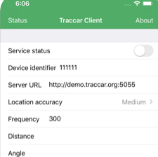
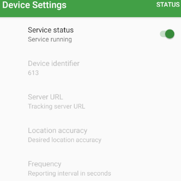

# GPS tracking

## Context

- During the census phase of the Bohemia project, the location of data capture devices (tablets) will be tracked. The purpose of this tracking is to both:
  - Help with recovery in the case of device loss or theft
  - Enable, over time, the identification of travel routes through the aggregation of the GPS tracks/paths taken by each tablet, and the subsequent generation of travel route planning tools and maps

## Testing

You have been selected to help test the GPS tracking system. Please carry out the following steps:

### Device configuration

- Install Traccar client via the [Google Play Store](https://play.google.com/store/apps/details?id=org.traccar.client) or the [Apple App Store](https://apps.apple.com/us/app/traccar-client/id843156974)
- Open the app
- You will be looking at a screen like this (left: Apple; right: Android):

<table style="width:100%">
  <tr>
    <td></td>
    <td></td>
  </tr>
</table>

- Set the "Device identifier" field to the ID number corresponding to your name:
  - Joe: `601`
  - Xing: `602`
  - Ben: `603`
  - Paula: `604`
  - Carlos: `605`
  - Eldo: `606`
  - Imani: `607`
  - Andrew: `608`
  - Anna: `609`
  - Chris: `610`
  - Megan: `611`
  - Joe 2: `612`
  - Joe 3: `613`
- Set the address of the server URL: `bohemia.fun`
- Set the Frequency field to: `60`
- Set location accuracy to: `high`
- Do not change the Distance or Angles fields
- At the top set "Service status" to on/running
- Optional: Click on "Status" in the upper right to ensure that everything is working and data is sent correctly

### Use

- Keep the app running for 48 hours
- It's okay to restart your device; the app should automatically initialize upon restart
- Pay attention to any odd / unexpected behavior
- Pay attention to battery life
- Report to joe@databrew.cc regarding the above
