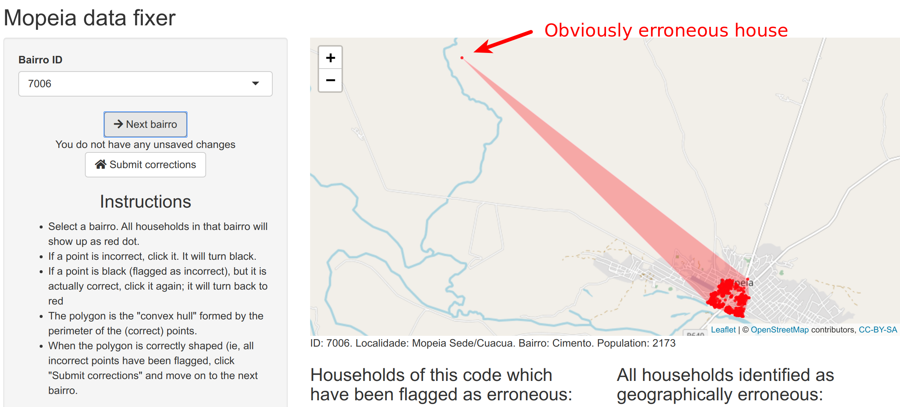
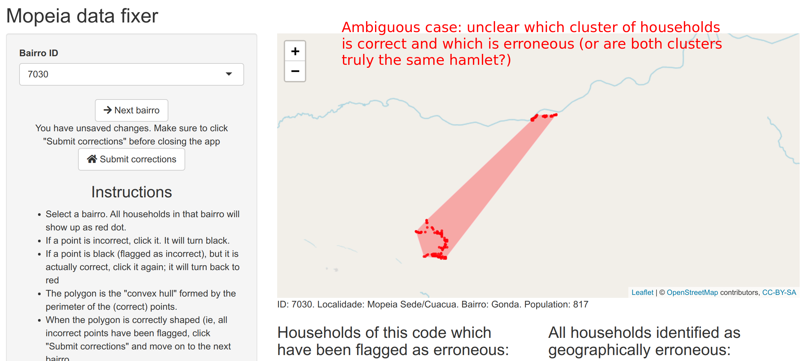

# Mopeia location corrections

## The problem

1. There does not exist any high-quality, granular polygonal geographic dataset (shapefile) of hamlet locations and borders for Mopeia. Accordingly, we have to create these shapefiles.

2. Creating these shapefiles from existing data (the COST census) is complicated to the high rate of geographic errors in these data.

## The solution

We need to identify all erroneously coded points in the COST census data in order to remove them prior to running our polygon delineation algorithm.

## The tool

We have created a web application for visualizing each hamlet's households. This web application is meant as a tool for both (a) seeing the geographic distribution of households in each hamlet and (b) flagging erroneous points. The application is online at: http://bohemia.team:3838/fixmopeia/

## How to use the tool

- Select a bairro. All households in that bairro will show up as red dot.
- If a point is incorrect, click it. It will turn black.
- If a point is black (flagged as incorrect), but it is actually correct, click it again; it will turn back to red
- The polygon is the "convex hull" formed by the perimeter of the (correct) points.
When the polygon is correctly shaped (ie, all incorrect points have been flagged, click "Submit corrections" and move on to the next bairro.
- Every time you click "submit corrections", the IDs of the flagged households are saved to a database
- When the above is finished for _all_ hamlets, polygon delineation will be carried out, generating a final shapefile for all of Mopeia.

## Who should use this tool?

The tool should be used by someone familiar with Mopeia hamlets (ie, Eldo). Though the unfamiliar may be able to flag some obviously erroneous households (see below)...

There are many cases where the distinction between correct and erroneous is not so clear (see below):

