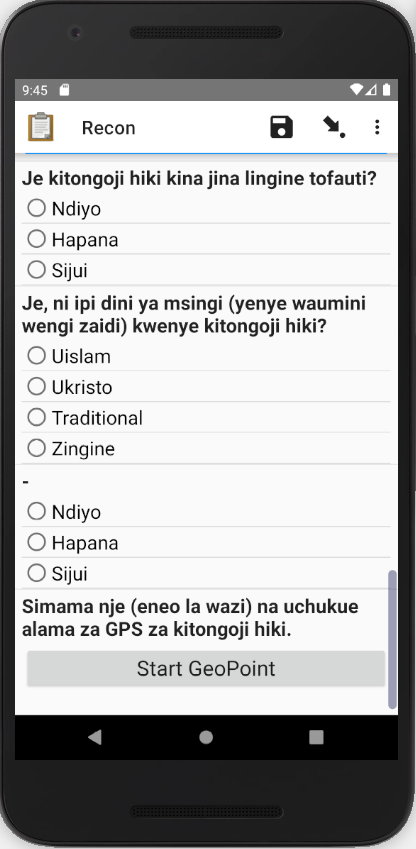
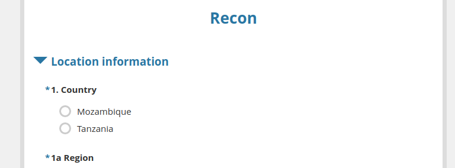
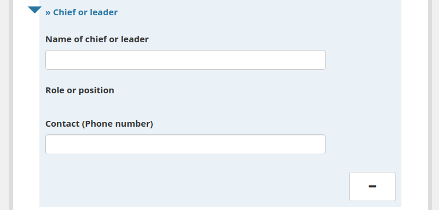

# Bohemia Reconnaissance Data Collection Application

## The concept

Prior to the census, operational teams will carry out "sensitisation" activities in each village in early 2020 (January-February). Because these activities require in-person visits to all areas of the census, it is an ideal time to carry out basic data collection. The purpose of this data collection is not to inform the Bohemia scientific studies, but rather to inform census operations (March onwards). We call this pre-census data collection "reconnaissance" (or "recon" for short).

## The tool

To assist with data collection, we have built a simple "recon" form. This form is meant to be collected at the level of the hamlet/bairro (ie, only one form filled out per hamlet). Data from this form will be used to populate the "Census operations helper app" (www.databrew.cc/bohemiaops) and will inform census operations (team assignment, resources planning, etc.)

## Where is the form?

- The forms xlsform definition is available [here](https://docs.google.com/spreadsheets/d/1xe8WrTGAUsf57InDQPIQPfnKXc7FwjpHy1aZKiA-SLw/edit?folder=1bN8Rix_Qf-v8gbs0VYniqP4V3_cyvaTK#gid=533144832)
- The web browswer version of the form is deployed on enketo, [here](http://papu.us:8005/x/#3QYL8hgP)
- The form can be used via the ODK Collect android application by pointing the server at `https://bohemia.systems` with username `data` and password `data`.

## What does the form cover?

- The form collections data on the following areas:

  - Hamlet location (hierarchical and geocoded) and name (standard and alternative)
  - Most commonly practiced religion
  - Contact and position information for hamlet chief(s) / leader(s)
  - Nearest health facility info (type and distance)
  - Hamlet size
  - Electricity status
  - Telecommunication status and best providers
  - Rainy season accessibility and travel directions

## What languages is the form available in?

- English, Portuguese and Swahili

## What is the look and feel of the form?

- In the ODK Collect application, the aesthetics are very similar to those of the census.

- In the Enketo web application, the look and feel are quite different, but the underlying functionality is identical.

## Where can I review the form?  

- The best way to review the form quickly is via the enketo web application: http://papu.us:8005/x/#3QYL8hgP

## Where can I see a video walk-through of the form?

https://youtu.be/ZLFC4O4faJU
