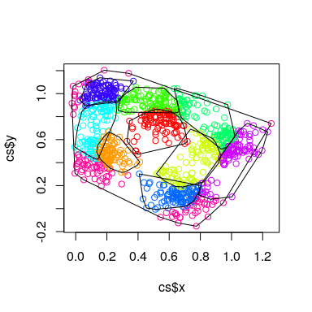

<!-- README.md is generated from README.Rmd. Please edit that file -->

# bohemia: The R package of the Bohemia project

This package contains utilities used by the Bohemia research team. It is
publicly available for the purposes of reproducibility and transparency.

## Installation

To install this package: - Clone the parent repo: `git clone
https://github.com/databrew/bohemia` - `cd` into `rpackage` - Run
`Rscript build_package.R`

Alternatively, one can install directly from
github:

``` r
devtools::install_github('databrew/bohemia', subdir = 'rpackage/bohemia', dependencies = TRUE, force = TRUE)
```

To remove the package (for example, so as to re-install for an update),
simply run: \`remove.packages(‘bohemia’)

## Setting up data

The package includes both tools (functions) as well as data. In order to
set up the package’s datasets, the following steps should be taken:

#### Download OSM data

1.  Download Mozambique data from
    <https://download.geofabrik.de/africa/mozambique-latest-free.shp.zip>
    into `data-raw/geofabrik` and extract

2.  Download Tanzania data from
    <https://download.geofabrik.de/africa/tanzania-latest-free.shp.zip>
    into `data-raw/geofabrik` and extract

#### Run the data compilation script

1.  From the command line, run `cd data-raw; Rscript DATASET.R; cd..`

## Building the package

Having done the above, run `Rscript build_package.R` from within the
main directory to compile the package.

## Package utilities

This package contains several noteworthy tools. What follows is a
walk-through of some of them.

### Data

#### Country-level polygonal data

``` r
library(sp)
library(bohemia)

# Create a map of Mozambique at the second administrative level (district)
plot(bohemia::mozambique2)
```

<!-- -->

``` r

# Create a map of Mozambique at the tertiary administrative level (posto administrativo)
plot(bohemia::mozambique3, lwd = 0.2)
```

<!-- -->

``` r

# Create a map of Tanzania at the second administrative level (district)
plot(bohemia::tanzania2)
```

<!-- -->

``` r

# Create a map of Tanzania at the tertiary administrative level (posto administrativo)
plot(bohemia::tanzania3, lwd = 0.2)
```

<!-- -->

#### Study area polygonal data

``` r
plot(bohemia::mopeia2)
```

<!-- -->

``` r
plot(bohemia::mopeia3)
```

<!-- -->

``` r

plot(bohemia::rufiji2)
```

<!-- -->

``` r
plot(bohemia::rufiji3)
```

<!-- -->

#### Study area road data

``` r
plot(bohemia::mopeia2)
plot(bohemia::mopeia_roads, add = TRUE)
```

<!-- -->

``` r

plot(bohemia::rufiji2)
plot(bohemia::rufiji_roads, add = TRUE)
```

<!-- -->

#### Study area road data

``` r
plot(bohemia::mopeia2)
plot(bohemia::mopeia_roads, add = TRUE)
```

<!-- -->

``` r

plot(bohemia::rufiji2)
plot(bohemia::rufiji_roads, add = TRUE)
```

<!-- -->

#### Study area water data

``` r
plot(bohemia::mopeia2)
plot(bohemia::mopeia_water, add = TRUE)
plot(bohemia::mopeia_waterways, add = TRUE)
```

<!-- -->

``` r

plot(bohemia::rufiji2)
plot(bohemia::rufiji_water, add = TRUE)
plot(bohemia::rufiji_waterways, add = TRUE)
```

<!-- -->

## Functions

### Retrieving data from ODK aggregate

The `bohemia` package has a series of tools meant for assisting with the
automated retrieval of data from the ODK Aggregate server. Below is a
basic walk-through with examples.

First define some basic parameters (this will vary depending on your
system).

``` r
odk_agg_url <- 'https://bohemia.systems'
user <- 'data'
password <- 'data'
form_name <- 'Recon'
```

Retrieve a list of forms from the server:

``` r
fl <- odk_list_forms(url = odk_agg_url)
#> OK (HTTP 200).
kable(fl)
```

| name   | id     | url                                             |
| :----- | :----- | :---------------------------------------------- |
| VA     | va     | <https://bohemia.systems/formXml?formId=va>     |
| Census | census | <https://bohemia.systems/formXml?formId=census> |
| Recon  | recon  | <https://bohemia.systems/formXml?formId=recon>  |

Fetch the ID for the form in question:

``` r
id <- fl %>% filter(name == form_name) %>% .$id
id
#> [1] "recon"
```

Get the secondary id of the form in question:

``` r
# (in most cases this will be identical)
id2 <- odk_get_secondary_id(url = odk_agg_url, id = id)
#> OK (HTTP 200).
id2
#> [1] "recon"
```

Get a list of submissions for that form:

``` r
submissions <- odk_list_submissions(url = odk_agg_url,
                                    id = id,
                                    user = user,
                                    password = password)
#> OK (HTTP 200).
kable(submissions)
```

| x                                         |
| :---------------------------------------- |
| uuid:ed8f30ea-be8d-4a1b-832b-885393a8d9d3 |
| uuid:a6929c84-92ca-4965-853e-763922d86b1a |
| uuid:3258d748-9aad-4f98-b824-3a2baf4fd35e |

Retrieve the data for an individual submission (the first one, for
example):

``` r
submission <- odk_get_submission(url = odk_agg_url,
                                 id = id,
                                 id2 = id2,
                                 uuid = submissions[1],
                                 user = user,
                                 password = password)
#> OK (HTTP 200).

# # What has been retrieved is a response for an http request in xml format:
# submission
# To take a better look at it, try:
# xmlview::xml_view(read_xml(submission))
```

To parse this submission, we’ll run the below:

``` r
parsed <- odk_parse_submission(xml = submission)
kable(parsed)
```

| key                         | value                                                   |
| :-------------------------- | :------------------------------------------------------ |
| device\_id                  | C0:BD:C8:8F:85:75                                       |
| start\_time                 | 2020-01-15T11:21:00.401+01:00                           |
| end\_time                   | 2020-01-15T11:25:03.131+01:00                           |
| todays\_date                | 2020-01-15                                              |
| Country                     | Tanzania                                                |
| Region                      | Pwani                                                   |
| District                    | Rufiji DC                                               |
| Ward                        | Ikwiriri                                                |
| Village                     | Ikwiriri Kati                                           |
| village\_other              |                                                         |
| Hamlet                      | Msikitini                                               |
| hamlet\_other               |                                                         |
| hamlet\_code                | MSN                                                     |
| hamlet\_alternative         | Yes                                                     |
| hamlet\_alternative\_name   | Altyalaix                                               |
| religion                    | Other                                                   |
| religion\_add\_comment      | Yes                                                     |
| religion\_comments          | Ydndksjdndjdjdn                                         |
| location                    | 41.5319358000 1.3852065000 776.7999877930 43.5000000000 |
| note\_chief                 |                                                         |
| repeat\_chief               | JoeVillage Executive Officer12374                       |
| repeat\_chief               | BenMtaa Executive Officer84747                          |
| note\_general               |                                                         |
| name\_nearest\_hf           | Hospy                                                   |
| type\_nearest\_hf           | Hospital                                                |
| type\_nearest\_hf\_other    |                                                         |
| distance\_nearest\_hf       | 0.5000000000                                            |
| time\_nearest\_hf           | 20                                                      |
| number\_hh                  | 150                                                     |
| electricity                 | Yes                                                     |
| group\_voice                | YesVodacomYesNoDon’t knowNo                             |
| group\_data                 | YesHalotelNoYesNoDon’t know                             |
| accessibility               | No                                                      |
| accessibility\_types        | Bicycle                                                 |
| accessibility\_types\_other |                                                         |
| accessibility\_details      | No comments                                             |
| instanceID                  | uuid:ed8f30ea-be8d-4a1b-832b-885393a8d9d3               |
| instanceName                | recon\_2020-01-15                                       |

### Generating fake data

Some methods and analysis require “dummy” data in order to be tested.
Functions which generate dummy data begin with the prefix
`generate_fake`. For example, `generate_fake_locations` creates a
dataframe of `n` locations, grouped into `n_clusters` clusters, which is
useful for testing algorithms related to clustering, buferring, etc.

Here is a working example:

``` r
set.seed(1)
library(tidyverse)
#> ── Attaching packages ───────────────────────────────────────────────────────────────────────────────────── tidyverse 1.2.1 ──
#> ✓ tibble  2.1.3     ✓ purrr   0.3.3
#> ✓ readr   1.3.1     ✓ stringr 1.4.0
#> ✓ tibble  2.1.3     ✓ forcats 0.4.0
#> ── Conflicts ──────────────────────────────────────────────────────────────────────────────────────── tidyverse_conflicts() ──
#> x dplyr::filter() masks stats::filter()
#> x dplyr::lag()    masks stats::lag()
library(sp)
library(bohemia)
# Generate some fake data
fake <- generate_fake_locations(n = 1000,
                                n_clusters = 10,
                                sd = 0.04)
# Plot the fake data
plot(fake$x, fake$y, col = rainbow(10)[fake$cluster])
```

<!-- -->

### Generating village boundaries

``` r
# Generate boundaries from the point locations
boundaries <- bohemia::create_borders(df = fake)
# Plot the boundaries
cols10 <- rainbow(10)
cols <- cols10[fake$cluster]
plot(fake$x, fake$y, col = cols, pch = 16, cex = 0.5)
plot(boundaries, add = T, col = adjustcolor(cols10, alpha.f = 0.3),
     border = NA)
```

<!-- -->

### Generating external buffers

``` r
# Generate buffers from boundaries
buffers <- bohemia::create_buffers(shp = boundaries,
                                   meters = 5000)
plot(fake$x, fake$y, col = cols, pch = 16, cex = 0.5)
plot(boundaries, add = T, col = adjustcolor(cols, alpha.f = 0.3))
plot(buffers, add = T)
```

<!-- -->

### Generating buffers based on tesselation

As an alternative to the above approach, and so as to generate
generealizable boundaries with no “holes”, we can use voronoi
tesselation as opposed to convex hulling.

``` r
boundaries <- create_borders(df = fake, voronoi = TRUE)
# Plot the boundaries
plot(fake$x, fake$y, col = cols, pch = 16, cex = 0.5)
plot(boundaries, add = T, col = adjustcolor(cols, alpha.f = 0.3))
```

<!-- -->

### Generating tesselated buffers

Just like with convex hull generated borders, we can add buffers to
delauney triangles.

``` r
# Generate buffers from boundaries
buffers <- bohemia::create_buffers(shp = boundaries,
                                   meters = 5000)
plot(fake$x, fake$y, col = cols, pch = 16, cex = 0.5)
plot(boundaries, add = T, col = adjustcolor(cols, alpha.f = 0.3), border = NA)
plot(buffers, add = T, col = adjustcolor(cols10, alpha.f = 0.3))
```

<!-- -->

### Generating tesselated internal buffers

In the above, we use *external* boundaries, which results in one areas
borders bleeding into the core of another area. As an alternative to
this, we can use *internal* boundaries.

``` r
# Generate buffers from boundaries
buffers <- bohemia::create_buffers(shp = boundaries,
                                   meters = -5000)
plot(fake$x, fake$y, col = 'white', pch = 16, cex = 0.5)
# plot(boundaries, add = T, col = adjustcolor(cols, alpha.f = 0.3))
plot(buffers, add = T, col = adjustcolor(cols10, alpha.f = 0.4))
points(fake$x, fake$y, col = cols, pch = 16, cex = 0.5)
```

<!-- -->

### Generating “collapsed” tesselated internal buffers

For the purposes of an intervention in which each area is assigned
status A or B (ie, intervention or control), the need for buffers
between areas of identical intervention status is redundant (and can
unecessarily eliminate potential study participants). The below is an
example of redundant buffers.

``` r
# Define some ids 
ids <- sample(1:2, nrow(boundaries), replace = TRUE)
cols2 <- c('lightblue', 'orange')
cols <- cols2[ids]

# Create a dataframe for joining clusters to ids
merger <- data.frame(cluster = boundaries@data$cluster,
                     id = ids)
# Bring the ids into the point data
old_fake <- fake
fake <- left_join(fake, merger, by = 'cluster')

# Generate buffers from boundaries
buffers@data <- left_join(buffers@data, merger, by = 'cluster')
plot(fake$x, fake$y, col = cols2[fake$id], pch = 16, cex = 0.5)
# plot(boundaries, add = T, col = adjustcolor(cols, alpha.f = 0.8))
plot(buffers, add = T, col = adjustcolor(cols2[buffers@data$id], alpha.f = 0.5))
points(fake$x, fake$y, col = cols2[fake$id], pch = 16, cex = 0.5)
```

<!-- -->

The below collapses redundant borders.

``` r
# Define some ids 
ids <- sample(1:2, nrow(boundaries), replace = TRUE)
cols2 <- c('lightblue', 'orange')
cols <- cols2[ids]

# Create a dataframe for joining clusters to ids
merger <- data.frame(cluster = boundaries@data$cluster,
                     id = ids)
# Bring the ids into the point data
fake <- old_fake
fake <- left_join(fake, merger, by = 'cluster')

# Generate buffers from boundaries
buffers <- create_buffers(shp = boundaries,
                                   meters = -5000,
                                   ids = ids)
plot(fake$x, fake$y, col = 'white', pch = 16, cex = 0.5)
# plot(boundaries, add = T, col = adjustcolor(cols, alpha.f = 0.8))
plot(buffers, add = T, col = adjustcolor(cols2[buffers@data$id], alpha.f = 0.5))
points(fake$x, fake$y, col = cols2[fake$id], pch = 16, cex = 0.5)
```

<!-- -->

### Generating village-agnostic clusters

Clusters can be defined *a priori* (ie, named administrative units) or
programatically (ie, village-agnostic groups of `n` people).
Alternatively, a cluster could be formed programatically, but with
certain restrictions (such as the a rule prohibiting the division of a
village into two). To do this, use the `create_clusters` function.

``` r
fake <- generate_fake_locations(n = 1000,
                                n_clusters = 10,
                                sd = 0.1) %>% dplyr::select(-cluster)
plot(fake$x, fake$y, pch = 16)
```

<!-- -->

``` r
cs <- create_clusters(cluster_size = 100,
                      locations = fake)

rcols <- length(unique(cs$cluster))
plot(cs$x, cs$y, col = rainbow(rcols)[cs$cluster])
```

<!-- -->

The data generated from `create_clusters` is compatible with the other
functions herein described. Here are some usage examples:

``` r
set.seed(2)
fake <- generate_fake_locations(n = 1000,
                                n_clusters = 5,
                                sd = 0.1) %>% dplyr::select(-cluster)
cs <- create_clusters(cluster_size = 100,
                      locations = fake)
rcols <- length(unique(cs$cluster))

# Create true borders
plot(cs$x, cs$y, col = rainbow(rcols)[cs$cluster])
boundaries <- create_borders(df = cs)
plot(boundaries, add = T)
```

<!-- -->

``` r

# Create tesselation borders
plot(cs$x, cs$y, col = rainbow(rcols)[cs$cluster])
boundaries <- create_borders(df = cs, voronoi = TRUE)
plot(boundaries, add = TRUE)
```

<!-- -->

``` r

# Create internal buffered tesselation borders
plot(cs$x, cs$y, col = rainbow(rcols)[cs$cluster])
boundaries <- create_borders(df = cs, voronoi = TRUE)
buffered <- create_buffers(shp = boundaries, meters = -3000)
plot(buffered, add = TRUE)
```

<!-- -->

``` r

# Create internal buffered tesselation borders with binary treatment status
id_df <- cs %>% 
  group_by(cluster) %>%
  tally 
id_df$id <- sample(1:2, nrow(id_df), replace = TRUE)
cs <- left_join(cs, id_df)
#> Joining, by = "cluster"
cols2 <- c('darkblue', 'pink')
plot(cs$x, cs$y, col = cols2[cs$id])
boundaries <- create_borders(df = cs, voronoi = TRUE)
buffered <- create_buffers(shp = boundaries, meters = -3000,
                           ids = id_df$id)
plot(buffered, add = TRUE)
```

<!-- -->

What follows below is a visualization of how the `create_buffers`
algorithm works.

``` r
set.seed(2)
fake <- generate_fake_locations(n = 1000,
                                n_clusters = 5,
                                sd = 0.1) %>% dplyr::select(-cluster)
cs <- create_clusters(cluster_size = 100,
                      locations = fake,
                      plot_map = TRUE,
                      save = 'animation')
setwd('animation')
system('convert -delay 100 -loop 0 *.png result.gif')
setwd('..')
```


## QR Codes

The Bohemia project uses QR codes for the purpose of quickly reading in
and confirming household ID numbers. These can be printed easily using
the `create_qr()` function in the `bohemia` r package. Here is an
example of its use:

``` r
# Example id number: 1234567
id <- ('111-222')
create_qr(id)
#> Loading required package: qrcode
```

<!-- -->

If many ids need to be printed at once, there is a .pdf functionality
for printing multiple IDs. To use this, run the following:

``` r
# Example ids: 5566778, 7654321, 1234567
ids <- c('123-456', '654-321', '999-888', '777-666')
render_qr_pdf(ids = ids,
              output_file = 'qrs.pdf')
```

The above will generate a pdf in the working directory named `qrs.pdf`
with all of the above QRs.

In order to generate *worker ID* QRs, once can run something like the
following:

``` r
print_worker_qrs(wid = '001', worker = TRUE, n = 12)
```

The above will generate 12 ID QRs for worker with ID number ‘001’.

In order to generate household-specific QRs for a given worker, do
something like below:

``` r
print_worker_qrs(wid = '001', restrict = 20:30)
```

The above will generate ids for house numbers 20 through 30 for worker
ID 001 (ie, ‘001-020’, ‘001-021’, etc.). Remove the `restrict` argument
to generate IDs for all 1000 houses assigned to the worker.
